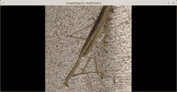

# 如何用 Python 旋转/镜像照片

> 原文：<https://www.blog.pythonlibrary.org/2017/10/05/how-to-rotate-mirror-photos-with-python/>

在我们上一篇[文章](https://www.blog.pythonlibrary.org/2017/10/03/how-to-crop-a-photo-with-python/)中，我们学习了如何用 Pillow 软件包裁剪图像。在这篇文章中，我们将学习如何旋转和镜像我们的图像。

* * *

### 旋转图像


使用 Python 和 Pillow 旋转图像非常简单。我们来看一些代码:

```py

from PIL import Image

def rotate(image_path, degrees_to_rotate, saved_location):
    """
    Rotate the given photo the amount of given degreesk, show it and save it

    @param image_path: The path to the image to edit
    @param degrees_to_rotate: The number of degrees to rotate the image
    @param saved_location: Path to save the cropped image
    """
    image_obj = Image.open(image_path)
    rotated_image = image_obj.rotate(degrees_to_rotate)
    rotated_image.save(saved_location)
    rotated_image.show()

if __name__ == '__main__':
    image = 'mantis.png'
    rotate(image, 90, 'rotated_mantis.jpg')

```

这里我们只是从 **PIL** 导入**图像**模块，并创建一个 **rotate()** 函数。我们的自定义旋转函数采用以下参数:我们将要旋转的图像路径、我们想要旋转的角度以及我们想要保存结果的位置。实际代码非常简单。我们所做的就是打开图像，然后调用图像对象的 **rotate()** 方法，同时向它传递逆时针旋转的度数。然后我们保存结果并调用 image 对象的 show()方法来查看结果:



在上面的例子中，我们将螳螂逆时针旋转了 90 度。

* * *

### 镜像图像


现在让我们试着翻转或镜像我们的螳螂图像。下面是一个从左到右镜像图像的示例:

```py

from PIL import Image

def flip_image(image_path, saved_location):
    """
    Flip or mirror the image

    @param image_path: The path to the image to edit
    @param saved_location: Path to save the cropped image
    """
    image_obj = Image.open(image_path)
    rotated_image = image_obj.transpose(Image.FLIP_LEFT_RIGHT)
    rotated_image.save(saved_location)
    rotated_image.show()

if __name__ == '__main__':
    image = 'mantis.png'
    flip_image(image, 'flipped_mantis.jpg')

```

这段代码与前面的例子非常相似。这段代码的核心是我们使用图像对象的 **transpose()** 方法，该方法采用以下常量之一:

*   PIL。图像。向左向右翻转
*   PIL。图像.翻转 _ 顶部 _ 底部
*   PIL。图像。转置

您也可以在这里使用 Pillow 的 ROTATE 常量之一，但是我们只关注 transpose()方法的镜像方面。试着将这些常量中的一个交换到上面的代码中，看看会发生什么。

* * *

### 包扎

现在你知道如何使用枕头包来旋转和翻转/镜像你的图像。Python 让这种事情变得很简单。你应该试一试，一定要查看 Pillow 的文档，看看你还能做些什么！

* * *

### 相关阅读

*   [图像模块](https://pillow.readthedocs.io/en/4.2.x/reference/Image.html#image-module)上的枕头文档
*   如何在 Python 中[裁剪图像](https://www.blog.pythonlibrary.org/2017/10/03/how-to-crop-a-photo-with-python/)
*   介绍 [Python 图像库/ Pillow](https://www.blog.pythonlibrary.org/2016/10/07/an-intro-to-the-python-imaging-library-pillow/)