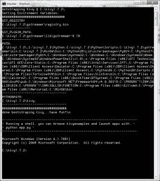
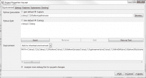

# 如何在 Windows 上为 Kivy 设置 Wing IDE

> 原文：<https://www.blog.pythonlibrary.org/2013/11/18/how-to-set-up-wing-ide-for-kivy-on-windows/>

我喜欢用 [Wingware 的 IDE](http://www.wingware.com/) 用 Python 编码。我正在用 [Kivy](http://kivy.org/) 开发一些示例应用程序，这是一个跨平台的 Python GUI 框架，也可以为移动设备创建 UI。无论如何，在 Wing 中设置 Kivy 有点令人困惑，所以这里有一个速成班:

1.  Download Kivy
2.  拉开 Kivy 的拉链。在我的例子中，我在这里解压它:C:\kivy1.7.2\
3.  运行解压到的目录中的 kivy.bat。您应该会看到如下所示的内容

现在我们准备打开机翼。一旦你打开了，开始一个新的项目。然后进入**项目**菜单，选择位于列表底部的**项目属性**选项。您应该会看到如下所示的内容:

将 **Python 可执行文件**选项设置为你的 Kivy 的 Python，在我的例子中是:**c:\ Kivy 1 . 7 . 2 \ Python \ Python . exe**

将 **Python 路径**设置为 **C:\kivy1.7.2\kivy** (或者修改以匹配提取 kivy 的位置)。

此时，您应该能够在您的环境中导入 kivy，但是您将无法实际执行您的 kivy 脚本。要解决这个问题，你需要进入项目属性对话框的底部，将**环境**设置下拉菜单更改为**添加到继承的环境**。最后，您需要将上面看到的 kivy.bat 屏幕中的路径信息复制到环境设置下的文本框中。在我的例子中，它看起来像这样:

 `PATH=C:\kivy1.7.2\;C:\kivy1.7.2\Python;C:\kivy1.7.2\Python\Scripts;C:\kivy1.7.2\gstreamer\bin;C:\kivy1.7.2\MinGW\bin;C:\Python26\Lib\site-packages\PyQt4;C:\Python27\Lib\site-packages\PyQt4;C:\Windows\system32;C:\Windows;C:\Windows\System32\Wbem;C:\Windows\System32\WindowsPowerShell\v1.0\;c:\Program Files (x86)\ATI Technologies\ATI.ACE\Core-Static;C:\Program Files (x86)\Intel\Services\IPT\;C:\Program Files (x86)\IBM\Client Access\Emulator;C:\Program Files (x86)\IBM\Client Access\Shared;C:\Program Files (x86)\IBM\Client Access\;C:\Python26;C:\Python26\Scripts;C:\Program Files\TortoiseSVN\bin;C:\Program Files\SlikSvn\bin;C:\Program Files (x86)\Calibre2\;C:\Program Files (x86)\QuickTime\QTSystem\;C:\Program Files (x86)\GNU\GnuPG\pub;C:\Windows\Microsoft.NET\Framework64\v4.0.30319;C:\PROGRA~1\IBM\SQLLIB\BIN;C:\PROGRA~1\IBM\SQLLIB\FUNCTION;C:\Program Files (x86)\Git\cmd;C:\Program Files (x86)\Mercurial;C:\MinGW\bin` 

除了它应该都在一行上。否则 Wing 会抱怨每个变量必须在 var=value 对中。一旦你完成了所有这些，你就可以在 Wing 中运行一个 kivy 脚本。这避免了将 Python 文件拖到 kivy.bat 上来运行 kivy 程序的需要。