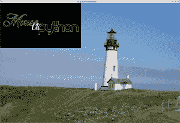
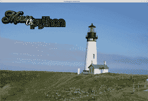

# 如何用 Python 给你的照片加水印

> 原文：<https://www.blog.pythonlibrary.org/2017/10/17/how-to-watermark-your-photos-with-python/>

当你在网上查找照片时，你会注意到有些照片带有水印。水印通常是覆盖在照片上的一些文本或徽标，用于标识照片的拍摄者或照片的所有者。一些专业人士建议在社交媒体上分享照片之前给照片添加水印，以防止其他人将你的照片用作自己的照片，并从你的作品中获利。当然，水印可以很容易地被移除，所以这并不像过去作为数字版权工具那样有用。

反正枕头包提供了给照片添加水印所需的工具！如果你还没有安装枕头，你需要做的第一件事是:

```py
pip install pillow

```

一旦安装完毕，我们就可以继续了！

* * *

### 添加文本水印

我们将从给照片添加一些文字开始。让我们用这张我在俄勒冈州拍摄的耶奎纳灯塔的照片:


现在我们将添加一些文字到图像中。在这种情况下，让我们添加我的域名:[www.mousevspython.com](http://www.mousevspython.com)

```py
from PIL import Image
from PIL import ImageDraw
from PIL import ImageFont

def watermark_text(input_image_path,
                   output_image_path,
                   text, pos):
    photo = Image.open(input_image_path)

    # make the image editable
    drawing = ImageDraw.Draw(photo)

    black = (3, 8, 12)
    font = ImageFont.truetype("Pillow/Tests/fonts/FreeMono.ttf", 40)
    drawing.text(pos, text, fill=black, font=font)
    photo.show()
    photo.save(output_image_path)

if __name__ == '__main__':
    img = 'lighthouse.jpg'
    watermark_text(img, 'lighthouse_watermarked.jpg',
                   text='www.mousevspython.com',
                   pos=(0, 0))

```

这里我们从 PIL 导入几个类: **Image** 、 **ImageDraw** 和 **ImageFont** 。然后我们创建一个函数， **watermark_text** ，它有四个参数:输入图像页面、输出图像路径、要添加到图像中的文本以及放置文本的位置坐标。

接下来，我们打开我们的形象。然后，我们基本上通过使用 **ImageDraw 重新绘制图像来制作图像的副本。绘制**方法。这使得我们可以更容易地向其中添加文本。然后我们使用 **ImageFont.truetype** 创建一个字体。该字体是 Pillow 库中包含的一种字体。我们也将字体大小设置为 40 磅。最后我们显示结果并保存到磁盘。结果如下:


现在让我们继续添加图像，而不仅仅是文本！

* * *

### 用图像加水印

大多数专业摄影师最终都会在他们的照片上打上商标。有时这包括他们网站的风格化“照片”版本。在 Pillow 中将一张照片添加到另一张照片也相当容易。让我们来看看怎么做吧！

在这个例子中，我们将使用我的一个标志作为水印图像。

```py
from PIL import Image

def watermark_photo(input_image_path,
                    output_image_path,
                    watermark_image_path,
                    position):
    base_image = Image.open(input_image_path)
    watermark = Image.open(watermark_image_path)

    # add watermark to your image
    base_image.paste(watermark, position)
    base_image.show()
    base_image.save(output_image_path)

if __name__ == '__main__':
    img = 'lighthouse.jpg'
    watermark_with_photo(img, 'lighthouse_watermarked2.jpg',
                         'watermark.png', position=(0,0))

```

这里我们创建了一个与上一节中的函数非常相似的函数，但是我们没有传入文本，而是传入水印的文件路径。在该函数中，我们打开了我们想要水印的图像以及水印图像本身。然后，我们获取要添加水印的图像并调用它的 **paste()** 方法，同时传入我们想要粘贴的内容(即水印)和我们想要粘贴的位置。最后，我们显示图像并保存它。结果如下:



嗯，这并没有按照我预想的方式进行。正如你所看到的，有一个黑色的背景遮挡了很多照片，因为当我们粘贴它时，我们没有考虑到透明度。

* * *

### 用透明度给图像加水印

让我们创建一个新的函数，可以使用透明度，所以我们从水印中删除所有的黑色。我在 [StackOverflow](https://stackoverflow.com/q/38627870/393194) 上找到了这个问题的解决方案，所以我在这个例子中使用了它并稍微修改了一下

```py
from PIL import Image

def watermark_with_transparency(input_image_path,
                                output_image_path,
                                watermark_image_path,
                                position):
    base_image = Image.open(input_image_path)
    watermark = Image.open(watermark_image_path)
    width, height = base_image.size

    transparent = Image.new('RGBA', (width, height), (0,0,0,0))
    transparent.paste(base_image, (0,0))
    transparent.paste(watermark, position, mask=watermark)
    transparent.show()
    transparent.save(output_image_path)

if __name__ == '__main__':
    img = 'lighthouse.jpg'
    watermark_with_transparency(img, 'lighthouse_watermarked3.jpg',
                                'watermark.png', position=(0,0))

```

在这段代码中，我们接受了与上一个例子中相同的所有参数。这一次，我们不仅打开了两幅图像，而且还获取了想要添加水印的图像的宽度和高度。然后，我们创建一个新的图像使用相同的宽度和高度的图像，我们是水印。你会注意到，我们创建的这个图像是 RGBA，这意味着它有红色，绿色和蓝色的阿尔法。接下来，我们粘贴在图像中，我们想水印从左上角开始，这是(0，0)。然后，我们使用传入的位置粘贴我们的水印，我们还用水印本身来屏蔽水印。最后我们显示并保存图像。

生成的图像如下所示:



很酷，是吧？

* * *

### 包扎

在这篇文章中，我们介绍了两种不同的给照片添加水印的方法。在第一个例子中，我们所做的只是将您选择的文本添加到图像中。第二个例子演示了一种添加图像水印的方法，但是它没有考虑 alpha(透明度)。我们用第三个例子纠正了这个问题。我希望这些例子对你有所帮助。编码快乐！

* * *

### 相关阅读

*   StackOverflow: [如何将一张带有透明度的 PNG 图片粘贴到另一张没有白色像素的 PIL 图片上？](https://stackoverflow.com/q/38627870/393194)
*   [如何用 Python 调整照片大小](https://www.blog.pythonlibrary.org/2017/10/12/how-to-resize-a-photo-with-python/)
*   用 Python 将一张[照片转换成黑白](https://www.blog.pythonlibrary.org/2017/10/11/convert-a-photo-to-black-and-white-in-python/)
*   [如何用 Python 旋转/镜像照片](https://www.blog.pythonlibrary.org/2017/10/05/how-to-rotate-mirror-photos-with-python/)
*   [如何用 Python 裁剪照片](https://www.blog.pythonlibrary.org/2017/10/03/how-to-crop-a-photo-with-python/)