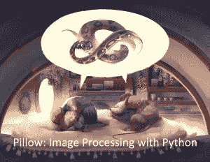

# Python Kickstarter 的图像处理即将结束

> 原文：<https://www.blog.pythonlibrary.org/2021/01/25/image-processing-with-python-kickstarter-ending-soon/>

我的新书《枕头:用 Python 处理图像》的 Kickstarter 将在 8 天后结束。你应该去看看，学习如何用 Python 编辑照片！

 
你将在本书中了解到以下主题:

*   第 1 章-枕头基础知识
*   第 2 章-颜色
*   第 3 章-获取图像元数据(ExifTags / TiffTags)
*   第 4 章-图像过滤器
*   第 5 章-裁剪、旋转和调整图像大小
*   第 6 章-增强图像(ImageEnhance)
*   第 7 章-组合图像
*   第 8 章-用枕头画画(ImageDraw)
*   第 9 章-绘图文本
*   第 10 章-图像印章
*   还有更多！

上周末，我实现了我的第一个延伸目标，并将为这本书增加两个新的章节。查看 [Kickstarter](https://www.kickstarter.com/projects/driscollis/image-processing-with-python/) 了解详情！