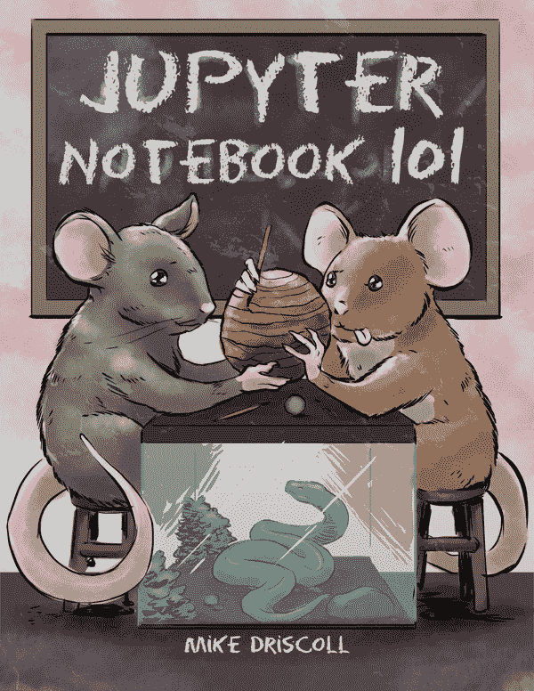

# Jupyter 笔记本 101 发布！

> 原文：<https://www.blog.pythonlibrary.org/2018/11/13/jupyter-notebook-101-released/>

我最新的一本书，Jupyter 笔记本 101 现在正式发行。

您可以在以下零售商处购买:

*   亚马逊 (Kindle 或平装)
*   [Leanpub](https://leanpub.com/jupyternotebook101/) (mobi、epub 和 PDF)在[以 9.99 美元的价格出售，直到 11 月底](http://leanpub.com/jupyternotebook101/c/OoI5dT5VF5H7)
*   [Gumroad](https://gum.co/jupyter101) (mobi、epub 和 PDF)

你也可以从 Leanpub 下载这本书的样本。在 Leanpub 上只需花 9.99 美元就能在限定时间内买到！

Jupyter Notebook 101 将教你如何有效地创建和使用笔记本。您可以使用 Jupyter Notebook 来帮助您学习编码、创建演示文稿和制作精美的文档。

Jupyter 笔记本被科学界用来以一种易于复制的方式展示研究。

你将在 **Jupyter 笔记本 101** 中学到以下内容:

*   如何创建和编辑笔记本
*   如何添加样式、图像、图表等
*   如何配置笔记本
*   如何将您的笔记本导出为其他格式
*   笔记本扩展
*   使用笔记本进行演示
*   笔记本小工具
*   还有更多！