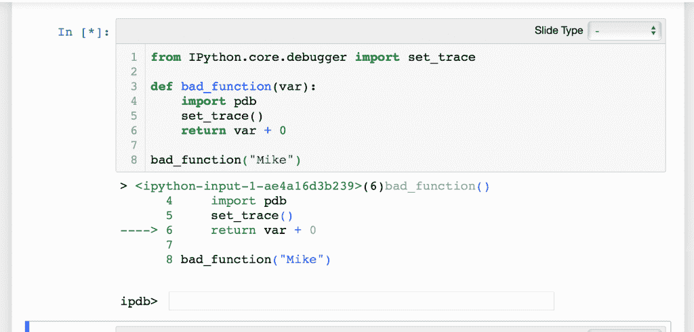

# Jupyter 笔记本调试

> 原文：<https://www.blog.pythonlibrary.org/2018/10/17/jupyter-notebook-debugging/>

调试是一个重要的概念。调试的概念是试图找出你的代码有什么问题，或者只是试图理解代码。有很多次我会遇到不熟悉的代码，我需要在调试器中一步一步地调试它，以掌握它是如何工作的。大多数 Python IDEs 都内置了很好的调试器。例如，我个人喜欢 Wing IDE。其他人喜欢 PyCharm 或 PyDev。但是如果你想调试 Jupyter 笔记本里的代码呢？这是怎么回事？

在这一章中，我们将看看调试笔记本的几种不同的方法。第一种是通过使用 Python 自己的 **pdb** 模块。

* * *

### 使用 pdb

pdb 模块是 Python 的调试器模块。就像 C++有 gdb 一样，Python 有 pdb。

让我们首先打开一个新的笔记本，添加一个包含以下代码的单元格:

```py

def bad_function(var):
    return var + 0

bad_function("Mike")

```

如果您运行这段代码，您应该会得到如下所示的输出:

```py

---------------------------------------------------------------------------
TypeError                                 Traceback (most recent call last)
 in <module>()
      2         return var + 0
      3 
----> 4 bad_function("Mike")

 <ipython-input-1-2f23ed1cac1e>in bad_function(var)
      1 def bad_function(var):
----> 2         return var + 0
      3 
      4 bad_function("Mike")

TypeError: cannot concatenate 'str' and 'int' objects
```

这意味着你不能把一个字符串和一个整数连接起来。如果你不知道一个函数接受什么类型，这是一个很常见的问题。您会发现在处理复杂的函数和类时尤其如此，除非它们碰巧使用了类型提示。弄清楚发生了什么的一种方法是使用 pdb 的 **set_trace()** 函数添加一个断点:

```py

def bad_function(var):
    import pdb
    pdb.set_trace()
    return var + 0

bad_function("Mike")

```

现在，当您运行单元时，您将在输出中得到一个提示，您可以使用该提示来检查变量并实际运行代码。如果你碰巧有 **Python 3.7** ，那么你可以通过使用新的内置**断点**来简化上面的例子，就像这样:

```py

def bad_function(var):
    breakpoint()
    return var + 0

bad_function("Mike")

```

这段代码在功能上等同于前面的例子，但是使用了新的**断点**函数。当您运行这段代码时，它的行为应该与上一节中的代码相同。

你可以在这里阅读更多关于如何使用 pdb 的信息。

您可以在 Jupyter 笔记本中使用任何 pdb 命令。以下是一些例子:

*   w(此处)-打印堆栈跟踪
*   d(own) -将当前帧下移 X 层。默认为 1。
*   u(p) -将当前帧上移 X 层。默认为 1。
*   b(break)-使用*lineno*参数，在当前文件/上下文中行号处设置一个断点
*   s(tep) -执行当前行并停在下一行
*   c(继续)-继续执行

请注意，这些是单字母命令:w、d、u 和 b 是命令。您可以使用这些命令以及上面列出的文档中列出的其他命令在笔记本中交互式调试您的代码。

* * *

### ipdb

IPython 还有一个名为 **ipdb** 的调试器。然而，它不能直接与 Jupyter 笔记本电脑一起使用。您需要使用类似 **Jupyter 控制台**的东西连接到内核，并从那里运行它来使用它。如果你想走这条路，你可以在这里阅读更多关于使用 Jupyter 控制台[的信息。](https://jupyter-console.readthedocs.io/en/latest/)

然而，我们可以使用一个名为**IPython . core . debugger . set _ trace**的 IPython 调试器。让我们用下面的代码创建一个单元格:

```py

from IPython.core.debugger import set_trace

def bad_function(var):
    set_trace()
    return var + 0

bad_function("Mike")

```

现在，您可以运行这个单元并获得 ipdb 调试器。下面是我的机器上的输出:



IPython 调试器使用与 Python 调试器相同的命令。主要区别在于它提供了语法高亮显示，并且最初是设计用于 IPython 控制台的。

还有另一种方法可以打开 **ipdb** 调试器，那就是使用 **%pdb** 魔法。以下是您可以在笔记本单元格中尝试的一些示例代码:

```py

%pdb

def bad_function(var):
    return var + 0

bad_function("Mike")

```

当您运行这段代码时，您应该会看到“typeerror”trace back，然后 ipdb 提示符会出现在输出中，您可以像以前一样使用它。

* * *

### %%debug 呢？

还有另一种方法可以在笔记本中打开调试器。您可以使用`%%debug '来调试整个单元，如下所示:

```py

%%debug

def bad_function(var):
    return var + 0

bad_function("Mike")

```

这将在您运行单元时立即启动调试会话。这意味着您可能希望使用 pdb 支持的一些命令来单步执行代码，并根据需要检查函数或变量。

请注意，如果您想调试一行代码，也可以使用“%debug”。

* * *

### 包扎

在这一章中，我们学习了几种不同的方法，可以用来调试 Jupyter 笔记本中的代码。我个人更喜欢使用 Python 的 pdb 模块，但是您可以使用 IPython.core.debugger 来获得相同的功能，如果您喜欢语法突出显示，它可能会更好。

还有一个更新的“可视化调试器”包，名为 PixieDebugger，来自于[pixedust](https://github.com/pixiedust/pixiedust)包:

我自己没用过。一些评论家说这是惊人的，其他人说这是相当错误的。我将让您来决定是否要将它添加到您的工具集中。

就我而言，我认为使用 pdb 或 IPython 的调试器工作得很好，应该也适合你。

* * *

### 相关阅读

*   StackOverflow: [在 IPython Noteobook 中调试的正确方法是什么？](https://stackoverflow.com/questions/32409629/what-is-the-right-way-to-debug-in-ipython-notebook)
*   你一直想要的 [Jupyter 笔记本的可视化 Python 调试器](https://medium.com/ibm-watson-data-lab/the-visual-python-debugger-for-jupyter-notebooks-youve-always-wanted-761713babc62)
*   调试 Jupyter 笔记本- [大卫·哈曼](https://davidhamann.de/2017/04/22/debugging-jupyter-notebooks/)