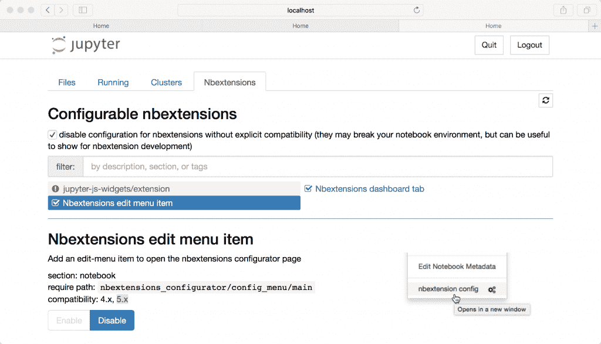
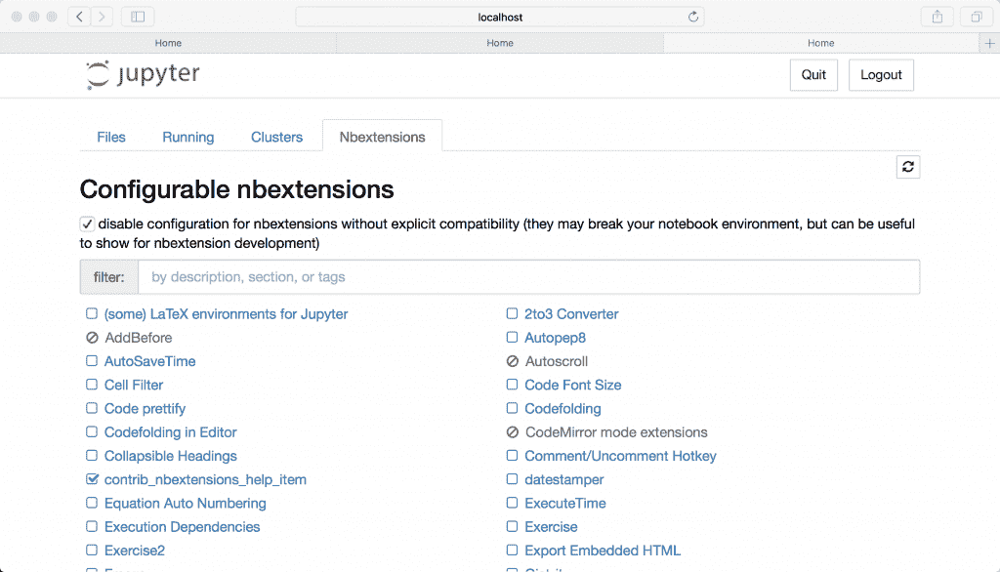

# Jupyter 笔记本扩展基础

> 原文：<https://www.blog.pythonlibrary.org/2018/10/02/jupyter-notebook-extension-basics/>

有几种方法可以扩展 Jupyter 笔记本的功能。以下是其中的四个:

*   核心
*   IPython 内核扩展
*   笔记本扩展
*   笔记本服务器扩展

出于本文的目的，我将重点关注第三项，**笔记本扩展**。但是，让我们花一点时间来谈谈其他三个，以便您了解它们会如何影响您的笔记本电脑。

#### 核心

内核基本上是运行时使用的语言。默认是通过 IPython 内核的 Python。您可以扩展您的 Jupyter 笔记本以使用除 Python 之外的其他语言。有关更多信息，请访问以下 URL:

*   [https://jupyter . readthedocs . io/en/latest/projects/kernels . html](https://jupyter.readthedocs.io/en/latest/projects/kernels.html)

由于每个内核都有不同的安装说明，所以我不会在本文中介绍其他内核的安装。应该使用上面的 URL，因为它有关于这个主题的最新信息的超链接。

如果你愿意，你也可以实现你自己的内核。这里有一个关于这个话题的很好的入门:

*   [https://jupyter-client . readthedocs . io/en/latest/kernels . html](https://jupyter-client.readthedocs.io/en/latest/kernels.html)

#### IPython 内核扩展

IPython 内核扩展只是一个 Python 模块，可用于修改交互式 shell 环境。在 Jupyter 的例子中，这些扩展将修改代码单元的行为。您可以使用这种类型的扩展来注册新的 magics、定义变量和修改用户的名称空间。您可以使用以下三个魔法来管理 IPython 扩展:

*   %加载 _ 扩展
*   %重载 _ 扩展
*   %卸载 _ 外部

参见 IPython [文档](https://ipython.readthedocs.io/en/stable/interactive/magics.html)了解这些魔法的全部细节。

#### 笔记本服务器扩展

Jupyter 笔记本也有“服务器扩展”的概念。服务器扩展是一个 Python 模块，在笔记本的 web 服务器应用程序启动时加载。当前加载这种类型的扩展的方法是通过 Jupyter 的配置系统，我们在第 3 章中讨论过。您需要在配置文件中或通过命令行界面指定要加载的扩展。

如果您在 Jupyter Notebook 运行时添加了新的扩展，您将需要重新启动笔记本进程来激活新的扩展。

### 笔记本扩展

本章我们最关心的扩展类型是**笔记本扩展**。笔记本扩展(或 nbextensions)是 JavaScript 模块，可以加载到笔记本前端的大多数视图中。他们可以访问页面的 DOM 和 Jupyter JavaScript API，后者允许扩展修改用户体验和界面。这种类型的扩展是笔记本前端独有的。

让我们了解一下如何安装笔记本扩展。假设您已经下载/ pip 安装了包含扩展的包，那么手动安装 Jupyter 笔记本扩展的方法看起来就像这样:

```py

jupyter nbextension install EXTENSION
jupyter nbextension enable EXTENSION

```

请注意，您可以用您打算安装的扩展的名称替换**扩展**。

管理笔记本扩展的另一种方法是使用 Jupyter NbExtensions 配置器，这种方法似乎获得了很多支持。你可以在这里查看项目[。](https://github.com/Jupyter-contrib/jupyter_nbextensions_configurator)

这个包不是 Jupyter 项目的一部分，但是它非常有帮助。您可以使用 pip 或 conda 来安装配置器。以下是使用 pip 的方法:

```py

pip install jupyter_nbextensions_configurator

```

如果您使用 conda 作为您的 Python 包管理器，那么您将像这样安装配置器:

```py

conda install -c conda-forge jupyter_nbextensions_configurator

```

配置器是 Jupyter 服务器扩展，必须启用。在启动 Jupyter Notebook 之前，您需要在终端中运行以下命令(或者您可以重新启动服务器):

```py

jupyter nbextensions_configurator enable --user

```

当我运行这个命令时，我得到了以下输出:

```py

Enabling: jupyter_nbextensions_configurator
- Writing config: /Users/michael/.jupyter
    - Validating...
      jupyter_nbextensions_configurator 0.4.0 OK
Enabling notebook nbextension nbextensions_configurator/config_menu/main...
Enabling tree nbextension nbextensions_configurator/tree_tab/main...

```

启动 Jupyter Notebook 后，只需点击 **Nbextensions** 选项卡，您应该会看到如下内容:



由于我们没有下载和安装任何扩展，配置器看起来有点贫瘠，现在真的不能为我们做那么多。让我们得到一些扩展来尝试！

如果您要搜索 Jupyter 笔记本扩展，您会很快找到* * Jupyter _ contrib _ nb extensions * *。它是由 Jupyter 社区提供的笔记本扩展的集合。您可以通过以下任一链接了解此软件包中包含的扩展的更多信息:

*   [https://github . com/ipython-contrib/jupyter _ contrib _ nb extensions](https://github.com/ipython-contrib/jupyter_contrib_nbextensions)
*   [https://jupyter-contrib-nb extensions . readthedocs . io/en/latest/index . html](https://jupyter-contrib-nbextensions.readthedocs.io/en/latest/index.html)

要安装这套扩展，您可以再次使用 pip 或 conda。以下是您将需要的 pip 命令:

```py

pip install jupyter_contrib_nbextensions

```

以下是 conda 命令:

```py

conda install -c conda-forge jupyter_contrib_nbextensions

```

一旦你下载并安装了这个包，你将需要使用一个 Jupyter 来安装 javascript 和 css 文件到正确的位置，以便笔记本可以访问它们。下面是您应该运行的命令:

```py

jupyter contrib nbextension install --user

```

现在您已经安装了新的扩展，您可以使用我们之前安装的配置器工具来轻松启用或禁用它们:



正如你在上面的截图中看到的，现在有很多扩展可以使用。配置器对于确定您已经安装并启用了哪些扩展非常方便。您也可以分别使用 **jupyter nbextension 启用扩展**或 **jupyter nbextension 禁用扩展**在终端中手动启用和禁用笔记本扩展，但我个人觉得配置器更容易使用。

* * *

### 包扎

在本文中，我们了解了 Jupyter 可以使用的不同类型的扩展。我们最关心的是 Jupyter 笔记本扩展。然后，我们继续学习安装扩展的基础知识。我们还学习了如何使用终端以及通过 Jupyter NbExtensions 配置器包来启用和禁用扩展。

* * *

### 相关阅读

*   使用 [Jupyter 笔记本](https://www.blog.pythonlibrary.org/2018/09/25/creating-presentations-with-jupyter-notebook/)创建演示文稿
*   Jupyter 贡献了[扩展](https://github.com/ipython-contrib/jupyter_contrib_nbextensions)