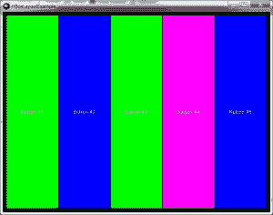
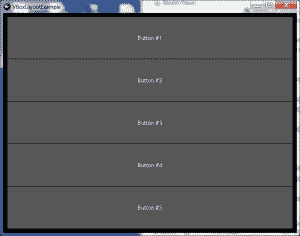
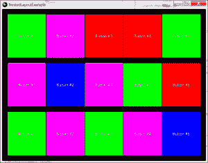
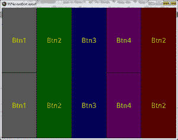

# Kivy 101:如何使用盒子布局

> 原文：<https://www.blog.pythonlibrary.org/2013/11/25/kivy-101-how-to-use-boxlayouts/>

最近我开始学习 Kivy，一个 Python 自然用户界面(NUI)工具包。据我所知，Kivy 是 pyMT 的精神继承者，你可以在这里阅读更多关于 T2 的内容。在这篇文章中，我们将学习 Kivy 如何处理布局管理。虽然您可以使用 x/y 坐标来定位小部件，但是在我使用过的每个 GUI 工具包中，使用工具包提供的某种布局管理几乎总是更好。这允许小部件在用户改变窗口大小时适当地调整大小和移动。在基维，这些东西**布局**。如果你用过 wxPython，它们类似于 wxPython 的 sizers。

我还应该注意到，Kivy 可以用两种不同的方式进行布局。第一种方法是只使用 Python 代码进行布局。第二种方式是混合使用 Python 和 Kv 语言。这是为了促进模型-视图-控制器的工作方式。它看起来有点像 CSS，让我想起了 wxPython 和 XRC。我们将在本文中研究如何使用这两种方法。虽然 Kivy 支持多种类型的布局，但本文将只关注 **BoxLayout** 。我们将展示如何嵌套 BoxLayouts。

### Kivy, Python and BoxLayout

[](https://www.blog.pythonlibrary.org/wp-content/uploads/2013/11/kivy_hboxlayout.png)

使用 Python 在 Kivy 中创建一个 BoxLayout 实际上非常简单和直观。我们将从一个代码示例开始，然后按照代码进行解释。我们开始吧！

```py

import kivy
import random

from kivy.app import App
from kivy.uix.button import Button
from kivy.uix.boxlayout import BoxLayout

red = [1,0,0,1]
green = [0,1,0,1]
blue =  [0,0,1,1]
purple = [1,0,1,1]

########################################################################
class HBoxLayoutExample(App):
    """
    Horizontally oriented BoxLayout example class
    """

    #----------------------------------------------------------------------
    def build(self):
        """
        Horizontal BoxLayout example
        """
        layout = BoxLayout(padding=10)
        colors = [red, green, blue, purple]

        for i in range(5):
            btn = Button(text="Button #%s" % (i+1),
                         background_color=random.choice(colors)
                         )

            layout.add_widget(btn)
        return layout

########################################################################
class VBoxLayoutExample(App):
    """
    Vertical oriented BoxLayout example class
    """

    #----------------------------------------------------------------------
    def setOrientation(self, orient):
        """"""
        self.orient = orient

    #----------------------------------------------------------------------
    def build(self):
        """"""
        layout = BoxLayout(padding=10, orientation=self.orient)

        for i in range(5):
            btn = Button(text="Button #%s" % (i+1) )
            layout.add_widget(btn)
        return layout

#----------------------------------------------------------------------
if __name__ == "__main__":
    app = HBoxLayoutExample()
    #app = VBoxLayoutExample()
    #app.setOrientation(orient="vertical")
    app.run()

```

这里我们创建了一个垂直方向的 BoxLayout 类和一个水平方向的 BoxLayout 类。每个类包含 5 个随机背景颜色的按钮。颜色遵循 RGBA，但可以有介于 0 和 1 之间的单个值。奇怪的是，如果你使用大于 1 的数字，颜色会变得更亮。当我创建上面的截图时，我碰巧用了 255 而不是 1，所以如果你碰巧运行这段代码并看到一组更柔和的颜色，这就是原因。

为了使例子非常简单，我们只导入 Kivy 的 App、Button 和 BoxLayout 类。BoxLayout 类接受几个参数，但我们将重点关注以下 3 个参数:方向、填充和间距。因为 BoxLayout 是 Layout 和 Widget 的子类，所以它继承了这里没有涉及的许多其他方法和关键字参数。但是回到我们目前关心的论点。**填充**参数告诉 Kivy 在布局和它的孩子之间应该有多少间距，而**间距**参数告诉它在孩子之间应该有多少间距。

为了创建按钮，我们使用了一个简单的循环来遍历一个小范围的数字。每次迭代都会创建一个具有随机背景颜色的按钮，并将该按钮添加到布局实例中。然后我们在最后返回布局。

**VBoxLayoutExample** 类中的垂直 BoxLayout 示例略有不同，因为我认为能够以编程方式设置方向会很有趣。除了我添加了一个 **setOrientation** 方法之外，代码基本相同。注意，如果再次调用 setOrientation，将没有任何效果。正如我的一位评论者友好地指出的那样，你需要将 orientation 绑定到 App orient 属性，或者使用 Kv 语言来实现这一点。

如果您在脚本末尾注释掉对 **HBoxLayoutExample** 的调用，并取消注释掉其他两行，那么您应该会看到类似这样的结果:

[](https://www.blog.pythonlibrary.org/wp-content/uploads/2013/11/kivy_vbox.png)

请注意，当您不设置背景颜色时，Kivy 默认为深灰色。Kivy 并不试图看起来像一个本地应用程序。这对于你来说可能是也可能不是什么大不了的事情，这取决于你想要完成什么样的项目，但是这一点应该注意。现在我们准备学习嵌套！

### 嵌套框布局

[](https://www.blog.pythonlibrary.org/wp-content/uploads/2013/11/kivy_nested_boxlayout.png)

Kivy 也很容易将 BoxLayouts 嵌套在一起。每当你创建一个需要嵌套尺寸的复杂界面的应用程序时，你应该花些时间用铅笔和纸勾画出布局。然后，您可以用不同的方式在小部件周围画出方框，以帮助您可视化您需要的布局以及如何将它们嵌套在一起。我发现这对于 wxPython 很有帮助，并且我认为它适用于任何其他没有 WYSIWYG 编辑器的 GUI 工具包。顺便说一下，BoxLayouts 非常强大。如果你知道你在做什么，你就可以使用巧妙的嵌套来创建任何接口。

说够了，我们来看一些代码！

```py

import kivy
import random

from kivy.app import App
from kivy.uix.button import Button
from kivy.uix.boxlayout import BoxLayout

red = [1,0,0,1]
green = [0,1,0,1]
blue =  [0,0,1,1]
purple = [1,0,1,1]

########################################################################
class NestedLayoutExample(App):
    """
    An example of nesting three horizontally oriented BoxLayouts inside
    of one vertically oriented BoxLayout
    """

    #----------------------------------------------------------------------
    def build(self):
        """
        Horizontal BoxLayout example
        """
        main_layout = BoxLayout(padding=10, orientation="vertical")

        colors = [red, green, blue, purple]

        for i in range(3):
            h_layout = BoxLayout(padding=10)
            for i in range(5):
                btn = Button(text="Button #%s" % (i+1),
                             background_color=random.choice(colors)
                             )

                h_layout.add_widget(btn)
            main_layout.add_widget(h_layout)

        return main_layout

#----------------------------------------------------------------------
if __name__ == "__main__":
    app = NestedLayoutExample()
    app.run()

```

这个例子和上一个很像。不过，问题出在细节上。这里我们有一个嵌套的 for 循环，它创建了 3 个 BoxLayouts，每个 box layouts 包含 5 个按钮。然后，在外部循环的每次迭代结束时，将每个布局插入到顶级布局中。如果你错过了它，请向上滚动，看看结果如何。诀窍是创建一个顶层或主布局，并向其添加其他布局。现在让我们把注意力转向学习如何用 Kv 语言做这些事情。

### Kv+Python 和 BoxLayout

[](https://www.blog.pythonlibrary.org/wp-content/uploads/2013/11/kivy_vbox.png)

学习一门新语言几乎总是有点痛苦。幸运的是，Kv 语言实际上非常接近 Python，包括 Python 使用缩进级别来表示一段代码何时开始和结束的要求。你可能想花几分钟在 Kivy 网站上阅读 Kv 语言。你准备好了，我们可以继续。首先，我们将从 Python 代码开始:

```py

# kvboxlayout.py

from kivy.app import App
from kivy.uix.boxlayout import BoxLayout

########################################################################
class KVMyHBoxLayout(BoxLayout):
    pass

########################################################################
class KVBoxLayoutApp(App):
    """"""

    #----------------------------------------------------------------------
    def build(self):
        """"""
        return KVMyHBoxLayout()

#----------------------------------------------------------------------
if __name__ == "__main__":
    app = KVBoxLayoutApp()
    app.run()

```

这段代码比我们前面的例子简单得多，但也相当神秘。首先，我们创建一个 BoxLayout 的空子类。然后我们创建我们的 App 类，它有一个 **build** 方法，该方法只返回空的 BoxLayout 类的一个实例。这是怎么回事？我们必须查看 Kv 文件才能找到答案！

```py

:
    color: .8,.9,0,1
    font_size: 32

<boxlayout>:
    orientation: 'horizontal'
    MyButton:
        text: "Btn1"
        background_color: 1,0,0,1
    MyButton:
        text: "Btn2"
        background_color: 0,1,0,1
    MyButton:
        text: "Btn3"
        background_color: 0,0,1,1
    MyButton:
        text: "Btn4"
        background_color: 1,0,1,1
    MyButton:
        text: "Btn5"
        background_color: 1,0,0,1</boxlayout> 
```

当您保存上面的代码时，您必须将其命名为与 App 类相同的名称，但是用. kv 代替. py，并且使用小写字母。这意味着这个 Kv 文件的名称需要是 **kvboxlayout.kv** 。您会注意到，您还需要去掉类名的 App 部分，这样 KVBoxLayoutApp 就变成了 kvboxlayout。是的，有点混乱。如果您没有正确遵循命名约定，文件将会运行，但是您将会看到一个空白的黑色窗口。

总之，首先在 Kv 文件中，我们有一个以`<mybutton>:`开头的部分。这告诉 Kivy，我们正在对 Button 类进行子类化，并将我们的子类叫做 **MyButton** 。然后我们缩进所需的四个空格，并设置按钮的标签颜色和字体大小。接下来，我们创建一个 BoxLayout 部分。注意，我们这次没有创建子类。然后我们告诉它应该是什么方向，并添加 5 个 MyButton 实例，每个实例都有自己的标签和颜色。

Kivy 的一位核心开发人员指出，通过以这种方式创建 BoxLayout，我正在为所有用途重新定义 BoxLayout。这是**而不是**一件好事，即使它确实使例子更简单。因此，在下一个例子中，我们将停止这样做，而是用正确的方法来做！

#### 带 Kv 的嵌套盒布局

[](https://www.blog.pythonlibrary.org/wp-content/uploads/2013/11/kv_nested_boxlayout.png)

在 Kv 中嵌套 BoxLayouts 一开始有点混乱，但是一旦你掌握了它，你会发现它真的很容易。我们将从 Python 代码开始，看看它是如何工作的，然后看看 Kv 代码。

```py

from kivy.app import App
from kivy.uix.boxlayout import BoxLayout
from kivy.uix.widget import Widget

########################################################################
class HBoxWidget(Widget):
    pass

########################################################################
class VBoxWidget(Widget):
    pass

########################################################################
class KVNestedBoxLayoutApp(App):
    """"""

    #----------------------------------------------------------------------
    def build(self):
        """"""
        return VBoxWidget()

#----------------------------------------------------------------------
if __name__ == "__main__":
    app = KVNestedBoxLayoutApp()
    app.run()

```

这一次，我们需要创建两个通用的小部件类:HBoxWidget 和 VBoxWidget。这些实际上是虚拟类，在 Kv 代码中变成了 BoxLayouts。说到这里，我们现在来看看。注意，您需要将 Kv 文件命名为 **kvnestedboxlayout.kv** ，您会注意到，它是 **KVNestedBoxLayoutApp** 的小写版本。

```py

:
    color: .8,.9,0,1
    font_size: 32

<hboxwidget>:
    BoxLayout:
        size: root.size
        pos: root.pos
        orientation: 'horizontal'
        MyButton:
            text: "Btn1"
            background_color: 1,1,1,1
        MyButton:
            text: "Btn2"
            background_color: 0,1,0,1
        MyButton:
            text: "Btn3"
            background_color: 0,0,1,1
        MyButton:
            text: "Btn4"
            background_color: 1,0,1,1
        MyButton:
            text: "Btn2"
            background_color: 1,0,0,1

<vboxwidget>:
    BoxLayout:
        size: root.size
        pos: root.pos
        id: foo_bar
        orientation: 'vertical'
        HBoxWidget:
        HBoxWidget:
```

按钮代码和以前一样。接下来我们有了 HBoxWidget，我们将其定义为一个包含 5 个按钮的水平 BoxLayout。然后我们创建一个垂直 BoxLayout 的 **VBoxWidget** 的实例，但是这个布局包含 HBoxWidget 的两个实例。您会注意到，在 Python 代码的 build 方法中，我们返回 VBoxWidget，所以这就是操作所在。如果您删除这两个 HBoxWidget 调用，结果将是一个空的黑色窗口。

在 Kivy 中使用 Kv 文件还有另外一种方法。它是通过 kivy.lang.Builder.load_file(或 load_string) API 实现的，这使您能够加载 Kv 文件，而无需记住以某种特殊的方式命名 Kv 文件。你可以在他们的[网站](http://kivy.org/docs/api-kivy.lang.html#kivy.lang.Builder)上读到这个 API，并在 github 上的 Kivy [示例中看到一个应用实例。使用这种方法的唯一警告是，您需要小心不要两次加载同一个文件，否则您的 UI 可能会出错。](https://github.com/kivy/kivy/blob/master/examples/widgets/screenmanager.py)

### 包扎

这只是触及了 Kivy 布局系统的表面。还有 6 种其他布局类型可用。然而，我想你会发现本文中的例子会让你开始成功地创建你自己的酷 Kivy 应用程序。如果你需要帮助学习 Kivy，他们的网站上有一套很好的文档。他们在 freenode 上还有一个谷歌群和一个 T2 频道。

### 相关阅读

*   Kivy 的[布局入门](http://kivy.org/docs/gettingstarted/layouts.html)
*   Kivy 的[编程指南](http://kivy.org/docs/guide/widgets.html#organize-with-layouts?)也涵盖了布局
*   github 上一个简单的嵌套布局示例
*   Kivy 的 [Kv 语言页](http://kivy.org/docs/guide/lang.html)
*   github 上的其他 [Kivy 示例](https://github.com/Kovak/KivyExamples)

### 下载源代码

*   [kivy_box_layouts.tar](https://www.blog.pythonlibrary.org/wp-content/uploads/2013/11/kivy_box_layouts.tar)
*   [kivy_box_layouts.zip](https://www.blog.pythonlibrary.org/wp-content/uploads/2013/11/kivy_box_layouts.zip)