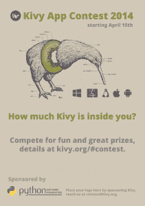

# Kivy App Contest 2014

> 原文：<https://www.blog.pythonlibrary.org/2014/03/17/kivy-app-contest-2014/>

Kivy 是一个开源 Python 库，用于快速开发利用创新用户界面的应用程序，如多点触摸应用程序。Kivy 组织正在组织第二次应用程序开发竞赛。！这对新用户和有经验的用户来说是一个展示技能和争夺奖品的好机会。参赛作品将根据一系列标准进行评判，新的和有经验的程序员都可以使用，所以不要害怕投入进去！欲了解更多信息，请访问[http://kivy.org/#contest](http://kivy.org/#contest)