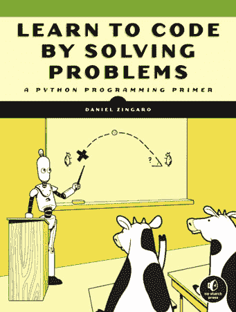

# 通过解决问题学习编码电子书竞赛

> 原文：<https://www.blog.pythonlibrary.org/2021/07/13/learn-to-code-by-solving-problems-ebook-contest/>

没有淀粉出版社与 Mouse vs Python 合作，为你带来一个电子书竞赛，题目是[通过解决问题学习编码:丹尼尔·津加罗的 Python 编程初级读本](https://amzn.to/3wCWDST)。

将有 **5 名获奖者**。要想加入，你只需要在推特上发布这篇文章，并标记 **@driscollis** 和 **@nostarch** 。

从现在起到 2021 年 11 月 20 日午夜 CST 你将可以参加这场比赛。获胜者将在 Twitter 上宣布并贴上标签，这样他们就知道他们赢了。然后，您需要联系@driscollis 领取奖品。