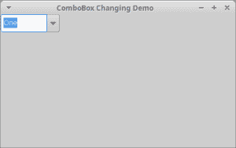

# 让用户更改 wx。wxPython 中 ComboBox 的内容

> 原文：<https://www.blog.pythonlibrary.org/2020/01/08/letting-users-change-a-wx-comboboxs-contents-in-wxpython/>

这个星期我遇到一个人，他想知道是否有一种方法允许用户编辑一个 **wx 的内容。组合框**。通过编辑内容，我的意思是更改 ComboBox 包含的预先存在的选项的名称，而不是向小部件添加新的项目。

当编辑组合框中所选项的内容时，小部件不会自动保存这些编辑。因此，如果您编辑了某个内容，然后在组合框中选择了不同的选项，被编辑的内容将恢复到之前的状态，您所做的更改将会丢失。

让我们看看如何创建一个允许这种功能的组合框！

| [](https://leanpub.com/reportlab) | 

### 用 wxPython 创建 GUI 应用程序

**立即在 [Leanpub](https://leanpub.com/creatingapplicationswithwxpython/) 或[亚马逊](https://www.amazon.com/dp/0996062890)购买** |

* * *

### 更改组合框



尝试新事物的第一步是写一些代码。您需要创建一个 **wx 的实例。ComboBox** 并向其传递一个选择列表，同时设置默认选择。当然，您不能孤立地创建一个小部件。小部件必须在父小部件内。在 wxPython 中，您几乎总是希望父对象是一个 **wx。面板**位于 **wx 的内部。画面**。

让我们编写一些代码，看看这一切是如何安排的:

```py

import wx

class MainPanel(wx.Panel):

    def __init__(self, parent):
        super().__init__(parent)

        self.cb_value = 'One'

        self.combo_contents = ['One', 'Two', 'Three']
        self.cb = wx.ComboBox(self, choices=self.combo_contents,
                              value=self.cb_value, size=(100, -1))

        self.cb.Bind(wx.EVT_TEXT, self.on_text_change)
        self.cb.Bind(wx.EVT_COMBOBOX, self.on_selection)

    def on_text_change(self, event):
        current_value = self.cb.GetValue()
        if current_value != self.cb_value and current_value not in self.combo_contents:
            # Value has been edited
            index = self.combo_contents.index(self.cb_value)
            self.combo_contents.pop(index)
            self.combo_contents.insert(index, current_value)
            self.cb.SetItems(self.combo_contents)
            self.cb.SetValue(current_value)
            self.cb_value = current_value

    def on_selection(self, event):
        self.cb_value = self.cb.GetValue()

class MainFrame(wx.Frame):

    def __init__(self):
        super().__init__(None, title='ComboBox Changing Demo')
        panel = MainPanel(self)
        self.Show()

if __name__ == "__main__":
    app = wx.App(False)
    frame = MainFrame()
    app.MainLoop()

```

您感兴趣的代码的主要部分在 **MainPanel** 类中。在这里创建小部件，设置它的选择列表和几个其他参数。接下来，您需要将 ComboBox 绑定到两个事件:

*   **wx。EVT _ 文本** -用于文本改变事件
*   **wx。EVT _ 组合框** -用于改变项目选择事件

第一个事件， **wx。EVT _ 文本**，当你通过输入改变小部件中的文本时触发，当你改变选择时也触发。另一个事件仅在您更改选择时触发。 **wx。EVT_TEXT** 事件首先触发，因此它优先于 **wx。EVT _ 组合框**。

当您更改文本时， **on_text_change()** 被调用。在这里，您将检查 ComboBox 的当前值是否与您期望的值相匹配。您还要检查当前值是否与当前设置的选择列表相匹配。这允许您查看用户是否更改了文本。如果有，那么您需要获取选择列表中当前所选项的索引。

然后使用列表的 **pop()** 方法删除旧字符串，并使用 **insert()** 方法添加新字符串。现在您需要调用小部件的 **SetItems()** 方法来更新它的**选择**列表。然后，将它的值设置为新的字符串，并更新 **cb_value** 实例变量，这样就可以检查它以后是否会再次改变。

**on_selection()** 法短而甜。它所做的只是将 **cb_value** 更新为当前的选择。

试试这段代码，看看它是如何工作的！

* * *

### 包扎

增加了允许用户更新 **wx 的能力。ComboBox** 的内容并不特别难。你甚至可以子类化 **wx。ComboBox** 并创建一个版本，让它一直为你做这件事。另一个有趣的增强是让小部件从配置文件或 JSON 文件中加载它的选择。然后你可以更新 **on_text_change()** 将你的更改保存到磁盘，然后你的应用程序可以保存这些选择，并在你下次启动应用程序时重新加载它们。

开心快乐编码！