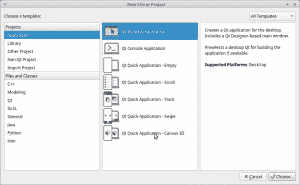
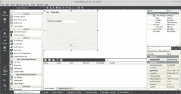
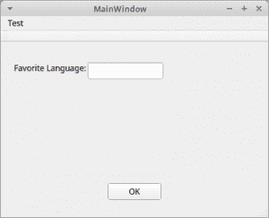

# 在 Qt for Python 中加载 UI 文件

> 原文：<https://www.blog.pythonlibrary.org/2018/05/30/loading-ui-files-in-qt-for-python/>

Qt for Python(即 PySide2)最近发布了，这让我有兴趣尝试用它来加载 UI 文件。如果你不知道，PyQt 和 PySide / PySide2 可以使用 [Qt Creator 应用程序](http://doc.qt.io/qtcreator/creator-using-qt-designer.html)创建使用拖放界面的用户界面。这实际上与您使用 Visual Studio 创建界面的方式非常相似。Qt 创建者/设计者将生成一个带有*的 XML 文件。然后可以在 PySide2 应用程序(或 PyQt)中加载的 ui 扩展。

* * *

### 创建用户界面

对于这个例子，我打开 Qt Creator，进入“文件”->“新建文件或项目”。然后我选择了“Qt Widgets 应用”选项。见下面截图:



然后我打开了 Qt Creator 给我做的 **mainwindow.ui** 。你可以双击它或者点击程序左边的设计按钮。这里有一个截图可能会有所帮助:



我在我的 UI 中添加了三个小部件:

*   QLabel
*   QLineEdit
*   q 按钮

当我保存文件时，我在我的 UI 文件中得到以下内容:

```py

 <class>MainWindow</class>
 <widget class="QMainWindow" name="MainWindow"><property name="geometry"><rect><x>0</x>
    <y>0</y>
    <width>400</width>
    <height>300</height></rect></property> 
  <property name="windowTitle"><string>MainWindow</string></property> 
  <widget class="QWidget" name="centralWidget"><widget class="QPushButton" name="pushButton"><property name="geometry"><rect><x>160</x>
      <y>210</y>
      <width>80</width>
      <height>25</height></rect></property> 
    <property name="text"><string>OK</string></property></widget> 
   <widget class="QLineEdit" name="lineEdit"><property name="geometry"><rect><x>130</x>
      <y>30</y>
      <width>113</width>
      <height>25</height></rect></property></widget> 
   <widget class="QLabel" name="label"><property name="geometry"><rect><x>20</x>
      <y>30</y>
      <width>111</width>
      <height>17</height></rect></property> 
    <property name="text"><string>Favorite Language:</string></property></widget></widget> 
  <widget class="QMenuBar" name="menuBar"><property name="geometry"><rect><x>0</x>
     <y>0</y>
     <width>400</width>
     <height>22</height></rect></property> 
   <widget class="QMenu" name="menuTest"><property name="title"><string>Test</string></property></widget></widget> 
  <widget class="QToolBar" name="mainToolBar"><attribute name="toolBarArea"><enum>TopToolBarArea</enum></attribute> 
   <attribute name="toolBarBreak"><bool>false</bool></attribute></widget> 

 <layoutdefault spacing="6" margin="11"></layoutdefault></widget> 

```

现在我们只需要学习如何在 Qt for Python 中加载这个文件。

* * *

### 在 Qt for Python 中加载 UI 文件



我发现有几种不同的方法可以用来在 Qt for Python (PySide2)中加载 UI 文件。第一个是从 Qt 为 Python 的 [wiki](http://wiki.qt.io/Qt_for_Python_UiFiles) 大量引用的:

```py

import sys

from PySide2.QtUiTools import QUiLoader
from PySide2.QtWidgets import QApplication
from PySide2.QtCore import QFile

if __name__ == "__main__":
    app = QApplication(sys.argv)
    file = QFile("mainwindow.ui")
    file.open(QFile.ReadOnly)
    loader = QUiLoader()
    window = loader.load(file)
    window.show()
    sys.exit(app.exec_())

```

虽然这可以工作，但它并没有真正向您展示如何连接事件或从用户界面中获得任何有用的东西。坦白地说，我认为这是一个愚蠢的例子。因此，我在其他网站上查找了一些其他例子，并最终将以下内容整合在一起:

```py

import sys

from PySide2.QtUiTools import QUiLoader
from PySide2.QtWidgets import QApplication, QPushButton, QLineEdit
from PySide2.QtCore import QFile, QObject

class Form(QObject):

    def __init__(self, ui_file, parent=None):
        super(Form, self).__init__(parent)
        ui_file = QFile(ui_file)
        ui_file.open(QFile.ReadOnly)

        loader = QUiLoader()
        self.window = loader.load(ui_file)
        ui_file.close()

        self.line = self.window.findChild(QLineEdit, 'lineEdit')

        btn = self.window.findChild(QPushButton, 'pushButton')
        btn.clicked.connect(self.ok_handler)
        self.window.show()

    def ok_handler(self):
        language = 'None' if not self.line.text() else self.line.text()
        print('Favorite language: {}'.format(language))

if __name__ == '__main__':
    app = QApplication(sys.argv)
    form = Form('mainwindow.ui')
    sys.exit(app.exec_())

```

在这个例子中，我们创建一个表单对象，并使用 **QUiLoader** 和 **QFile** 加载 UI 文件。然后我们对从 QUiLoader 返回的对象使用 **findChild** 方法来提取我们感兴趣的小部件对象。对于这个例子，我提取了 QLineEdit 小部件，这样我就可以得到用户输入的内容，还提取了 QPushButton 小部件，这样我就可以捕捉按钮被点击的事件。最后，我将 click 事件连接到一个事件处理程序(或插槽)。

* * *

### 包扎

至此，您应该对如何使用 Qt 的 Creator / Designer 应用程序创建用户界面以及如何将它生成的 UI 文件加载到您的 Python 应用程序中有了大致的了解。这是相当直截了当的，但不是很好的记录。您也可以跳过创建 UI 文件，手动编写所有代码。不管您选择哪种方法，这似乎都是一个相当容易上手的工具包，尽管我希望文档/教程能尽快增加细节。

* * *

### 相关阅读

*   Python Ui 文件的 Qt[wiki 页面](http://wiki.qt.io/Qt_for_Python_UiFiles)
*   PySide [食谱](https://www.visitusers.org/index.php?title=PySide_Recipes)
*   StackOverflow - [加载 QtDesigner 的。PySide 中的 ui 文件](https://stackoverflow.com/q/7144313/393194)
*   PyQt4 在 [Qt Designer](http://pyqt.sourceforge.net/Docs/PyQt5/designer.html) 上的页面