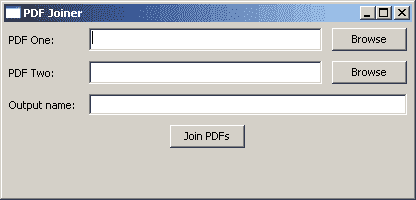

# 使用 Python 和 pyPdf 操作 Pdf

> 原文：<https://www.blog.pythonlibrary.org/2010/05/15/manipulating-pdfs-with-python-and-pypdf/>

有一个方便的第三方模块叫做 [pyPdf](http://pybrary.net/pyPdf/) ，你可以用它来合并 Pdf 文档，旋转页面，分割和裁剪页面，以及解密/加密 PDF 文档。在本文中，我们将看看其中的一些函数，然后用 [wxPython](http://www.wxpython.org) 创建一个简单的 GUI，它将允许我们合并几个 pdf。

## pyPdf 之旅

要充分利用 pyPdf，您需要了解它的两个主要功能:PdfFileReader 和 PdfFileWriter。它们是我用得最多的。让我们看看他们能做些什么:

```py

# Merge two PDFs
from pyPdf import PdfFileReader, PdfFileWriter

output = PdfFileWriter()
pdfOne = PdfFileReader(file( "some\path\to\a\PDf", "rb"))
pdfTwo = PdfFileReader(file("some\other\path\to\a\PDf", "rb"))

output.addPage(pdfOne.getPage(0))
output.addPage(pdfTwo.getPage(0))

outputStream = file(r"output.pdf", "wb")
output.write(outputStream)
outputStream.close()

```

上面的代码将打开两个 PDF，从每一个中取出第一页，并通过合并这两页创建第三个 PDF。注意页面是从零开始的，所以零是第一页，一是第二页，以此类推。我使用这种脚本从 PDF 中提取一个或多个页面，或者将一系列 PDF 连接在一起。例如，有时我的用户会收到一堆扫描的文档，文档的每一页都以单独的 PDF 结束。他们需要将所有的单页合并成一个 PDF，pyPdf 允许我非常简单地做到这一点。

在我的日常体验中，pyPdf 提供给我的旋转功能的应用并不多，但也许你有很多横向而不是纵向扫描文档的用户，你最终需要做很多旋转。幸运的是，这是相当无痛的:

```py

from pyPdf import PdfFileWriter, PdfFileReader

output = PdfFileWriter()
input1 = PdfFileReader(file("document1.pdf", "rb"))
output.addPage(input1.getPage(1).rotateClockwise(90))
# output.addPage(input1.getPage(2).rotateCounterClockwise(90))

outputStream = file("output.pdf", "wb")
output.write(outputStream)
outputStream.close()

```

上面的代码摘自 pyPdf 文档，在本例中被缩短了。如你所见，要调用的方法是 *rotateClockwise* 或 *rotateCounterClockwise* 。确保将翻页的度数传递给该方法。

现在，让我们来看看我们可以从 PDF 中获得什么信息:

```py

>>> from pyPdf import PdfFileReader
>>> p = r'E:\My Documents\My Dropbox\ebooks\helloWorld book.pdf'
>>> pdf = PdfFileReader(file(p, 'rb'))
>>> pdf.documentInfo
{'/CreationDate': u'D:20090323080712Z', '/Author': u'Warren Sande', '/Producer': u'Acrobat Distiller 8.0.0 (Windows)', '/Creator': u'FrameMaker 8.0', '/ModDate': u"D:20090401124817-04'00'", '/Title': u'Hello World!'}
>>> pdf.getNumPages()
432
>>> info = pdf.getDocumentInfo()
>>> info.author
u'Warren Sande'
>>> info.creator
u'FrameMaker 8.0'
>>> info.producer
u'Acrobat Distiller 8.0.0 (Windows)'
>>> info.title
u'Hello World!'

```

如您所见，我们可以使用 pyPdf 收集相当多的有用数据。现在让我们创建一个简单的 GUI 来使合并两个 pdf 更加容易！

## 创建 wxPython PDF 合并应用程序

[](https://www.blog.pythonlibrary.org/wp-content/uploads/2010/05/pdf_joiner.png)

我昨天想出了这个剧本。它使用 Tim Golden 的 [winshell](http://timgolden.me.uk/python/winshell.html) 模块，让我在 Windows 上轻松访问用户的桌面。如果你在 Linux 或 Mac 上，那么你会想为你的平台改变这部分代码。我想使用 wxPython 的 StandardPaths 模块，但是它没有获取我可以看到的桌面的功能。总之，说够了。我们来看一些代码！

```py

import os
import pyPdf
import winshell
import wx

class MyFileDropTarget(wx.FileDropTarget):
    def __init__(self, window):
        wx.FileDropTarget.__init__(self)
        self.window = window

    def OnDropFiles(self, x, y, filenames):
        self.window.SetInsertionPointEnd()

        for file in filenames:
            self.window.WriteText(file)

########################################################################
class JoinerPanel(wx.Panel):
    """"""

    #----------------------------------------------------------------------
    def __init__(self, parent):
        """Constructor"""
        wx.Panel.__init__(self, parent=parent)

        self.currentPath = winshell.desktop()

        lblSize = (70,-1)
        pdfLblOne = wx.StaticText(self, label="PDF One:", size=lblSize)
        self.pdfOne = wx.TextCtrl(self)
        dt = MyFileDropTarget(self.pdfOne)
        self.pdfOne.SetDropTarget(dt)
        pdfOneBtn = wx.Button(self, label="Browse", name="pdfOneBtn")
        pdfOneBtn.Bind(wx.EVT_BUTTON, self.onBrowse)

        pdfLblTwo = wx.StaticText(self, label="PDF Two:", size=lblSize)
        self.pdfTwo = wx.TextCtrl(self)
        dt = MyFileDropTarget(self.pdfTwo)
        self.pdfTwo.SetDropTarget(dt)
        pdfTwoBtn = wx.Button(self, label="Browse", name="pdfTwoBtn")
        pdfTwoBtn.Bind(wx.EVT_BUTTON, self.onBrowse)

        outputLbl = wx.StaticText(self, label="Output name:", size=lblSize)
        self.outputPdf = wx.TextCtrl(self)
        widgets = [(pdfLblOne, self.pdfOne, pdfOneBtn),
                   (pdfLblTwo, self.pdfTwo, pdfTwoBtn),
                   (outputLbl, self.outputPdf)]

        joinBtn = wx.Button(self, label="Join PDFs")
        joinBtn.Bind(wx.EVT_BUTTON, self.onJoinPdfs)

        self.mainSizer = wx.BoxSizer(wx.VERTICAL)
        for widget in widgets:
            self.buildRows(widget)
        self.mainSizer.Add(joinBtn, 0, wx.ALL|wx.CENTER, 5)
        self.SetSizer(self.mainSizer)

    #----------------------------------------------------------------------
    def buildRows(self, widgets):
        """"""
        sizer = wx.BoxSizer(wx.HORIZONTAL)
        for widget in widgets:
            if isinstance(widget, wx.StaticText):
                sizer.Add(widget, 0, wx.ALL|wx.CENTER, 5)
            elif isinstance(widget, wx.TextCtrl):
                sizer.Add(widget, 1, wx.ALL|wx.EXPAND, 5)
            else:
                sizer.Add(widget, 0, wx.ALL, 5)
        self.mainSizer.Add(sizer, 0, wx.EXPAND)

    #----------------------------------------------------------------------
    def onBrowse(self, event):
        """
        Browse for PDFs
        """
        widget = event.GetEventObject()
        name = widget.GetName()

        wildcard = "PDF (*.pdf)|*.pdf"
        dlg = wx.FileDialog(
            self, message="Choose a file",
            defaultDir=self.currentPath, 
            defaultFile="",
            wildcard=wildcard,
            style=wx.OPEN | wx.CHANGE_DIR
            )
        if dlg.ShowModal() == wx.ID_OK:
            path = dlg.GetPath()
            if name == "pdfOneBtn":
                self.pdfOne.SetValue(path)
            else:
                self.pdfTwo.SetValue(path)
            self.currentPath = os.path.dirname(path)
        dlg.Destroy()

    #----------------------------------------------------------------------
    def onJoinPdfs(self, event):
        """
        Join the two PDFs together and save the result to the desktop
        """
        pdfOne = self.pdfOne.GetValue()
        pdfTwo = self.pdfTwo.GetValue()
        if not os.path.exists(pdfOne):
            msg = "The PDF at %s does not exist!" % pdfOne
            dlg = wx.MessageDialog(None, msg, 'Error', wx.OK|wx.ICON_EXCLAMATION)
            dlg.ShowModal()
            dlg.Destroy()
            return
        if not os.path.exists(pdfTwo):
            msg = "The PDF at %s does not exist!" % pdfTwo
            dlg = wx.MessageDialog(None, msg, 'Error', wx.OK|wx.ICON_EXCLAMATION)
            dlg.ShowModal()
            dlg.Destroy()
            return

        outputPath = os.path.join(winshell.desktop(), self.outputPdf.GetValue()) + ".pdf"
        output = pyPdf.PdfFileWriter()

        pdfOne = pyPdf.PdfFileReader(file(pdfOne, "rb"))
        for page in range(pdfOne.getNumPages()):
            output.addPage(pdfOne.getPage(page))
        pdfTwo = pyPdf.PdfFileReader(file(pdfTwo, "rb"))
        for page in range(pdfTwo.getNumPages()):
            output.addPage(pdfTwo.getPage(page))

        outputStream = file(outputPath, "wb")
        output.write(outputStream)
        outputStream.close()

        msg = "PDF was save to " + outputPath
        dlg = wx.MessageDialog(None, msg, 'PDF Created', wx.OK|wx.ICON_INFORMATION)
        dlg.ShowModal()
        dlg.Destroy()

        self.pdfOne.SetValue("")
        self.pdfTwo.SetValue("")
        self.outputPdf.SetValue("")

########################################################################
class JoinerFrame(wx.Frame):

    #----------------------------------------------------------------------
    def __init__(self):
        wx.Frame.__init__(self, None, wx.ID_ANY, 
                          "PDF Joiner", size=(550, 200))
        panel = JoinerPanel(self)

#----------------------------------------------------------------------
# Run the program
if __name__ == "__main__":
    app = wx.App(False)
    frame = JoinerFrame()
    frame.Show()
    app.MainLoop()

```

你会注意到框架和面板有愚蠢的名字。请随意更改它们。这毕竟是 Python 啊！MyFileDropTarget 类用于在前两个文本控件上启用拖放功能。如果用户愿意，他们可以将 PDF 拖到其中一个文本控件上，路径就会神奇地被插入。否则，他们可以使用浏览按钮来查找他们选择的 PDF。一旦他们选择了他们的 PDF，他们需要输入输出 PDF 的名称，这个名称在第三个文本控件中。你甚至不需要添加“.pdf”扩展名，因为这个应用程序将为您做这件事。

最后一步是按下“加入 pdf”按钮。这会将第二个 PDF 添加到第一个 PDF 的末尾，如果创建成功，会显示一个对话框。为了正确运行，我们需要循环每个 PDF 的所有页面，并按顺序将它们添加到输出中。

用某种拖放界面来增强这个应用程序会很有趣，用户可以看到 PDF 页面，并通过拖动它们来重新排列它们。或者只是能够从每个 PDF 文件中指定几页来添加，而不是将它们完整地连接起来。不过，我将把这些作为练习留给读者。

我希望你觉得这篇文章很有趣，它会激发你的创造力。如果你用这些想法写了一些很酷的东西，一定要发表评论让我能看到！