# matplotlib——用 Python 创建图形的介绍

> 原文：<https://www.blog.pythonlibrary.org/2021/09/07/matplotlib-an-intro-to-creating-graphs-with-python/>

数据可视化是与他人共享数据的一种重要方法。有些人把可视化称为绘图、图表或图形。这些名字在本文中是同义的。

Python 有许多第三方包来实现数据可视化。事实上，有这么多，它可以有些不知所措。其中最古老也是最受欢迎的是 [**Matplotlib**](https://matplotlib.org/) 。Matplotlib 以在 Python 中创建静态、动画和交互式可视化而闻名。

您可以使用 Matplotlib 创建许多不同类型的绘图和图表。它还可以与其他数据科学和数学库很好地集成，如 **NumPy** 和 **pandas** 。您还会发现 Matplotlib 可以与 Python 的大多数 GUI 工具包兼容，如 Tkinter、wxPython 和 PyQt。因为 Matplotlib 如此出名，所以它将是本文所涉及的图形包。

您将了解以下主题:

*   用 PyPlot 创建简单的折线图
*   创建条形图
*   创建饼图
*   添加标签
*   向地块添加标题
*   创造传奇
*   显示多个图形

让我们开始用 Matplotlib 绘图吧！

## 安装 Matplotlib

您需要安装 Matplotlib 才能使用它。幸运的是，使用`pip`很容易做到:

```py
python -m pip install matplotlib 
```

这将安装 Matplotlib 以及它需要的任何依赖项。现在你已经准备好开始绘图了！

## 用 PyPlot 创建简单的折线图

创建图表(或绘图)是使用绘图包的主要目的。Matplotlib 有一个名为`pyplot`的子模块，您将使用它来创建一个图表。首先，创建一个名为`line_plot.py`的新文件，并添加以下代码:

```py
# line_plot.py

import matplotlib.pyplot as plt

def line_plot(numbers):
    plt.plot(numbers)
    plt.ylabel('Random numbers')
    plt.show()

if __name__ == '__main__':
    numbers = [2, 4, 1, 6]
    line_plot(numbers)

```

在这里，您将`matplotlib.pyplot`作为`plt`导入。然后创建一个`line_plot()`，它接受一个 Python 数字列表。要绘制数字，您可以使用`plot()`功能。您还可以向 y 轴添加一个标签。最后，你调用`show()`来显示情节。

您现在应该会看到一个如下所示的窗口:

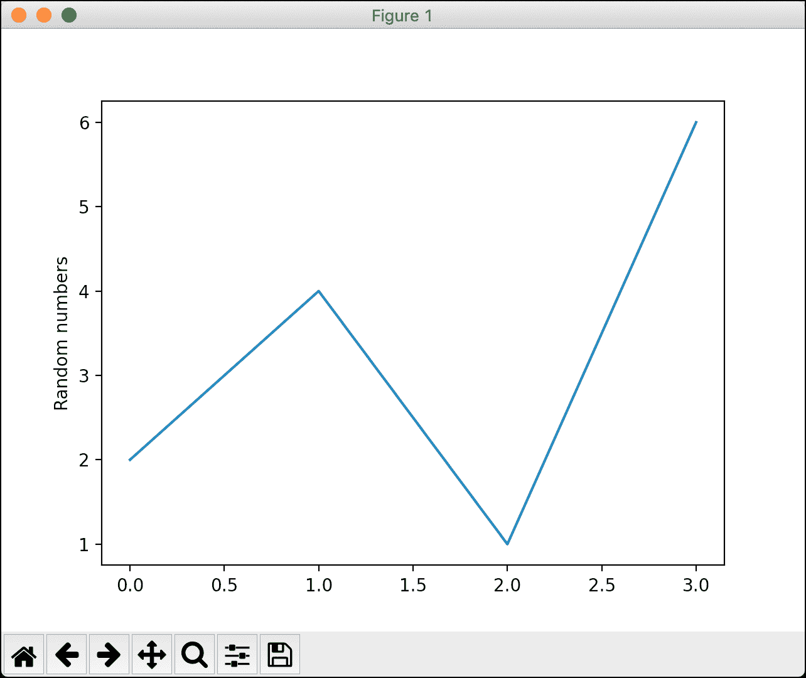

现在你知道如何使用 Matplotlib 创建一个简单的折线图了！现在，您将在下一节中了解如何制作条形图。

## 创建条形图

使用 Matplotlib 创建条形图与创建折线图非常相似。只需要一些额外的参数。继续创建一个名为`bar_chart.py`的新文件，并在其中输入以下代码:

```py
# bar_chart.py

import matplotlib.pyplot as plt

def bar_chart(numbers, labels, pos):
    plt.bar(pos, numbers, color='blue')
    plt.xticks(ticks=pos, labels=labels)
    plt.show()

if __name__ == '__main__':
    numbers = [2, 1, 4, 6]
    labels = ['Electric', 'Solar', 'Diesel', 'Unleaded']
    pos = list(range(4))
    bar_chart(numbers, labels, pos)

```

当您使用`bar()`创建一个条形图时，您会传入一个 x 轴的值列表。然后你传入一个酒吧的高度列表。您还可以选择设置条形的颜色。在这种情况下，您将它们设置为“蓝色”。接下来，设置`xticks()`，它是应该出现在 x 轴上的刻度线。您还可以传入对应于刻度的标签列表。

继续运行这段代码，您应该会看到下图:

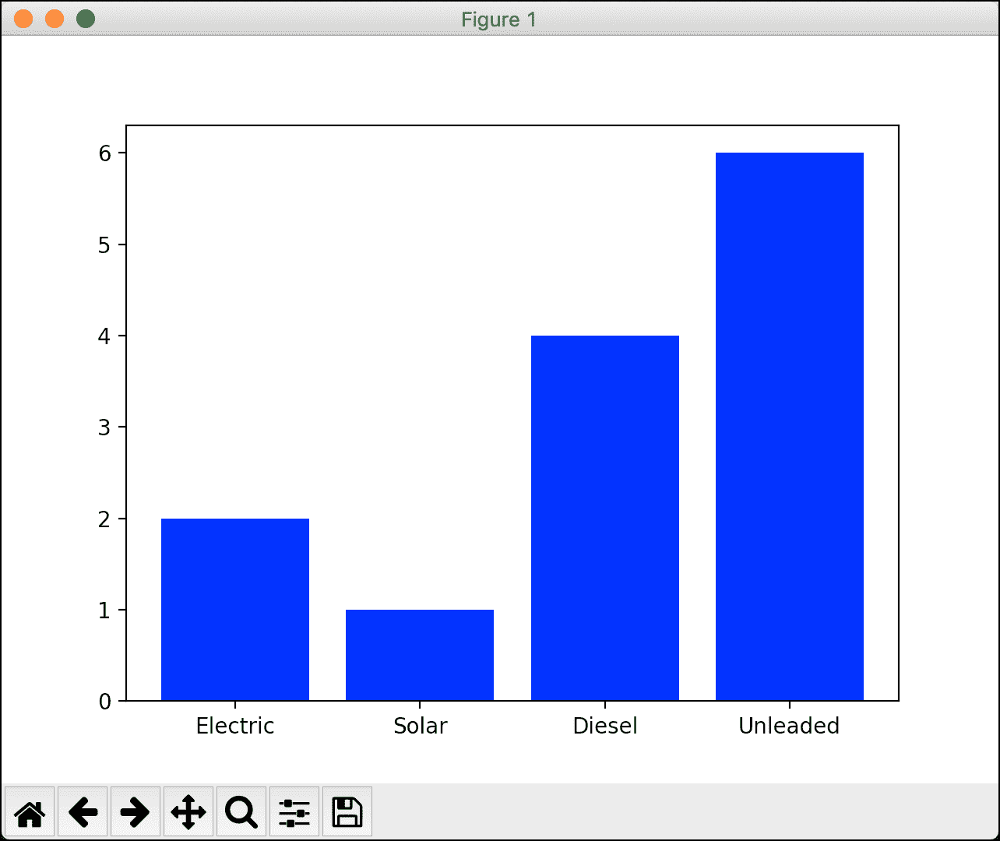

也可以用 Matplotlib 做一个水平条形图。你需要做的就是把`bar()`改成`barh()`。创建一个名为`bar_chartsh.py`的新文件，并添加以下代码:

```py
# bar_charth.py

import matplotlib.pyplot as plt

def bar_charth(numbers, labels, pos):
    plt.barh(pos, numbers, color='blue')
    plt.yticks(ticks=pos, labels=labels)
    plt.show()

if __name__ == '__main__':
    numbers = [2, 1, 4, 6]
    labels = ['Electric', 'Solar', 'Diesel', 'Unleaded']
    pos = list(range(4))
    bar_charth(numbers, labels, pos)

```

这里还有一个偷偷摸摸的变化。你能发现它吗？变化在于，由于现在它是一个水平条形图，您将希望设置`yticks()`而不是`xticks()`，否则它看起来不会很正确。

一旦一切准备就绪，运行代码，您将看到以下内容:

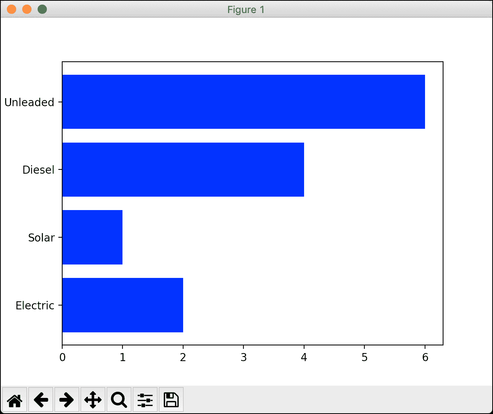

这看起来很棒，而且根本不需要太多代码！现在让我们看看如何用 Matplotlib 创建一个饼图。

## 创建饼图

饼状图有点与众不同。要创建一个饼图，您将使用 Matplotlib 的`subplots()`函数，该函数返回一个`Figure`和一个`Axes`对象。要查看它是如何工作的，创建一个名为`pie_chart_plain.py`的新文件，并将以下代码放入其中:

```py
# pie_chart_plain.py

import matplotlib.pyplot as plt

def pie_chart():
    numbers = [40, 35, 15, 10]
    labels = ['Python', 'Ruby', 'C++', 'PHP']

    fig1, ax1 = plt.subplots()
    ax1.pie(numbers, labels=labels)
    plt.show()

if __name__ == '__main__':
    pie_chart()

```

在这段代码中，您创建了`subplots()`，然后使用了`Axes`对象的`pie()`方法。您像以前一样传入一个数字列表，以及一个标签列表。然后当您运行代码时，您将看到您的饼图:

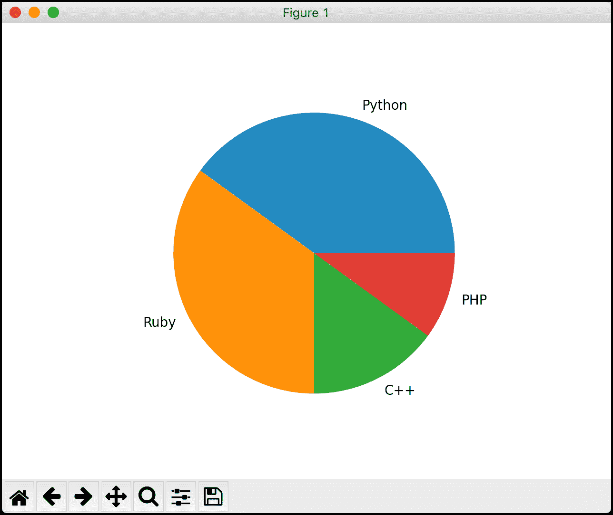

对于这么短的代码来说，这已经很不错了。但是你可以让你的饼图看起来更好。创建一个名为`pie_chart_fancy.py`的新文件，并添加以下代码，看看如何操作:

```py
# pie_chart_fancy.py

import matplotlib.pyplot as plt

def pie_chart():
    numbers = [40, 35, 15, 10]
    labels = ['Python', 'Ruby', 'C++', 'PHP']
    # Explode the first slice (Python)
    explode = (0.1, 0, 0, 0)

    fig1, ax1 = plt.subplots()
    ax1.pie(numbers, explode=explode, labels=labels,
            shadow=True, startangle=90,
            autopct='%1.1f%%')
    ax1.axis('equal')
    plt.show()

if __name__ == '__main__':
    pie_chart()

```

对于本例，您使用`explode`参数来告诉饼图“爆炸”或从饼图中移除一个切片。在这种情况下，您删除第一个切片，它对应于“Python”。您还可以向饼图添加一个`shadow`。您可以通过设置`startangle`来告诉您的饼图逆时针旋转一定的角度。如果您想显示切片百分比，可以使用`autopct`，它将使用 Python 的字符串插值语法。

当您运行这段代码时，您的饼图将如下所示:

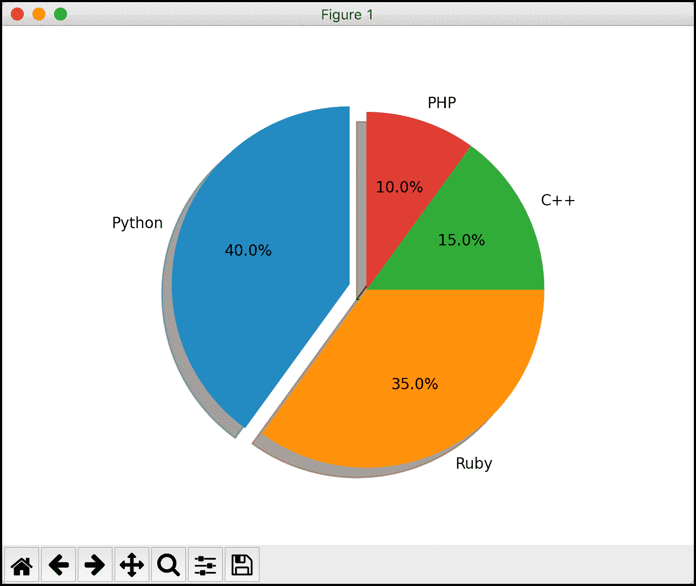

这不是很棒吗？你的饼图现在看起来更加完美了！现在是时候学习如何给其他图表添加标签了！

## 添加标签

当您绘制数据时，您通常会想要标注轴。您可以使用`xlabel()`功能标记 x 轴，使用相应的`ylabel()`功能标记 y 轴。要了解这是如何工作的，创建一个名为`bar_chart_labels.py`的文件，并向其中添加以下代码:

```py
# bar_chart_labels.py

import matplotlib.pyplot as plt

def bar_chart(numbers, labels, pos):
    plt.bar(pos, numbers, color='blue')
    plt.xticks(ticks=pos, labels=labels)
    plt.xlabel('Vehicle Types')
    plt.ylabel('Number of Vehicles')
    plt.show()

if __name__ == '__main__':
    numbers = [2, 1, 4, 6]
    labels = ['Electric', 'Solar', 'Diesel', 'Unleaded']
    pos = list(range(4))
    bar_chart(numbers, labels, pos)

```

这里你同时调用了`xlabel()`和`ylabel()`并将它们设置为不同的字符串。这将分别在图表的下方和左侧添加一些说明性文本。结果如下所示:

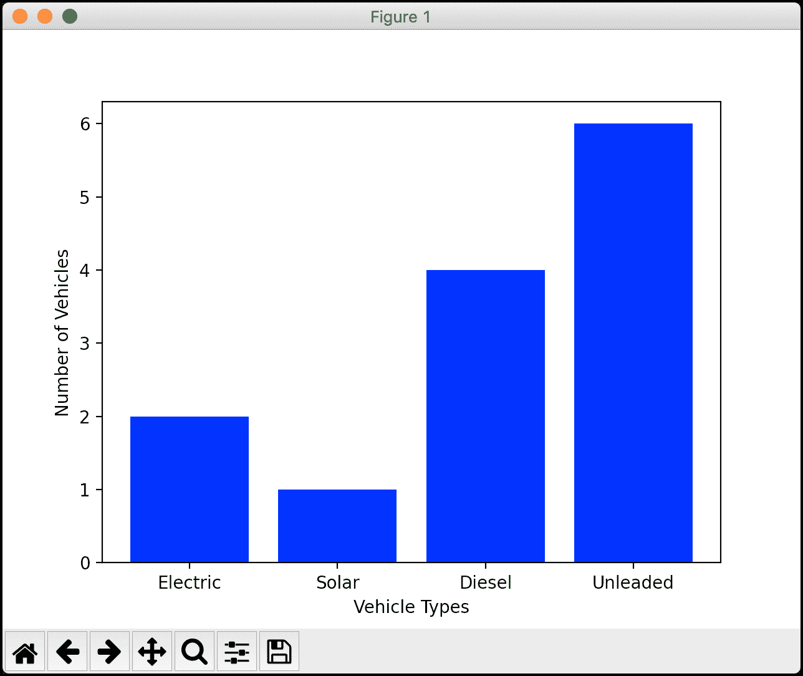

看起来很不错。你的图表更容易理解，但它缺少一个标题。您将在下一节学习如何做到这一点！

## 向地块添加标题

用 Matplotlib 给你的图表添加标题非常简单。事实上，你需要做的就是使用`title()`函数来添加一个。要了解如何操作，创建一个名为`bar_chart_title.py`的新文件，并向其中添加以下代码:

```py
# bar_chart_title.py

import matplotlib.pyplot as plt

def bar_chart(numbers, labels, pos):
    plt.bar(pos, [4, 5, 6, 3], color='green')
    plt.bar(pos, numbers, color='blue')
    plt.xticks(ticks=pos, labels=labels)
    plt.title('Gas Used in Various Vehicles')
    plt.xlabel('Vehicle Types')
    plt.ylabel('Number of Vehicles')
    plt.show()

if __name__ == '__main__':
    numbers = [2, 1, 4, 6]
    labels = ['Electric', 'Solar', 'Diesel', 'Unleaded']
    pos = list(range(4))
    bar_chart(numbers, labels, pos)

```

这里的主要变化在第 9 行，在那里调用`title()`并传入一个字符串。默认情况下，这会设置图形的标题，并使其沿顶部居中。您可以通过将`loc`参数设置为“left”或“right”来稍微更改位置，但是您不能指定标题位于顶部以外的任何位置。还有一个`fontdict`参数，可以用来控制标题字体的外观。

您还可以向图表中添加一个新的条形图。这有助于您了解堆积条形图的外观，并为下一节做好准备。

你的图表现在看起来是这样的:

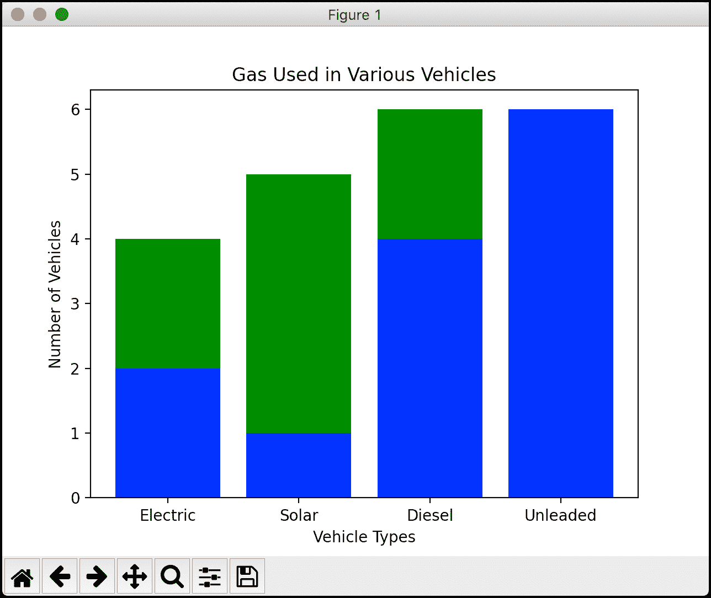

这张图看起来更好，但它仍然缺少一些东西。哦！你需要一个传奇！让我们看看下一步该怎么做。

## 创造传奇

向 Matplotlib 图添加图例也很简单。您将使用`legend()`功能添加一个。创建一个名为`bar_chart_legend.py`的新文件。然后，向其中添加以下代码:

```py
# bar_chart_legend.py

import matplotlib.pyplot as plt

def bar_chart(numbers, labels, pos):
    plt.bar(pos, [4, 5, 6, 3], color='green')
    plt.bar(pos, numbers, color='blue')
    plt.xticks(ticks=pos, labels=labels)
    plt.xlabel('Vehicle Types')
    plt.ylabel('Number of Vehicles')
    plt.legend(['First Label', 'Second Label'], loc='upper left')
    plt.show()

if __name__ == '__main__':
    numbers = [2, 1, 4, 6]
    labels = ['Electric', 'Solar', 'Diesel', 'Unleaded']
    pos = list(range(4))
    bar_chart(numbers, labels, pos)

```

在这里，您在图表的`show()`前添加一个`legend()`。创建图例时，可以通过传入字符串列表来设置标签。列表应与图形中的地块数量相匹配。您也可以使用`loc`参数设置图例的位置。

当您运行这段代码时，您将看到您的图形更新成这样: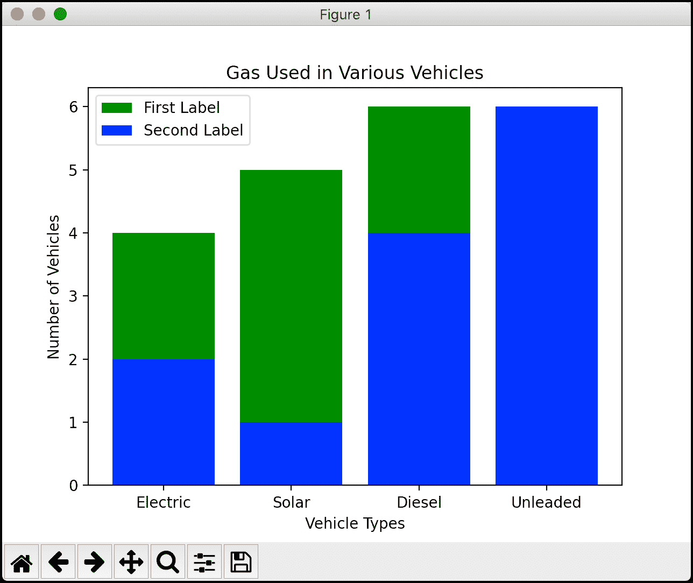

现在你的图拥有了你期望在图中拥有的所有正常组件。至此，您已经看到了许多使用 Matplotlib 可以完成的任务。最后一个要学习的主题是如何用 Matplotlib 将多个图形相加。

## 显示多个图形

Matplotlib 允许您在显示之前创建几个图。这使您可以同时处理多个数据集。有几种不同的方法可以做到这一点。您将看到一种最简单的方法。

创建一个名为`multiple_figures.py`的新文件，并添加以下代码:

```py
# multiple_figures.py

import matplotlib.pyplot as plt

def line_plot(numbers, numbers2):
    first_plot = plt.figure(1)
    plt.plot(numbers)

    second_plot = plt.figure(2)
    plt.plot(numbers2)
    plt.show()

if __name__ == '__main__':
    numbers = [2, 4, 1, 6]
    more_numbers = [5, 1, 10, 3]
    line_plot(numbers, more_numbers)

```

这里您创建了两个线形图。在绘图之前，您调用`figure()`，这将为调用它之后的绘图创建一个顶级容器。因此，第一个图被添加到图 1，第二个图被添加到图 2。当您在最后调用`show()`时，Matplotlib 将打开两个窗口，分别显示每个图形。

运行代码，您将在机器上看到以下两个窗口:

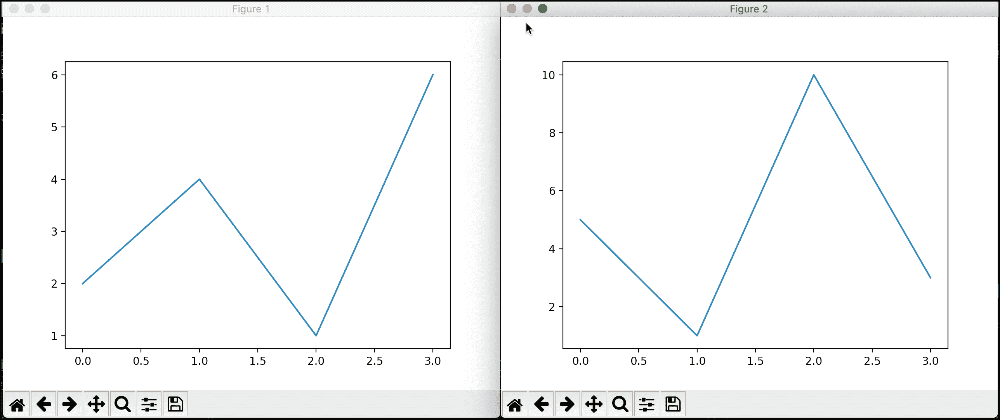

Matplotlib 还支持在单个窗口中添加两个或多个图。要了解这是如何工作的，创建另一个新文件，并将其命名为`multiple_plots.py`。为了使事情更有趣，您将在本例中使用 NumPy 来创建这两个图。

**注意:**如果您还没有安装 NumPy，那么您需要安装它来运行这个例子。

此示例基于 Matplotlib 文档中的一个示例:

```py
# multiple_plots.py

import matplotlib.pyplot as plt
import numpy as np

def multiple_plots():
    # Some example data to display
    x = np.linspace(0, 2 * np.pi, 400)
    y = np.sin(x ** 2)

    fig, axs = plt.subplots(2)
    fig.suptitle('Vertically stacked subplots')
    axs[0].plot(x, y)
    axs[1].plot(x, -y)
    plt.show()

if __name__ == '__main__':
    multiple_plots()

```

这里你创建了两个独立的正弦波图。为了让它们都出现在同一个窗口中，您可以调用`subplots()`，这是一个方便的实用程序，可以在一次调用中创建多个图形。然后您可以使用它返回的`Axes`对象来绘制您用 NumPy 创建的数据。

结果看起来像这样:

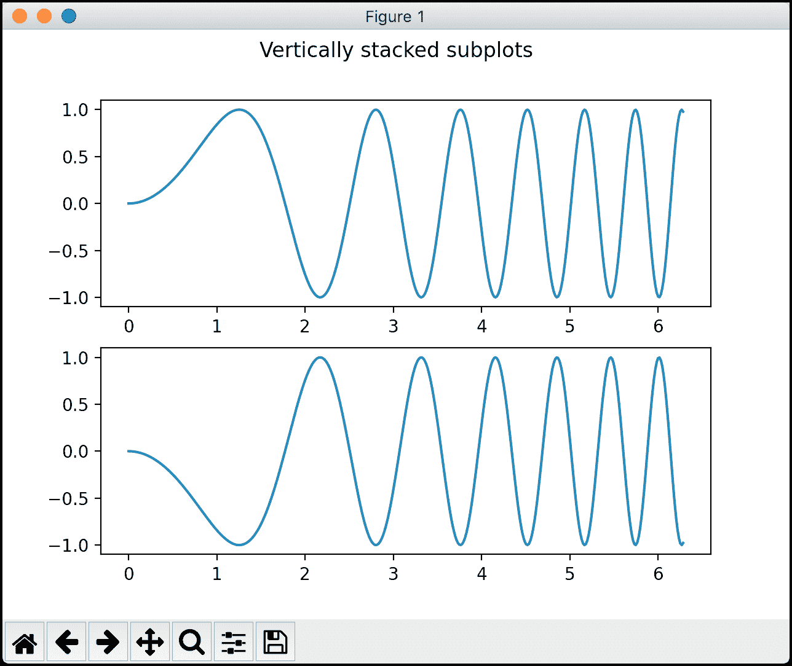

如果您不想使用 NumPy，您可以绘制上一个示例中的两组数字。事实上，你应该试试。继续创建一个名为`multiple_plots2.py`的新文件，并添加以下代码:

```py
# multiple_plots2.py

import matplotlib.pyplot as plt

def multiple_plots():
    numbers = [2, 4, 1, 6]
    more_numbers = [5, 1, 10, 3]
    fig, axs = plt.subplots(2)
    fig.suptitle('Vertically stacked subplots')
    axs[0].plot(numbers)
    axs[1].plot(more_numbers)
    plt.show()

if __name__ == '__main__':
    multiple_plots()

```

在这段代码中，您完全删除了 NumPy 代码，并添加了前面示例中的两个数字列表。然后使用`Axes`对象绘制它们。

这导致了以下堆积图:

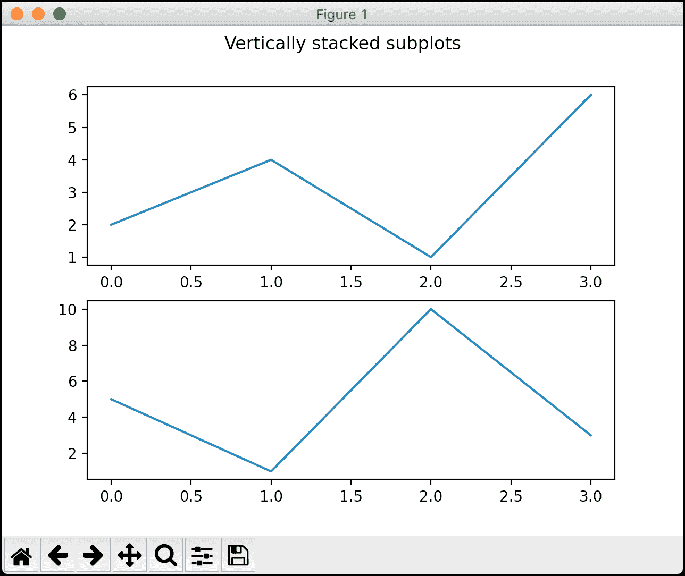

至此，您应该已经很好地掌握了如何使用 Matplotlib 创建多个图形和堆叠图。

## 包扎

Matplotlib 是一个很棒的包，可以用来创建各种简洁的图形。令人惊讶的是，从数据中创建一个有用的绘图只需要编写几行代码。在本文中，您了解了以下主题:

*   用 PyPlot 创建简单的折线图
*   创建条形图
*   创建饼图
*   添加标签
*   向地块添加标题
*   创造传奇
*   显示多个图形

Matplotlib 非常强大，有很多这里没有涉及的特性。您可以使用 Matplotlib 创建许多其他类型的可视化。有一个更新的包叫做 **Seaborn** ，它构建在 Matplotlib 之上，使它的图形看起来更好。还有许多其他完全独立的 Python 绘图包。您会发现 Python 支持您能想到的几乎任何类型的图，可能还有许多您不知道的图。

## 相关阅读

想了解更多关于 Python 的功能吗？查看这些教程:

*   Python 101: [使用 JSON 的介绍](https://www.blog.pythonlibrary.org/2020/09/15/python-101-an-intro-to-working-with-json/)

*   Python 101 - [创建多个流程](https://www.blog.pythonlibrary.org/2020/07/15/python-101-creating-multiple-processes/)
*   python 101-[用 pdb 调试你的代码](https://www.blog.pythonlibrary.org/2020/07/07/python-101-debugging-your-code-with-pdb/)

*   Python 101—[使用 Python 启动子流程](https://www.blog.pythonlibrary.org/2020/06/30/python-101-launching-subprocesses-with-python/)