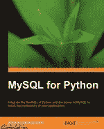

# 迷你书评:MySQL for Python

> 原文：<https://www.blog.pythonlibrary.org/2010/12/09/mini-book-review-mysql-for-python/>

|  | 

### Python 的 MySQL

阿尔伯特·卢卡申科斯基**[亚马逊](http://www.amazon.com/exec/obidos/ASIN/1849510180/thmovsthpy-20/)****[打包](https://www.packtpub.com/mysql-for-python-database-access-made-easy/book)** |

上个月，Packt Publishing 的市场部找到我，让我对他们的新书 Albert Lukaszewski 的《MySQL for Python》进行评论。这本书有 440 页，我应该很快读完。不幸的是，现实生活挡住了我的去路，我将对这本书的内容做一个小小的回顾(即 161 页+略读)。为什么？因为他们市场部一直烦我。将来，我打算只买我自己的书，这样我就不会有这些愚蠢的时间限制。

另一个原因是，我花了这么长时间来阅读这篇文章，因为我只有一本电子书，这使得阅读起来不太方便。我承认我更喜欢真书。它们不会像显示器那样让我的眼睛很快变干。我发现我对 MySQL 并不感兴趣...但你来我的博客不是为了看我的牢骚吧？让我们来看看这本书是否值得你辛苦赚来的钱！

## 继续复习！

这本书背后有一些相当重要的凭据。作者在 About 上撰写“关于 Python”专栏，评论者涵盖了所有作者、MySQL for Python 背后的主要程序员以及 Sun/Oracle 的 MySQL 支持团队成员。这本书的写作(正如所料)相当不错。我承认我觉得它有点干。然而，我还没有读过一本激动人心的数据库书籍。

无论如何，这本书的第一章是关于在你的机器上设置 MySQL 和 MySQL for Python 的。你可以从各个项目的网站上获得这些信息。第二章和第三章介绍了基本的 SQL 语法，到处都有一些 Python 例子。这让我有点困惑，因为我以为这本书是给那些已经了解 SQL，并且正在学习如何使用 Python 编程语言与 MySQL 接口的人看的。这些章节没有什么特别的问题，但是我希望更多的 Python，而不是 SQL。你的品味可能会不同。

我读的最后一章是第四章，是关于异常处理的。作者花了很多时间讨论警告和异常之间的区别，以及应该如何处理它们。本文还介绍了 MySQL for Python 包可以捕获的各种自定义错误。

我读了第五章的一半。它涵盖了如何使用 fetchone()和 fetchmany()方法以及循环和迭代器来逐个记录地检索结果。在这一章的最后我没有讲到电影数据库项目。

我还没有读到的章节涵盖了以下主题:插入多个条目、创建和删除(我猜是表)；创建用户和授予访问权限(我认为是权限或安全性)；日期和时间值、聚合函数和子句；选择替代品；字符串函数；显示 MySQL 元数据；最后，灾难恢复。

## 判决结果？

据我所知，我认为这本书很好地涵盖了这些主题。虽然我发现有很多内容需要复习(因此有点无聊)，但我认为作为一个学习 SQL 和 Python 程序员新手，这本书会对我很有帮助。不过，我现在倾向于使用 SqlAlchemy 来处理我所有的数据库工作。尽管如此，如果你需要了解这个主题或者想学习如何用 Python 连接 MySQL 而不使用 SqlAlchemy 这样的 ORM，那么这本书就是为你准备的！否则，尝试在亚马逊网站或书店预览，以确保它符合您的需求。