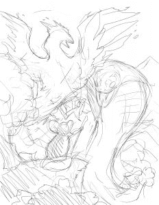
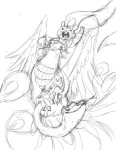
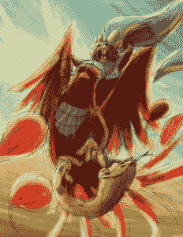
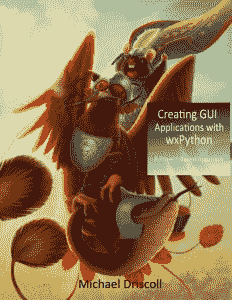

# 我用 wxPython 书创建 GUI 应用程序的封面故事

> 原文：<https://www.blog.pythonlibrary.org/2019/04/01/my-cover-story-for-creating-gui-applications-with-wxpython-book/>

我认为为我的新书《用 wxPython 创建 GUI 应用程序》写一点封面设计会很有趣。我本打算在实际的 [Kickstarter](https://www.kickstarter.com/projects/34257246/create-gui-applications-with-python-wxpython) 活动中发布这个消息。

我最初的封面想法是让老鼠指挥一只凤凰去攻击一条蛇。Phoenix 是 wxPython 4 发布前的代码名，您仍然可以在 wxPython 项目的文档和一些页面上看到对 Phoenix 的引用。

事实上，是我委托做的封面。这是它的草图:

原创封面概念艺术

正如你所看到的，艺术家很难记住这条蛇应该是一条蟒蛇。他继续在成品中犯懒惰的错误，我最终取消了那个封面。我不确定我是否会在未来的书中使用这个封面。我个人很喜欢老鼠和凤凰的样子，但是蟒蛇会一直困扰我。

所以我最终再次雇佣了 Varya Kolesnikova 来做这本书的封面。她是为我创作 Python 201 封面艺术的艺术家。你可以在 [Behance](https://www.behance.net/paskamarja) 或 [Instagram](https://www.instagram.com/varya.kolesnikova/) 上查看更多她的艺术作品。

这是她对我的新概念的原始草图，我的新概念是让老鼠骑着凤凰，背着蟒蛇:

实际封面概念艺术素描

我更喜欢她的方法，尽管她对凤凰的想法与我最初的想象大相径庭。

这是概念艺术的彩色版本:

色彩概念艺术素描

我喜欢 Varya 的艺术方法，她最终完成了你今天所知道的艺术品:

最终封面艺术

我正在努力完成这本书的最后几章。如果你有兴趣提前得到这本书，你可以现在就在 Leanpub 上预订。该书的最终版本将于 2019 年 5 月在**发布。**