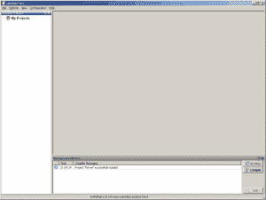
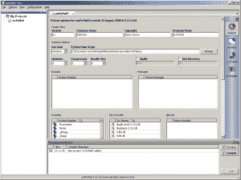
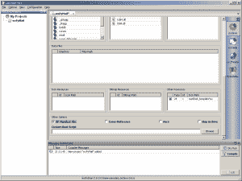
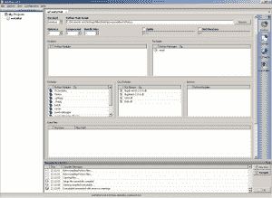
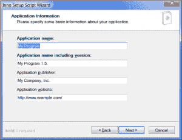
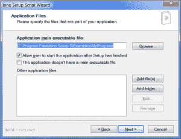

# 包装用于分发的 wxPyMail

> 原文：<https://www.blog.pythonlibrary.org/2008/08/27/packaging-wxpymail-for-distribution/>

在本文中，我将介绍打包我的程序 [wxPyMail](https://www.blog.pythonlibrary.org/?p=38) 所需的步骤，这样我就可以将它分发给其他 Windows 用户。我将使用 [Andrea Gavana 的](http://xoomer.alice.it/infinity77/)优秀的 [GUI2Exe 实用程序](http://xoomer.alice.it/infinity77/main/GUI2Exe.html)来创建一个可执行文件，我将使用 [Inno Setup](http://www.innosetup.com/isinfo.php) 来创建一个安装程序。有人告诉我，Andrea 正在开发他的应用程序的新版本，所以当它发布时，我将针对该版本重新编写这篇文章并发布。

## 设置 GUI2Exe

用 GUI2Exe 创建可执行文件的过程非常简单。GUI2Exe 实际上是 [py2exe](http://www.py2exe.org/) 的一个 GUI 前端。我强烈推荐用 GUI2Exe 来创建你所有的可执行文件，因为它更容易使用。但是，如果您喜欢命令行，那么您可以单独使用 py2exe。它们甚至在 Samples 目录中包含 wxPython 应用程序的示例。反正下载完 GUI2Exe，安装好，加载程序。您现在应该会看到这样的内容:

[](https://www.blog.pythonlibrary.org/wp-content/uploads/2008/08/gui2exe1.png)

现在进入*文件* - > *新建项目*，给你的项目起个名字。我要给我的*起名叫 wxPyMail* 。我准备加一个假的*公司名*，*版权*，给它一个*节目名*。一定要浏览您的主要 Python 脚本。这个项目是 wxPyMail.py，根据 Andrea 的网站，你应该把*优化*设置为 2，*压缩*设置为 2，*捆绑文件*设置为 1。这在大多数情况下似乎是可行的，但是我遇到过一些奇怪的错误，这些错误似乎是由于将最后一个设置为“1”而引起的。事实上，根据我在 py2exe 邮件列表上的一个联系人所说，“bundle”选项应该设置为 3，以尽量减少错误。将 *bundle* 设置为“1”的好处是，你最终只得到一个文件，但是因为我要用 Inno 把它卷起来，所以我要用选项“3”来确保我的程序运行良好。

还要注意，我已经包含了 *XP 清单*。这使得您的应用程序在 Windows 上看起来很“本地”，因此您的程序应该与当前有效的主题相匹配。

为了确保你能跟上，请看下面的截图:

[](https://www.blog.pythonlibrary.org/wp-content/uploads/2008/08/gui2exe2.png)

[](https://www.blog.pythonlibrary.org/wp-content/uploads/2008/08/gui2exe3.png)

一旦你得到了你想要的一切，点击右下角的*编译*按钮。这将在*区*文件夹中创建您想要分发的所有文件，除非您通过选中*区*复选框并编辑随后的文本框更改了名称。编译完成后，GUI2Exe 会询问您是否要测试您的可执行文件。继续并点击*是*。我第一次这样做时遇到了一个错误，当我查看日志时，它说找不到 smtplib 模块。要修复这个特定的错误，我们需要包含它。

要包含此模块，请在标有*包含*的框内单击，然后按 CTRL+A。您应该会看到一个图标和文字*编辑我*。只需点击这些单词并输入 *smtplib* 。现在试着编译它。我得到另一个奇怪的错误:

```py

Traceback (most recent call last):
  File "wxPyMail.py", line 20, in 
    import smtplib
  File "smtplib.pyo", line 46, in 
ImportError: No module named email.Utils

```

看起来我需要电子邮件模块。嗯，如果你包括电子邮件模块，那么你需要把它从*排除*列表中删除。然而，在做了所有这些之后，您仍然会得到一个关于不能导入“multipart”的错误。这花了我一分钟才弄明白，不过看起来邮件模块其实是一个包。因此，我将电子邮件*包*添加到*包*列表控件中。像以前一样从 Excludes 列表中删除 email 模块，也从 *Includes* listctrl 中删除 smtplib 模块，因为它本来就不是问题。要从这些控件中删除项目，您需要右键单击项目并选择“删除所选项目”。现在，您的屏幕应该看起来像这样:

[](https://www.blog.pythonlibrary.org/wp-content/uploads/2008/08/gui2exe4.png)

请注意，这是大量的试验和错误。最终，您可以大致猜出哪些模块将被包含，哪些不会。好像 wmi.py 或者 BeautifulSoup 这样的小模块会被 py2exe 抢，但是 lxml 包这样的东西不会。随着练习，这个过程变得越来越容易，所以不要放弃！此外，如果您有问题，py2exe 组和 Andrea 都是很好的资源。

## 我们来做一个安装程序吧！

现在我们有了一个可执行文件和一堆依赖项，我们如何创建一个安装程序呢？有各种各样的实用程序，但是我将使用 Inno Setup。下载并安装后，运行程序。选择标记为“使用脚本向导创建新脚本文件”的选项。单击下一个的*，您应该会看到类似这样的内容:*

[](https://www.blog.pythonlibrary.org/wp-content/uploads/2008/08/inno1.png)

请随意填写，然后单击下一步。此屏幕允许您选择应用程序的默认安装位置。默认为*程序文件*即可。点击*下一个*。现在，您应该会看到以下屏幕:

[](https://www.blog.pythonlibrary.org/wp-content/uploads/2008/08/inno2.png)

浏览到您创建的可执行文件以添加它。然后点击*添加文件...*按钮添加其余部分。你可以选择除 exe 文件之外的所有文件，然后点击 OK。然后点击*下一个*。确保*开始菜单*文件夹有正确的名称(在这种情况下，wxPyMail)并继续。如果您愿意，您可以忽略接下来的两个屏幕，或者尝试使用它们。不过，我没有使用许可证，也没有将信息文件显示给用户。完成前的最后一个屏幕允许您选择输出到的目录。我只是将它留空，因为它默认为可执行文件所在的位置，这对于本例来说很好。点击*下一步*和*完成*。

现在，您将拥有一个成熟的*。iss 文件。请阅读 Inno 的文档，了解您能做些什么，因为这超出了本文的范围。相反，只需点击*构建*菜单并选择*编译*。如果您没有收到任何错误消息，那么您已经成功地创建了一个安装程序！恭喜你！

然而，有一点需要注意。似乎有一些关于你是否能合法分发 MSVCR71.dll 文件的问题。有人说这个 dll 的发布需要 Visual Studio 2003 的许可，也有人说 python.org 团队以这样一种方式许可了 VS2003(即 VS7 ), Python 变成了“被许可软件”,而你变成了“发布者”。你可以在[这个博客](http://www.brunningonline.net/simon/blog/archives/001906.html)上读到所有血淋淋的细节，其中 Python 名人如 Phillip Eby(因 easy_install 而出名，是它的主要维护者)和 [Fredrik Lundh](http://effbot.org) 都参与其中。

我希望这有助于您成为一名优秀的 Python 应用程序开发人员。一如既往，如果您有任何问题或改进建议，请随时给我发电子邮件至 mike (at) pythonlibrary (dot) org。