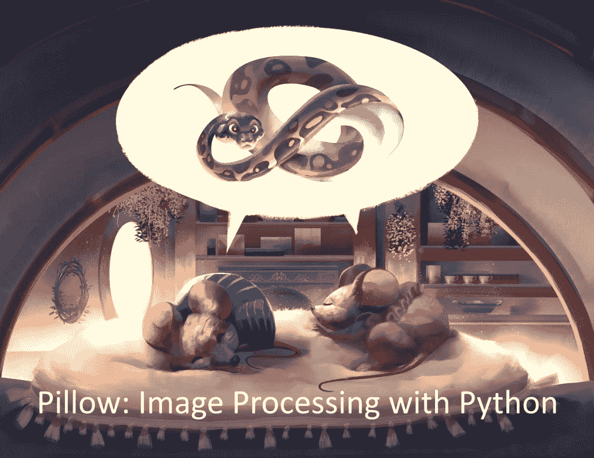

# 抱枕:可预购 Python 图像处理

> 原文：<https://www.blog.pythonlibrary.org/2021/02/17/pillow-image-processing-with-python-available-for-pre-order/>

**Pillow:用 Python 进行图像处理**是我最新的一本关于 Python 的书。现在可以预订了。这意味着你可以购买这本书的早期版本，并在购买后免费获得所有更新，包括最终版本。最终版本将于 2021 年 4 月在**完成。**

你可以在 [Leanpub](https://leanpub.com/pillow/) 或 [Gumroad](https://gum.co/pypillow) 上预订这本书。

Python 图像库允许您使用 Python 编辑照片。Pillow 包是 Python 图像库的最新版本。您可以使用 Python 通过 Pillow 批量处理您的照片。

在本书中，您将了解以下内容:

*   打开和保存图像
*   提取图像元数据
*   使用颜色
*   应用图像滤镜
*   裁剪、旋转和调整大小
*   增强图像
*   组合图像
*   用枕头画画
*   图像印章
*   与 GUI 工具包集成

在这本书里，你会学到所有这些东西，甚至更多。很快你就能像专业人士一样使用 Python 编程语言编辑照片了！