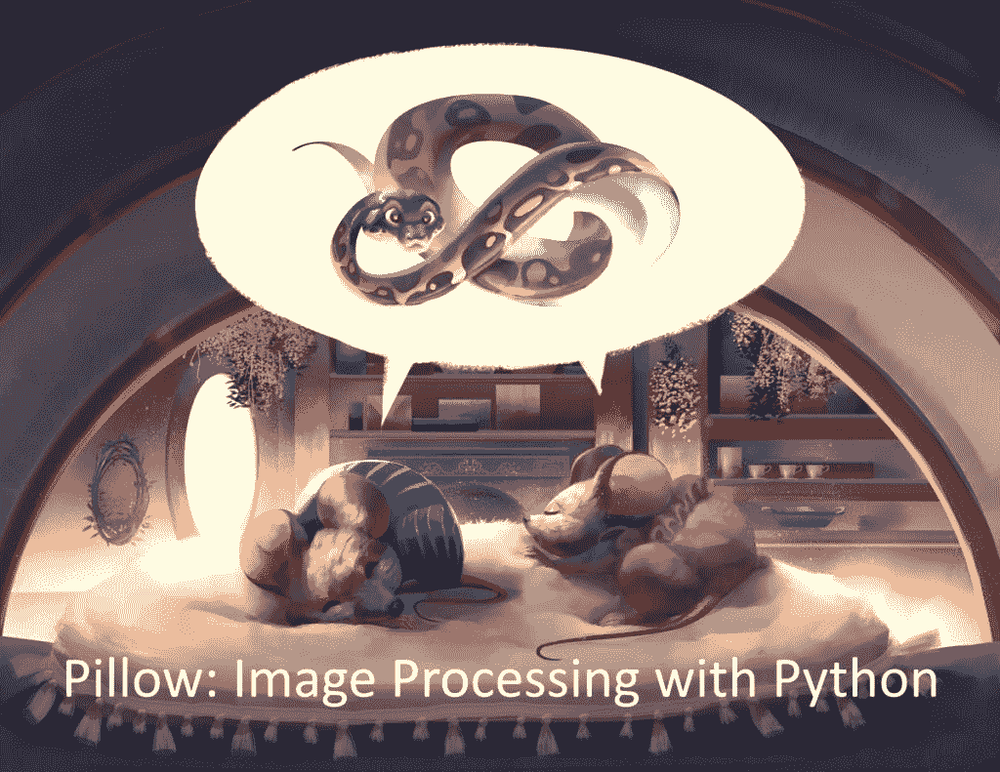

# Pillow:用 Python 进行图像处理的书籍示例

> 原文：<https://www.blog.pythonlibrary.org/2021/01/05/pillow-image-processing-with-python-book-sample/>

我的新书**Pillow:Image Processing with Python**的 [Kickstarter](https://www.kickstarter.com/projects/driscollis/image-processing-with-python) 昨天获得了全额资助。我知道不看一本书很难决定是否要买，所以我免费发布这本书的前三章。你可以用这个 [Dropbox 链接](https://www.dropbox.com/s/65ro6newgsv99jf/pillow-preview.pdf?dl=0)下载它们。这一小部分书还是 **70 页**的内容！

这本书进展顺利。如果你想在一本 Python 书中寻找一些新的和不同的东西，我希望你能抓住这个机会。