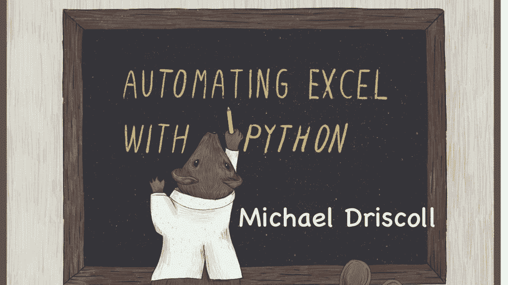

# 使用 Python 自动预订 Excel

> 原文：<https://www.blog.pythonlibrary.org/2021/07/30/pre-order-automating-excel-with-python/>

我的第十本 Python 书籍叫做**用 Python 自动化 Excel:用 OpenPyXL 处理电子表格**。还有 11 天就可以在 [Kickstarter](https://www.kickstarter.com/projects/driscollis/automating-excel-with-python) 上获得一件专属 t 恤了！

我也有电子书可以在 [Gumroad](https://driscollis.gumroad.com/l/openpyxl) 上预订。无论你是在 Kickstarter 还是 Gumroad 上购买，你都会得到这本书的早期版本，以及我对这本书的所有更新。

你可以在这里得到一些章节的样本，这样你就可以在决定购买之前试用这本书了！

在本书中，您将学习如何使用 Python 来完成以下任务:

*   创建 Excel 电子表格
*   阅读 Excel 电子表格
*   创建不同的细胞类型
*   添加和移除工作表
*   将 Excel 电子表格转换为其他文件类型
*   单元格样式(更改字体、插入图像、背景颜色等)
*   条件格式
*   添加图表
*   还有更多！