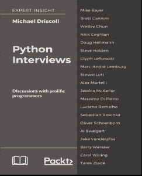

# 预购 Python 访谈

> 原文：<https://www.blog.pythonlibrary.org/2018/02/07/pre-order-python-interviews/>

我很高兴地宣布我正在写的另一本书，名为《Python 访谈》,由 Packt 出版社出版。这是他们网站的简介:

*Python 访谈包含了 Mike Driscoll 和 Python 社区中各种领军人物之间的一系列一对一访谈。Mike 是 Python 社区的终身成员，多年来一直在他的博客 Mouse vs. Python 中对 Python 社区的精英进行“PyDev of the Week”采访。*

在本书中，Mike 与 Python 社区的核心成员讨论了 Python，例如 Steve Holden(Python 软件基金会的前主席)、Mike Bayer(SQLAlchemy 的创建者)、Brett Cannon(Python 核心开发人员)、Glyph Lefkowitz(Twisted 的创建者)、Massimo DiPierro(web 2 py 的创建者)、Oliver schoen born(PyPubSub 的创建者)等等。采访中充满了对成功程序员的思想、Python 语言的内部运作、Python 的历史以及来自蓬勃发展的 Python 社区的幽默轶事的洞察。

[Python 访谈](https://www.packtpub.com/web-development/python-interviews)目前可以预购，应该会在 2018 年 2 月下旬或者 2018 年 3 月出版。

注意:这些是全新的采访，并非摘自我的“本周 PyDev”系列。然而，这本书对这些采访有一些交叉，因为涉及了一些相同的主题。