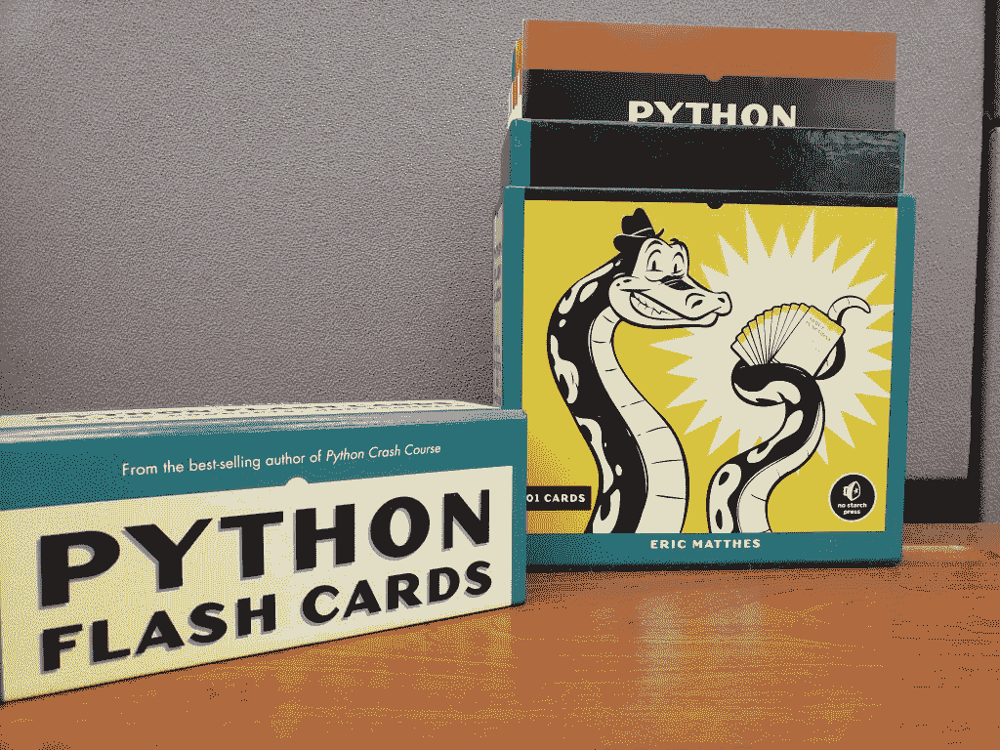
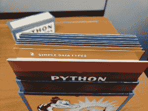
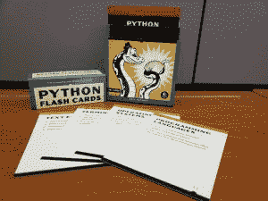
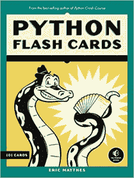

# 产品评论:Python 闪存卡

> 原文：<https://www.blog.pythonlibrary.org/2019/04/02/product-review-python-flash-cards/>

没有哪家淀粉出版社以出版计算机编程书籍而闻名。然而，他们最近发布了一款名为 [Python 闪存卡](https://nostarch.com/pythonflashcards)的新产品，作者是 [Python 速成班](https://amzn.to/2WyQcPm)的作者 Eric Matthes。我认为这是一个独特的产品，并决定要求审查副本。

这些卡片和它们的盒子是高质量的。我很喜欢他们用的卡片。卡本身针对 **Python 3.7** 。

每张卡的顶部都标有与其类别相匹配的颜色:

卡片也有编号。这在卡片引用其部分中的其他卡片或完全引用其他部分的时候很有用。这使得引用不同的卡片变得简单明了。

当然，抽认卡就其本质而言，短小精悍。所以卡片的测试和包装部分对我来说太简单了。另一方面，它们是闪存卡，所以介质不允许它们以我希望的方式被充实。如果你需要更多的细节，谷歌从未远离。

虽然我肯定不是这些卡片的目标市场，但我认为它们对想学习的高中生，甚至可能是大学新生很有用。它们对于刷新您的 Python 基础当然是有用的。如果你有学生，这一套可能会证明对他们很有用。

|  | 

### Python 闪存卡

埃里克·马特斯**[亚马逊](https://amzn.to/2HMoECx)，[无淀粉](https://nostarch.com/pythonflashcards)，** |

* * *

### 书评

*   书评- [任务 Python:编写一个太空冒险游戏！肖恩·麦克马纳斯](https://www.blog.pythonlibrary.org/2019/03/20/book-review-mission-python/)
*   Julien Danjou 的《严肃的 Python:关于部署、可伸缩性、测试等的黑带建议》
*   Brian Okken 的 pytestPython 测试
*   Erik Westra 的 Python 模块编程
*   [Python Playground——好奇的程序员的极客项目](https://www.blog.pythonlibrary.org/2015/12/11/book-review-python-playground-geeky-projects-for-the-curious-programmer/)Mahesh Venkitachalam 著
*   L. Felipe Martins 著