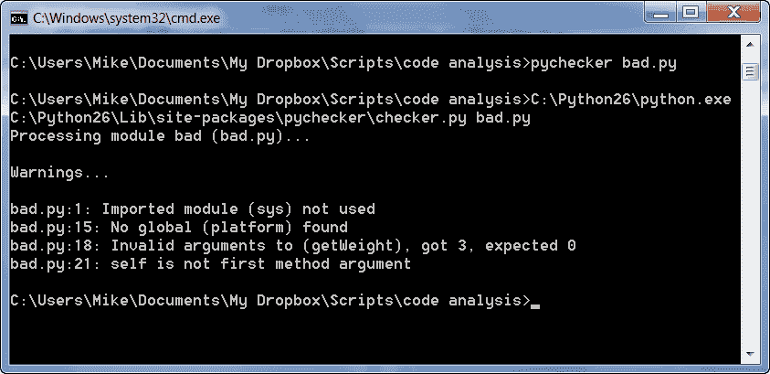

# PyChecker: Python 代码分析

> 原文：<https://www.blog.pythonlibrary.org/2011/01/26/pychecker-python-code-analysis/>

PyChecker 是一个很酷的工具，用于检查 Python 脚本中的错误。它适用于 Python 2.0 - 2.7。在本文中，我们将编写一些蹩脚的代码，看看 PyChecker 能从中发现什么。然后，我们将根据我们的发现改进代码，直到代码通过检查。根据 PyChecker 的[网站](http://pychecker.sourceforge.net/)，它可以检测到以下问题:

*   找不到全局(例如，使用模块而不导入它)
*   向函数/方法/构造函数传递了错误数量的参数
*   向内置函数和方法传递错误数量的参数
*   使用与参数不匹配的格式字符串
*   使用不存在的类方法和属性
*   重写方法时更改签名
*   在相同的范围内重新定义函数/类/方法
*   在设置变量之前使用它
*   self 不是为方法定义的第一个参数
*   未使用的全局变量和局部变量(模块或变量)
*   未使用的函数/方法参数(可以忽略自身)
*   模块、类、函数和方法中没有文档字符串

## 入门指南

我们不会测试它能检测到的所有东西，但是我们可以编写一些非常混乱的代码供 PyChecker 检查。开始编码吧！

```py

import sys

########################################################################
class CarClass:
    """"""

    #----------------------------------------------------------------------
    def __init__(self, color, make, model, year):
        """Constructor"""
        self.color = color
        self.make = make
        self.model = model
        self.year = year

        if "Windows" in platform.platform():
            print "You're using Windows!"

        self.weight = self.getWeight(1, 2, 3)

    #----------------------------------------------------------------------
    def getWeight(this):
        """"""
        return "2000 lbs"

```

这段代码实际上并没有做太多的事情，只是为了举例说明。根据 PyChecker 的说法，这段代码有四个问题。你能看到问题吗？如果没有，那么让我们来看看如何使用 PyChecker 来揭露它们！一旦您安装了 PyChecker 并将其放在您的路径中(参见 PyChecker 的文档)，您应该能够执行以下命令:

 `C:\Users\Mike\Documents\My Dropbox\Scripts\code analysis>pychecker bad.py` 

*注意:只有当你在 Windows 系统路径上有 pychecker 时，以上才有效。从技术上讲，在 Windows 上你将使用 pychecker.bat*

如果您这样做，您将得到如下结果:

[](https://www.blog.pythonlibrary.org/wp-content/uploads/2011/01/pychecker_output.png)

希望你能告诉我们这一切意味着什么，但我们会把它分解，以防你不知道。它发现了四个问题。它发现的第一个问题是我们导入了 **sys** 模块，但是我们没有使用它。第二个问题与第一个相反。我们指的是**平台**模块，但实际上不是进口的！第三，我们调用我们的 **getWeight** 方法，它报告我们给它传递了太多的参数。我认为 PyChecker 可能有一个错误，因为我们的方法应该接受一个方法，而不是零个。“this”参数肯定会让 PyChecker 感到困惑。幸运的是，它发现的最后一个问题是 getWeight 没有将 **self** 作为第一个参数。这就纠正了我提到的错误。虽然第一个方法不要求我们将其命名为“self ”,但这是类方法中第一个参数的常规命名约定。

## 其他提示

PyChecker 不只是在命令行上工作。也可以直接在代码中使用！您只需在模块顶部导入 PyChecker，如下所示:

```py

import pychecker.checker

```

这将使 PyChecker 检查下面所有导入的模块，尽管它不会检查主模块。那是什么意思？这意味着，如果您在我们使用的示例中坚持这一行，您将不会看到任何与该代码相关的错误。PyChecker 文档说您还可以通过 os.environ 设置 PyChecker 的选项。

```py

os.environ['PYCHECKER'] = 'command line options here'

```

说到这里，下面是常见的命令行选项:

[表 id=2 /]

如果您想要完整的命令列表，请键入以下命令:pychecker -h

注意:PyChecker 的文档字符串检查在默认情况下是关闭的，所以如果你想要的话，你需要传递"-m -f "命令。这只找到了类模块的空 docstring。“-f”似乎有一个小错误，它认为空文档字符串是可以的。我已经提醒过 PyChecker 小组了。

## 包扎

我认为 PyChecker 非常酷，看起来它可能是一个方便的工具。试试看，看你怎么想！

## 附加阅读

*   PyChecker 官方[网站](http://pychecker.sourceforge.net/)
*   PyLint -与 PyChecker 一脉相承的另一个项目
*   另一个类似的项目
*   来自 Python 杂志的 Doug Hellman 对 Python 静态代码分析器的[评论](http://www.doughellmann.com/articles/pythonmagazine/completely-different/2008-03-linters/index.html)