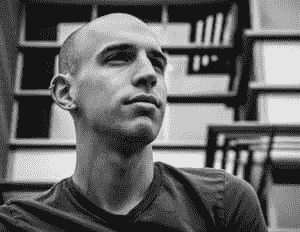

# 本周 PyDev:Adrian rose Brock

> 原文：<https://www.blog.pythonlibrary.org/2017/11/20/pydev-of-the-week-adrian-rosebrock/>

本周，我们欢迎 Adrian rose Brock([@ PyImageSearch](https://twitter.com/PyImageSearch))成为我们的本周 PyDev。Adrian 是几本关于 Python 和 OpenCV 的书籍的作者。他也是 PyImageSearch.com[的作者，这是一个非常受欢迎的专注于计算机视觉的 Python 博客。让我们花些时间去更好地了解他吧！](https://www.pyimagesearch.com/)

你能给我们介绍一下你自己和 PyImageSearch 吗？

你好，迈克，感谢你给我机会在本周 PyDev 上接受采访。

我叫艾德里安·罗斯布鲁克。我在 UMBC 的马里兰大学获得了计算机科学博士学位，主要研究计算机视觉和机器学习。

我在 PyImageSearch.com 写了一篇关于 Python、计算机视觉和深度学习的博客。在过去几年运行 PyImageSearch 的过程中，我写了一些书/课程，包括:

*   [实用 Python 和 OpenCV](https://www.pyimagesearch.com/practical-python-opencv/) ，用 Python 温和地介绍了计算机视觉和 OpenCV 的世界。
*   PyImageSearch 大师，深入研究计算机视觉，类似于你在大学水平的课程中可能会发现的，只是*更多*的实际操作和实践。
*   [用 Python 进行计算机视觉的深度学习](https://www.pyimagesearch.com/deep-learning-computer-vision-python-book/)，我全新的 800 多页的书。这本书是我的“代表作”，是给那些想掌握神经网络和深度学习的读者的。

你的爱好是什么？

健身是我生活中很重要的一部分，所以当我不工作或编码时，我会花很多时间在健身房。

我一直对运动和身体活动感兴趣。从小到大，我踢过足球、棒球、篮球和一些其他运动。

到了大学三年级，我开始喜欢举重。我操作系统课上的一个朋友提出带我去举重房，教我几个举重动作。

从那以后，我不再那么关注团队运动，而是更多地关注举重。我结合了奥林匹克举重、交叉训练和个人训练。我喜欢不断的变化和挑战我的身体。

另外，我是一个超级 RPG 迷，尤其是 SNES 上的老式 RPG。我已经玩过*最终幻想*系列太多次了。

**你是什么时候开始用 Python 的？**

我第一次使用 Python 是在大约 13 年前，大约 15 年前，大约在 Python 2.1/Python 2.2 发布的时候。

我刚开始接触编程，说实话，我一开始并不喜欢 Python。我没有完全理解读取-评估-打印循环(REPL)的意义，我仍在努力适应命令行环境和 Unix 环境。

那时 Python 对于我(极其)新手的编程技能来说有点太复杂了。当我学习用其他语言编写代码时，我继续玩 Python，但是直到大学二年级，我才真正回到 Python。

从那以后，Python 一直是我选择的编程语言。

你还知道哪些编程语言，你最喜欢哪一种？

了解一门语言的语法和了解与这门语言相关的库和生态系统是有区别的。

在研究生院时，我做了大量大数据方面的工作，主要是 Hadoop 集群——这需要我用 Java 编写大量代码。在 UMBC，Java 也用于大多数 200 和 300 级的课程(尤其是数据结构，尽管现在 UMBC 使用 Python)。

我大学毕业后的第一份工作也要求我在 Hadoop 集群和 Accumulo 数据库上使用 Java。正因为如此，我变得非常熟悉 Java 库和构建可扩展的数据工作流和预测模型。

我也非常了解 PHP，尽管我不愿意承认。我学习这门语言是因为它有类似 C 的语法，但带有脚本语言的味道。这也为我早期的 web 开发生涯打开了大门。

在大学期间，我为 RateMyTeachers.com 工作，从初级开发人员做起，一路晋升到高级开发人员，最终成为首席技术官。

在这个过程中，我用 PHP 和 CodeIgniter 框架从头开始重写了这个站点(这远在 Laravel 或任何其他成熟的、体面的、可以轻松扩展的 PHP 框架出现之前)。这帮助我了解了很多关于可伸缩性和 web 应用程序的知识。

我对 C/C++也相当了解，但现在我主要只把它们用于优化各种 Python 例程。

在我人生的这个阶段，我可以说 Python 无疑是我最喜欢的编程语言。从生产代码到需要解析日志文件的一次性脚本，我都使用它。它确实是一种通用语言。

你现在在做什么项目？

除了我正在从事的少数咨询/承包工作，我的主要关注点是 PyImageSearch 以及围绕 Python 编程语言创建高质量的计算机视觉和深度学习教程。

我刚刚在本月早些时候发布了我的新书， [*用 Python 进行计算机视觉的深度学习*](https://www.pyimagesearch.com/deep-learning-computer-vision-python-book/) 。

在今年剩下的时间里，我将最终确定我将于 2018 年在加利福尼亚州旧金山举办的会议的细节。

我还为 2018 年准备了几本其他的书。

哪些 Python 库是你最喜欢的(核心或第三方)？

OpenCV 虽然不是一个纯 Python 库，但它提供了 Python 绑定。如果没有 OpenCV，计算机视觉就不会这么容易实现。我每天都用 OpenCV。

NumPy 和 SciPy 也是如此——这些库对转向 Python 编程语言的研究人员、从业人员和数据科学家负有重大责任。NumPy 和 SciPy 在我写的每一个计算机视觉+机器学习脚本中都扮演着举足轻重的角色。

Scikit-learn 和 scikit-image 是我每天使用的另一组库。如果没有 scikit-learn，我真的很难完成与我的论文相关的研究。

最后，我不能说太多关于 Keras 的积极的事情。正如 scikit-learn 使机器学习变得可访问一样，Keras 也为深度学习做了同样的事情。

你是如何成为一名作家的？

我成为一名作家的同时也成为了一名企业家。当我还是个孩子的时候，也许只有七八岁，我是一个狂热的读者。我阅读我能得到的一切。

在我童年早期的某个时候，我决定要写自己的书。

这正是我所做的。

我会拿 20 多张索引卡，在索引卡上写下我自己的故事(通常侧重于恐怖故事)，然后用厚纸板设计我自己的封面。我会用蜡笔给封面上色。最后把它们钉在一起，形成一本书。

一旦这本书完成，我会以 25 美分的价格卖给我的父母。

当我还是个孩子的时候，我想成为(1)作家或者(2)建筑师。作为一个成年人，我在很多方面都将他们结合在了一起。

你能描述一下你写书时学到的一些东西吗？

我从 17 岁开始就以开发软件为职业，但直到 20 多岁，我才开始写计算机视觉书籍。

写作对我来说不是挑战——我有多年的写作经验，尤其是考虑到我的论文。

但是营销和销售一本书是一个全新的领域。一开始我不知道自己在做什么。有很多盲目的实验在进行。

我(愉快地)惊讶地发现，运输和销售一本书与运输一个软件没有太大的不同:最初的用户反馈很重要。

在我的情况下，我写了书的草稿，并在它们 100%定稿之前发布。这帮助我更快地获得最初的读者反馈*，然后*在书上重复*；如果你要验证一个 SaaS 企业，你会采取的确切过程。*

 *事实证明，我在软件领域为小型初创公司工作时学到的技能可以直接用于写书。

你还有什么想说的吗？

我只想再次感谢你给我这次机会和面试。

如果你想更多地了解我，请前往 PyImageSearch.com。你也可以[在 Twitter 上关注我](https://twitter.com/PyImageSearch)。

如果你有兴趣了解更多关于我的新书《用 Python 进行计算机视觉的深度学习》，[只需点击这里](https://www.pyimagesearch.com/deep-learning-computer-vision-python-book/)并获取免费的样本章节和目录。

感谢您接受采访！*