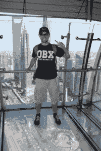

# 本周 PyDev:安德鲁·奈特

> 原文：<https://www.blog.pythonlibrary.org/2018/04/16/pydev-of-the-week-andrew-knight/>

本周我们欢迎安德鲁·奈特( [@automationpanda](https://twitter.com/automationpanda) )成为我们本周的 PyDev！Andrew 是一名企业家，他联合创立了[改革男装](https://www.reformedmenswear.com/)，该网站是使用 Python 和 Django 创建的。如果你有时间，可以看看他的 [Github 简介](https://github.com/AndyLPK247)，看看 Andrew 都在做些什么。Andrew 也有[编程博客](https://automationpanda.com/)，你可能想看看。让我们花一些时间来更好地了解他！

你能告诉我们一些关于你自己的事情吗(爱好、教育等)。)?

从专业上讲，我是一名软件工程师，专注于测试、自动化和 CI/CD。我的专业是构建测试自动化框架。我在北卡罗来纳州罗利附近的大型软件公司工作过，我在[automationpanda.com](https://automationpanda.com/)经营一个软件博客，我也做独立咨询。

我来自美国马里兰州的巴尔的摩。我第一次接触软件是在 9 年级，当时我学会了如何将数学公式编程到我的 TI-83 Plus 图形计算器中。编码会上瘾！2010 年，我在罗切斯特理工学院获得了计算机科学的综合学士/硕士学位，从那以后，我一直在软件行业工作。

我是一个相当忙碌的人，但我喜欢烹饪、精酿啤酒和玩任天堂游戏。现在，我正在深入[塞尔达传说:野性的呼吸](https://www.zelda.com/breath-of-the-wild/)。我在当地的教堂非常活跃:我曾经担任过引座员，现在正在教授一门系统神学的课程。我妻子和我也喜欢旅行。我们已经走遍了美国、中国，甚至泰国，并计划着更多有趣的旅行。

**你为什么开始使用 Python？**

为什么*不是*？Python 太牛了！

我第一次使用 Python 是在高中高年级的一堂计算机科学课上。那时，我还是一个年轻的程序员，主要是 Java 和 C++方面的经验。Python 简洁优雅的代码给我留下了深刻的印象。

快进到 2015 年，我开始在 MaxPoint 工作:我从高中开始第一次重新拿起 Python 进行测试自动化。MaxPoint 在 Python 自动化方面做了一点工作，但不多。他们的节俭服务框架也有 Python 绑定，这使得集成更加容易。我开始为定制的日志、服务、数据库、SSH、环境和输入开发自动化模块。这些模块可以被任何测试框架使用:unittest、nose、pytest、behavior 等等。我还开发了一些 Python 命令行工具来改进流程和辅助手工测试。Python 使得开发测试和工具变得快速而简单。

你还知道哪些编程语言，你最喜欢哪一种？

我主要的四门语言是 Python，Java，C#，JavaScript。现在，C#和 Java 是我的日常工作，Python 是独立项目，JavaScript 像打地鼠一样随处可见。我使用了带角度的类型脚本。在 NetApp，我只做 Perl。我也用过 C/C++、AspectJ、Scheme、Haskell、R，甚至 COBOL(那是一段可怕的过去)。

到目前为止，我最喜欢的语言是 Python。我坚信好的软件设计既是工程，也是艺术。语言应该帮助开发人员有效地表达设计，而不碍事。Pythonic 代码非常精确而简洁。

我也相信 Python 是测试自动化的最佳语言之一。测试必须是可读的，以便维护。Python 丰富的测试框架、包和工具生态系统使得构建像 LEGOs 这样的自动化解决方案变得容易。

你现在在做什么项目？

目前，我正在使用 Django 框架开发两个不同的网站。一个是为我共同创立的西装公司“改良男装”设计的。我为客户数据和订单处理建立了一个后端系统。唯一需要的页面是 Django 的自动生成的管理，因为它是一个私人后端网站！接受订单时，我们通过管理员输入尺寸、图片和风格点。由于我们的裁缝在中国，一个管理动作生成了英文和中文的 pdf 格式的订单规格。该网站位于 Heroku，图片存储在亚马逊 S3。我计划使用 Django REST 框架添加一个带有服务层的 Angular 前端，以便客户可以直接输入他们的订单。(新的前端将最终取代我们目前的 Wix 网站。)第二个 Django 站点是我妻子的一家公司的一个类似的订单处理系统。

哪些 Python 库是你最喜欢的(核心或第三方)？

除了 Django，我真的很喜欢测试自动化包。我最喜欢的 Python 测试框架是 **pytest** ,因为它如此强大却又如此简洁。像**请求**和 Selenium WebDriver 这样的包让测试变得轻而易举。标准日志模块负责测试日志。虚拟环境处理测试依赖性。几乎任何其他测试任务都可能在 PyPI 中有一个包。

你参加过会议或聚会吗？

是啊！今年 5 月，我将在俄亥俄州克利夫兰市举行的 2018 年 PyCon 大会上发表演讲。我将发表一篇题为“行为驱动的 Python”的演讲，在这篇演讲中，我将展示如何在 Python 测试自动化中使用行为驱动的开发。这将是我第一次参加 PyCon，我等不及了。

我还在 PyData Carolinas 2016 大会上发表了题为“Python 中的测试很有趣”的演讲。我概述了主要的 Python 测试框架。这个演讲被上传到了 YouTube 上。几个月后，我给皮拉迪斯·RDU 做了一次类似的演讲。

你还有什么想说的吗？

谢谢你花时间采访我。Python 很牛逼。查看[自动化熊猫](https://automationpanda.com/)并在 PyCon 2018 上查找我！

感谢您接受采访！