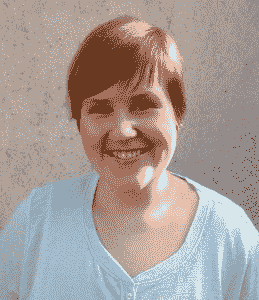

# 本周 PyDev:安娜·奥索斯基

> 原文：<https://www.blog.pythonlibrary.org/2015/06/01/pydev-of-the-week-anna-ossowski/>

本周，我们欢迎安娜·奥索斯基( [@OssAnna16](https://twitter.com/ossanna16) )成为我们本周的 PyDev。Anna 是一名来自德国的有抱负的开发人员。她拥有英语和神学学位，但不久前爱上了编程，现在正致力于在该领域建立职业生涯。她非常喜欢[姜戈女孩](http://djangogirls.org/)。她共同组织了 Django Girls Budapest 和 PyCon 研讨会，并在 Django Girls [博客](http://blog.djangogirls.org/)上运营“你的 Django 故事”采访系列。Anna 也是 Django 软件基金会资助委员会的成员，目前正在构建 PyLadies 远程分部。她非常热衷于多元化和社区拓展，并希望鼓励更多的女性学习编程，因为这太棒了！在空闲时间，她会写一篇博客。让我们花几分钟时间更好地了解安娜。

你能告诉我们一些关于你自己的情况吗(爱好、教育等)

我出生在德国的一个小镇，并在那里长大。高中期间，我作为交换生在密苏里州圣路易斯附近的一个更小的城镇呆了一年。这是我一生中最美好的一年，我深深地爱着美国和我在那里遇到的人们。我最大的梦想之一就是有一天能住在美国。我有英语和天主教神学学位，但我正在追求编程生涯，并努力成为一名优秀的开发人员。

我非常热衷于多样性，将更多的女性带入 Python/Django 社区，并帮助人们开始编程。我为姜戈女孩([http://djangogirls.org](http://djangogirls.org))工作，这是一个为女性组织为期一天的免费网络开发研讨会的组织。我共同组织了 Django 女孩布达佩斯和 Django 女孩@ PyCon 讲习班。我还在 Django Girls 博客(【http://blog.djangogirls.org】)上开设了“你的 Django Story”采访系列，采访了和 Django 一起工作的出色女士。我真的很喜欢旅行，探索新的地方，学习新的东西，参加编程会议，烘焙，观看 Youtube 视频，以及修补个人项目。

**你为什么开始使用 Python / Django？**

完成学位后，我有了一些空闲时间，但我真的不知道我的职业生涯将走向何方。我在考虑是否应该获得硕士学位，如果是，应该获得什么专业的学位。我喜欢学习英语和神学，但因为我不想成为一名教师，我从来不知道我的学位该做什么。我当时有个朋友是软件开发人员，对 Python 很有热情。一天晚上，我问他是否认为我可以学习编程，因为我很好奇他为什么这么喜欢编程。他说“是的，每个人都可以学习如何编程”,给了我 Codeacademy Python 教程的链接，这就是一切的开始。在学校里，我总是被告知我在数学或科学方面不是很有天赋，所以我从来没有想过我可以学习如何编程，如果没有我朋友的鼓励，我可能永远不会尝试。

解决 Codeacademy 练习题并发现我真的可以学习如何编码是世界上最棒的感觉。这并不总是容易的，事实上有时非常令人沮丧，但我喜欢解决问题的部分，我喜欢创造东西，我喜欢学习新的东西。我就是瞬间爱上了编程。我喜欢那一刻，当我终于明白了一些事情，或者终于得到了一些工作。过了一会儿，我决定把它作为我的职业。我去了蒙特利尔的 PyCon 2014，这是我第一次参加编程会议，度过了最美好的时光。人们很友好，很热情，我学到了很多新东西，我觉得我真正属于这里。

去年夏天，我申请了欧洲 Python 的第一个 Django 女孩工作坊，并被录取了，这是我经历过的最棒、最能改变生活的经历之一。我不仅学会了如何用 Python 和 Django 建立网站，还结交了很好的朋友，并成为了一个了不起的社区的一员，这个社区给了我信心，让我可以做很多我从未想过可以做的事情，比如今年在 PyTennessee 做我的第一次会议演讲。

 **你会如何帮助一个新的 Python 程序员入门？**

我会建议他们挑选一本好的初学者教程，并通过它来理解 Python 的基础。我真的很喜欢 Zed Shaw 的《艰难地学习 Python 》,但是还有很多其他很棒的资源。如果一个教程对你不起作用，那并不意味着你愚蠢或者缺乏天赋，或者永远学不会编程。我们都有不同的学习方式。尝试不同的教程，不断尝试不同的东西，直到你找到适合你的东西。退出一个教程并不意味着你失败了或者缺乏野心，它只是意味着你正在向对你更好的方向前进。如果你陷入困境，开始感到沮丧，不要花几个小时试图自己解决问题，寻求帮助，使用谷歌。如果你还是不明白，休息一下，散散步，上床睡觉，第二天再试。不要把自己逼得太紧。我记得在 Codeacademy Python 教程中有一章是关于二进制数的，我根本不理解这个概念。一遍又一遍地读完这一章后，我终于向我的朋友求助。他很努力地向我解释，但我还是不明白。我非常沮丧，感觉很糟糕，因为我认为我浪费了他的时间。那天晚上，在我决定上床睡觉之前，我看了一个关于二进制数的 3 分钟的 Youtube 视频，它终于打开了。你会成功的，不要放弃！🙂有时候你理解事情很快，有时候需要一段时间。永远记住:做不好某件事是做好某件事的第一步。

一旦你掌握了基本知识，我会建议你选择一个项目，从头开始构建。挑一个你喜欢并且真的想做的事情。我知道这有多难。教程给你一些指导和保障。当你开始从零开始构建一个东西时，你必须自己解决很多问题。这就是为什么找一个导师很重要。不要害怕寻求帮助，人们通常非常友好并愿意提供帮助。你可以在当地的 PyLadies 或 Girl develop it 分会寻找导师，加入我们的 Django Girls 聊天室或在 Twitter 上寻求帮助，你可以发推特给我(@ossanna16)，我会尽力帮助你或让你联系上有能力的人。拥有了不起的导师对我来说意义重大，他们不仅教我、给我解释，还帮助我保持动力。

我最后的建议是参与社区活动。参加编程会议、本地聚会、短跑和黑客马拉松。是的，即使你刚开始学习编程，我们也希望你能参加🙂你对社区很有价值。不要害怕！Python 和 Django 社区非常友好和热情。很多编程会议，比如 PyCon、EuroPython 和 DjangoCon EU，都有很棒的多样性和财政援助项目，你可以申请。参加会议在很多方面改变了我的生活。我学到了很多以前从未想到过的新东西，我遇到了很棒的人，找到了新朋友，这帮助我克服了很多恐惧。

你现在在做什么项目？

我目前正在向我的朋友 Ian 学习测试和 API。在 Ian 的指导下，我将构建我的第一个简单的 API，它也将实现 JSON Home。我们将编写一个库，从 JSON Home 文档构建客户机，并在此过程中测试一切。我们的最终目标是把所有的东西都放进一个关于初学者测试的教程里。我在我的博客([http://anna-oz.tumblr.com](http://anna-oz.tumblr.com))上开始了一个名为“理解计算机词汇”的系列，在这个系列中，我解释了我在这个过程中学到的一些小事，例如“什么是室内装潢师?”？并从一个学习者到另一个学习者，用非常简单的术语解释它们。我认为这些帖子对刚开始编程的人以及努力用一种初学者容易理解的方式解释事情的老师会有帮助。

我还开始阅读特蕾西·奥斯本的书《你好，网络应用程序》，我非常喜欢这本书，它帮助我理解了姜戈的一些对我来说很难的部分。这是一个很好的学习资源，我强烈推荐它。

除此之外，我正在努力建立一个远程皮拉第斯分会，提供在线课程，让那些不住在皮拉第斯分会附近的皮拉第斯人有机会在家参加课程和研讨会。

我也在帮助组织 DjangoCon US。我对这个机会感到非常兴奋，也很高兴成为如此伟大的组织者团队的一员。

我还有很多其他的项目想法，我计划一步一步地实现它们🙂

 **你为什么开始“你的姜戈故事”采访系列？**

我们开始“你的 Django 的故事”,因为我们想告诉大家，有很多了不起的女性在和 Django 一起工作，无论是工作还是业余时间。我们希望这些故事能激励其他女性开始编程，并向她们展示有很多途径可以让你走上编程生涯。你不需要有一个程序员男朋友，不需要有计算机科学学位，不需要数学很棒，也不需要在 10 岁时就开始编程。你可以现在就开始，你可以学着做得更好，你可以有一段美好的时光，做一些了不起的事情。如果你努力工作，你可以成为一名职业程序员。一些从事编程工作的女性不知道她们到底有多伟大，认为她们的故事没有意思或不值得讲述。我个人的目标是让每一位女性知道她的故事是有趣的、独特的和鼓舞人心的，并鼓励她与世界分享。

你还有什么想说的吗？

请友好地对待编程初学者，鼓励你遇到的每一个人。鼓励人们开始编程，向他们展示编程有多棒，提供你的帮助，做一个导师。我保证这是非常值得的，帮助别人是世界上最美好的感觉。想想你刚开始学新东西的时候有多难。表现出一些同情心。请记住，有时只需要一个人就能改变一个人的生活和/或职业道路。努力成为那个人！🙂

*如果你有兴趣了解更多关于导师的知识，看看杰西·吉尤·戴维斯[http://emptysqua.re/blog/mentoring/.](http://emptysqua.re/blog/mentoring/.)的这篇博文吧*

非常感谢！

### 一周的最后 10 个 PyDevs

*   加布里埃尔·佩蒂尔
*   [瓦苏德夫拉姆](https://www.blog.pythonlibrary.org/2015/05/18/pydev-of-the-week-vasudev-ram/)
*   [朱利安·丹朱](https://www.blog.pythonlibrary.org/2015/05/11/pydev-of-the-week-julien-danjou/)
*   马特·哈里森
*   阿迪娜·豪
*   [诺亚礼物](https://www.blog.pythonlibrary.org/2015/04/20/pydev-of-the-week-noah-gift/)
*   道格拉斯·斯塔内斯
*   [可降解的脊椎动物](https://www.blog.pythonlibrary.org/2015/04/06/pydev-of-the-week-lennart-regebro/)
*   迈克·弗莱彻
*   丹尼尔·格林菲尔德