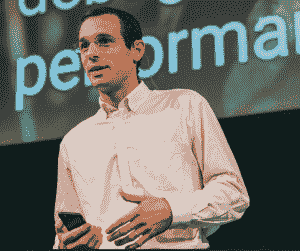

# 本周 PyDev:Aymeric Augustin

> 原文：<https://www.blog.pythonlibrary.org/2019/09/09/pydev-of-the-week-aymeric-augustin/>

本周，我们欢迎 Aymeric Augustin([@ aymericaugustin](https://twitter.com/aymericaugustin))成为我们本周的 PyDev。Aymeric 是一个 Python web 框架 Django 的核心开发者。他还是一名企业家，并在多个 Django 相关会议上发言。你可以在他的[网站](https://myks.org/en/)上找到 Aymeric，或者在 [Github](https://github.com/aaugustin) 上查看他的自由/开源软件贡献。让我们花一些时间来更好地了解他！



你能告诉我们一些关于你自己的情况吗(爱好、教育等)

你知道怎么认出法国人吗？那总是他们提到的第一件事！现在那已经不碍事了...

这些天来，我的爱好集中在做三个好女孩的父亲🙂我们一起做很多体育活动:游泳、骑自行车、园艺、演奏音乐等。

我在 CANAL+管理一个大约 200 人的软件工程部门，CANAL+是一家法国视听媒体集团，在几个国家经营电视服务。

我被培养成一名多面手工程师，最终专攻计算机科学和信息技术，但我在工作中学会了大部分知识。

**你为什么开始使用 Python？**

2006 年，一个朋友告诉我一种叫做 Python 的伟大而简单的语言。起初我拒绝了它:我说 PHP 对于我想做的任何事情来说都足够简单。这在我说过的一长串愚蠢的事情中排名很高🙂

一年后，我在(现已倒闭的)Zonbu 实习，在帕洛阿尔托过着创业的生活。那是我写第一个 Python 应用的时候。这是一个桌面图形用户界面，用于编码视频，以便在 iPods 或刚刚发布的 iPhone 上播放。我和 PyGTK 还有 glade 一起建的。在引擎盖下，它运行 mencoder 和 MP4box。

我从我的档案中找出了这次采访的源代码。它不仅使用制表符缩进和反斜杠换行，还拥有一个优雅的日志系统:

```py

if __debug__:
print("INFO: Initializing BackgroundEncoder")
```

然后，在 2009 年，在我的第一份工作中，我写了两个重要的 Python 项目。我在做一个火车上的娱乐门户网站。第一个集中了门户网站和网络基础设施之间的板载通信。第二种方法根据可用的网络连接来管理内容同步。我发现了自动化测试的概念，并为我的测试覆盖率感到非常自豪。

**你还知道哪些编程语言，你最喜欢哪一种？**

我的第一语言是 Basic，1995 年第一次是 FutureBASIC，后来是 TI-BASIC。然后一个朋友在 1997 年给我介绍了 HTML 和万维网。我们一起为我们的高中做了一个网站。

我的计算机科学课程大部分是 Caml 一种面向数学的优秀语言，但在法国学术界、Java 和 c 之外鲜为人知。我还有机会尝试其他有趣的语言，如 Erlang、Factor、Haskell 和 Scheme。

我仍然喜欢写一些小的 C 语言，主要是 Python 扩展。我没有用过 Java，因为 1.5 是最新最棒的。我不能说我还知道它。我试过 C#。网大约在同一时间。我不喜欢它，因为文档总是告诉我我已经知道的，而不是我想知道的。

在课程之外，我写了很多 PHP。如果你正在阅读这篇文章，你可能已经意识到用 PHP 编写重要项目的挑战。然而，没有 PHP 我就不会在这里，所以我很感激它的存在。一步一步，我从静态 HTML 到小的动态比特，然后分解出重复的部分，然后编写自己的迷你框架，然后是 Python 和 Django。这是一个很好的学习途径。

专业上，除了 Python，我一直在写 JavaScript 和 CSS。当我联合创办[或](https://otherwise.fr/)时，我自学了现代全栈开发——因为在初创公司担任首席技术官意味着一开始你是唯一的开发者。在我职业生涯的早期，我也写过一些 Ruby，但是我更喜欢 Django 而不是 Rails。

纯粹从语言角度，我还是很喜欢 Caml 的。我当然在美化我学习编程时的记忆🙂反正有时候感觉自己就是一个迷失在 Python 土地上的静态打字迷！

你现在在做什么项目？

这些天我主要在维护 [websockets](https://websockets.readthedocs.io/en/stable/) 。这是一个很好的挑战，因为在这两个领域我还有很多东西要学:并发编程和优秀的文档。

目前我正在考虑将协议从 I/O 中分离出来。我想基于 trio 和 curio 构建替代方案。然而，这将是对基于 asyncio 的当前实现的大规模重构。它的好处大多是理论上的。我仍然在想我是否真的想在那里度过时光。

我开始 websockets 的时候，吉多·范·罗苏姆正在建造一个叫郁金香的 asyncio。我在工作中有一个用例，WebSocket 协议似乎是一个很好的匹配。受请求营销的启发，我决定构建一个开源库，这将由于一个伟大的 API 而获得成功。我忽略了营销至少和 API 设计一样重要🙂尽管如此，websockets 还是适度地流行了起来。几个月后我离开了那份工作。在实践中，我从未使用过 websockets。这是我的一个爱好，给了我很大的自由去尝试。

不过，我正在努力应对一个意想不到的后果。从 GitHub 的问题来看，websockets 的主要用例似乎是连接到加密货币追踪器。我希望我不是这场环境灾难的罪魁祸首，哪怕是间接的。(比特币矿工燃烧了太多的煤，向大气中排放了太多的二氧化碳。我知道理论上的选择，但我对现实更感兴趣。[比特币](https://digiconomist.net/bitcoin-energy-consumption)耗电量相当于奥地利，除了投机和购买非法商品之外没有主流用例。)

我理解为什么开源精神拒绝对软件使用方式的限制。尽管如此，把我的时间和精力无偿地给那些直接违背我的信念的人还是令人沮丧的。

哪些 Python 库是你最喜欢的(核心或第三方)？

对于 whitenoise 我只有好话要说。用 WSGI 服务器高效地提供静态文件，让 CDN 去做剩下的事情，这是一种解放。

我喜欢在我关心的一个方面比主流解决方案更好的挑战者。比起 gunicorn 我更喜欢 waste，因为它不太容易受到 slowloris 的攻击，所以不需要设置 nginx。我使用 django-s3-storage 而不是 django-storages，因为它的 listdir()实现具有不错的性能。我最近开始考虑将 trio 作为 asyncio 的替代方案，理论上我喜欢这种设计。希望我在实践中也会喜欢它。

我不能错过这个宣传我的一个图书馆的机会🙂检查[日期增量](https://github.com/aaugustin/datedelta)。你会喜欢的！

**你是如何成为 Django 的核心开发者的？**

多亏了杰里米·莱恩，我在 2008 年发现了姜戈。2010 年 1 月，他就他遇到的一个 bug 征求我的意见，我们开了一张罚单。Jeremy 已经是一名经验丰富的开源贡献者——他是一名 Debian 开发人员。他让我意识到我可以为开源软件做贡献！

25 岁生日那天，我第一次尝试[贡献](https://code.djangoproject.com/ticket/13362#comment:3)。几天后，我设法提交了我的第一个[补丁](https://code.djangoproject.com/ticket/13166)——一个 JavaScript 补丁🙂我不知道我为什么那样做；我没有再往前走。(顺便说一句，将所有的历史保存在公共工具中非常酷。)

2011 年 1 月，当我开始为巴黎的汽车共享服务 Autolib '构建软件时，我有机会选择堆栈。我决定用 Django 和 PostgreSQL。在接下来的三年里，我全职和姜戈一起工作，将它推向极限甚至超越极限。

2011 年 3 月，斯特凡尼和我结婚了，我开始更加积极地捐款——希望是巧合？那时候一个补丁很难得到评论。姜戈没有同伴。我对提交补丁的低成功率感到沮丧。

2011 年 4 月，Django 的 BDFL 雅各布·卡普兰-莫斯(Jacob Kaplan-Moss)提出了一个 5 对 1 的提议:分流 5 张票，核心开发人员将审核 1 张。正是我需要的！我抓住了这个机会，用了五次。我掌握了分类票的窍门，最终在三周内处理了 70 张票。

大约在那个时候，我挑战自己成为 Django 核心开发人员。我想我是在寻找与该职位的声望相关的自我提升，也许也是为了在没人关心的情况下，能够提交自己的补丁。(事后看来，我希望我没有那么自私的理由，但事情就是这样。2011 年是艰难的一年。)

所以，我照着手册做了。它说潜在的提交者应该贡献一个主要的特性。很好。我浏览了谷歌代码创意之夏的列表。我寻找一个能以最小风险完成的功能。我选择了“对日期时间表示的多时区支持”。

作为一个额外的收获，它对 Autolib '很有用。如果客户在夏令时变更期间租车，我们就无法计算出正确的时长和价格。这在 Django 1.3 中是不可能的，因为它不支持时区感知日期时间。

我彻底研究了这个问题。九月，我发了一份关于 django-developers 的提案。甚至在我写代码之前就已经成功了！两周后，卡尔·迈耶提议将我加入核心团队。我就是这样成为核心开发者的。

最后，当时区支持补丁准备好的时候，Luke Plant 好心地审核了它，我很高兴自己提交了它！

如你所见，如果没有足够的运气、同事们的好建议、同事们的帮助和 stphanie 的支持，我是不会成功的。

Django 让你兴奋的是什么？

Django 从一个框架到一个生态系统再到一个社区迅速成长。雅各布·卡普兰-莫斯就是这样塑造了这个项目。许多社区成员付出了惊人的努力，将这个机会转化为巨大的成功。

你知道很多技术社区吗...

*   通过在 100 个国家的 500 个城市举办[工作坊](https://djangogirls.org/)来辅导 2 万名女性？
*   培养了一个当地社区，直到它准备好在非洲组织一次会议？
*   给那些欢迎新人，免费给予帮助，帮助社区成长的人颁发一个[奖](https://www.djangoproject.com/foundation/prizes/)？

而且我连 DjangoCon Europe 和 Django under the Hood 之类的优秀会议都没提。

从技术角度来说，Django 令人兴奋，因为它很无聊。谁愿意花时间考虑他们的框架而不是他们的应用程序？Django 及其生态系统涵盖了许多大大小小的 web 应用的需求。它是健壮的、有据可查的、经过充分测试的，并且不落伍。还有什么？

你还有什么想说的吗？

我发现从生态学的角度来看待开源是最有趣的。在过去的十年里，生态系统发生了巨大的变化。我们还在开始。

当看单个项目时，画面往往是暗淡的。大多数项目依赖于几个与倦怠作斗争的关键贡献者。我们还没有弄清楚[可持续性](https://www.fordfoundation.org/about/library/reports-and-studies/roads-and-bridges-the-unseen-labor-behind-our-digital-infrastructure/)。

从更广阔的角度来看，现在比以往任何时候都更有活力。新项目一直在开始。[最佳实践](https://opensource.guide/)日趋成熟。

Django 已经不像 2008 年那样炙手可热了，但 DSF 会支付全职人员来确保它得到良好的维护。自 2014 年以来，我一直在思考 Django 的下一个前沿领域是进军企业 IT。我不知道这是否真的会发生，但这似乎是可能的！

今天，志愿者时间是开源的货币。明天，金钱将发挥更大的作用。我们还不知道这将如何工作。企业与开源的交互经常令人失望，但是随着 IT 利益相关者对开源有了更好的理解，这种情况正在改善。

如果我们保持学习路径的开放，如果我们知道如何组织更大的努力，开源将会蓬勃发展。如果数百万有抱负的程序员编写他们自己的迷你框架，这没什么:他们正在为更大的项目培养技能。我们已经看到开源社区在社会规范及其编纂方面取得了很大进步。我希望我们将开发治理实践，使大型的、社区驱动的开源项目更容易扩展！

谢谢你接受采访，艾默瑞