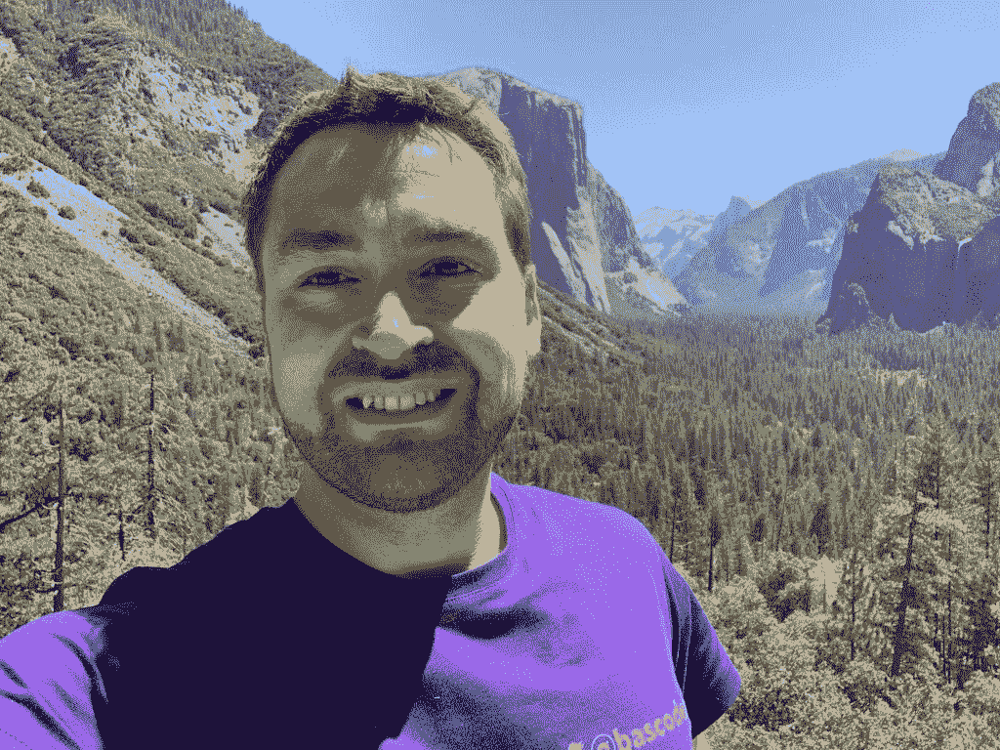

# PyDev of the Week: Bas Steins

> 原文：<https://www.blog.pythonlibrary.org/2022/07/11/pydev-of-the-week-bas-steins/>

This week we welcome Bas Steins ([@bascodes](https://twitter.com/bascodes)) as our PyDev of the Week! Bas is active in the Python community and freely gives out advice on Twitter. You can see what else Bas is up to on his [blog](https://bas.codes).

Let's take some time to get to know Bas better!

**Can you tell us a little about yourself (hobbies, education, etc):**

Hi, I'm Bas. I am a Software developer for more than a decade now. I started right after school working for a small web agency in the neighborhood and got my university degree in Scientific Programming while working for them.

When I'm not in front of a screen, I enjoy riding my road bike a lot (since I moved to the Netherlands, that's double the fun) and cooking.

Recently, I became a bee keeper and I expect to have my first self-made honey next year.

As a software developer, almost needles to say that I have a passion for great freshly grounded coffee. My hometown happens to be the domicile of Germany's oldest coffee roastery and their blends are still my favorites.

**Why did you start using Python?**

I started to have a look into Python in the early 2000s. I picked up a very weird book that was more about creating a Mayan calendar software than about Python. I enjoyed it a lot and started using it as part of my first job together with Django. That was before Django's 1.0 release and it was fun!

**What other programming languages do you know and which is your favorite?**

As a consultant, I have seen and touched many different technologies and programming languages, including Java, C#, C, C++, Rust, Go, PHP, and JavaScript.

Every now and then, I try something new – most of the time just out of curiosity. I spent a lot of time getting my head around LISP, for example.

I wouldn't say, I have a favorite programming language apart from Python. but I really like C# and JavaScript besides it.

**What projects are you working on now?**

At the moment, my main project is at a biotech company. They produce clinical devices, mostly for blood cell analysis. My job is to provide layers of abstraction to the biologists and physicists on the team and train them in software development.
As a freelancer, my projects change a lot over time, but all of them have in common that I help teams to make better software. It includes usually a lot of hands-on coding, training, and coaching, but most importantly a good understanding of the client's needs. I try to refrain from choosing development stacks based on popularity and hype. Maybe that's one reason why I like Python so much: It evolves, it is popular, but it has a stable ecosystem, too (let's not talk about 2to3).

**Which Python libraries are your favorite (core or 3rd party)?**

That depends a lot on the task I need to tackle. My all-time favorites for sure include Django, NumPy, and SciPy.

**Do you have any advice for other people who would like to become trainers or go into consulting?**

The worst part about being a consultant is the paperwork associated with working for larger corporations. I personally deal mostly with specialised recruiting agencies for these freelance roles to get around these hassles. I highly recommend doing the same. It might not be needed for contracts with smaller clients but when you want to work for larger corps, it really solves a lot of legal and accounting issues.

**Is there anything else you’d like to say?**

I started doing more of my work in public on [Twitter](https://twitter.com/bascodes) and on my [blog](https://bas.codes). I really made some great connections to awesome people.

Also, I started doing coffee chats to have a more personal connection to other people in tech. If you want to have such a chat over a (virtual) coffee, feel free to reach out!

**Thanks for doing the interview, Bas!**