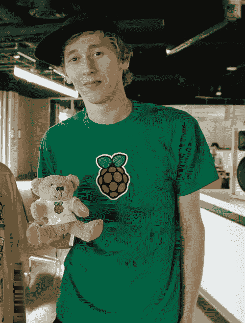

# 本周 PyDev:Ben Nuttall

> 原文：<https://www.blog.pythonlibrary.org/2016/08/08/pydev-of-the-week-ben-nuttall/>

本周，我们欢迎本·纳托尔([@本 _ 纳托尔](https://twitter.com/ben_nuttall))成为我们本周的 PyDev。Ben 是 Raspberry Pi 社区经理 http://bennuttall.com/，并且是 [GPIO Zero](https://pypi.python.org/pypi/gpiozero) 的创建者，这是一个到 Raspberry Pi 上 GPIO 组件的简单接口。你也应该看看他的[网站](http://bennuttall.com/)，看看本在做什么。让我们花一些时间来更好地了解本！

你能告诉我们一些关于你自己的情况吗(爱好、教育等)

除了编程，我还喜欢激流皮划艇，以及其他户外活动。我最近也迷上了摄影(还有很多东西要学)。

我在大学学习数学和计算，然后在软件行业工作了几年。在这段时间，我越来越多地参与当地的技术社区，参加用户组和会议。我为 Raspberry Pi 建立了一个社区活动(称为 Raspberry Jam)，并与学校一起开展了一些活动，帮助教师在课堂上使用 Raspberry Pi，并让孩子们参与数字制作。

通过这样的社区工作，我最终被 Raspberry Pi 基金会雇佣来做开发和推广工作。我们组建了一个教育团队，并开始实施教师培训方案和其他讲习班。随着我们努力通过我们的教育项目接触到世界各地更多的人，基金会的规模越来越大，影响也越来越大。我现在担任 Raspberry Pi 社区经理，支持 Jams 和其他社区工作，包括一些伟大的开源项目。

**你为什么开始使用 Python？**

一个朋友在 2011 年向我展示了 Python，他演示了一些简单的例子，语法的简单性给我留下了深刻的印象。那时我已经使用了很多 PHP、Java 和 Matlab，所以我习惯了更冗长的语法。Python 看起来就像一种出色的通用语言。很快，因为我选择了简单任务的语言，通过做这些事情，通过[pythonchallenge.com](http://pythonchallenge.com)，我很快就掌握了一套全面的技能。

当 Raspberry Pi 出现时，它变得与我更加相关，因为我学会了用 Pi 的 GPIO 引脚做物理计算项目。通过为我们放在一起的学习资源构思项目想法，以及根据团队其他成员的规范构建项目，我学到了很多东西。

你还知道哪些编程语言，你最喜欢哪一种？

我对 PHP、Ruby 和 JavaScript、Java 和 C#有相当好的理解。我想如果 Python 不存在的话，Ruby 会是我选择的语言——它在很多方面都一样好用，只是风格不同而已。我挺喜欢 Julia 的样子，但是使用经验有限。

你现在在做什么项目？

去年年底，我在 Raspberry Pi 上开发了一个控制 GPIO 组件的新库。以前的事实上的库非常低级，只允许您将单个引脚调高或调低，并读取引脚的状态，并且需要大量样板代码才能开始，这使得很难进行教学。我创建了 GPIO Zero，它的命名参考了 py game Zero(py game 的 Zero 样板包装器)。这个项目发展得非常快，我们在几个月内发布了 1.0 版。进展非常顺利，我收到了一些很好的反馈。我从达夫·琼斯那里得到了很多帮助，他维护着 Raspberry Pi 的 picamera 库。

我们目前在国际空间站上有两个 Raspberry Pis，运行由英国学校的孩子们编写的 Python 程序。这是一个名为 Astro Pi 的推广计划的一部分，由 Raspberry Pi 和英国航天局与英国欧空局宇航员 Tim Peake 合作。

哪些 Python 库是你最喜欢的(核心或第三方)？

我喜欢 itertools 的强大功能，里面有一些我经常使用的非常方便的功能。我真的很喜欢丹尼尔·波普的 py game Zero——它通过去除样板文件，使创建游戏的过程变得简单明了，取得了很大的成就。它也启发了我和其他人创建类似的图书馆，特别是用于教育。

作为一门编程语言，你认为 Python 将何去何从？

Python 在教育领域非常受欢迎。它是一种受欢迎的教学语言，因为它易于读写，并且扩展到几乎所有地方——游戏、桌面应用程序、网站、物理计算、机器人、科学、数学等等。有趣的是，如果每个孩子都有机会学习 Python，这将对未来语言的适应产生巨大影响。

我希望我们有一个适合初学者的更好的编辑器。闲着不适合目的。有一个很棒的社区项目叫做 Mu，它是为教育而设计的。它仍然需要一些工作(它目前只在 micro:bit 设备上与 micropython 一起工作),但我希望看到它继续下去。教室里也存在类似的问题，大多数开发人员都没有意识到，比如安装库的困难。我推荐图书馆维护人员阅读英国教师劳拉·迪克森的文章“Scratch 是新的 PowerPoint”。

你还有什么想说的吗？

我维护着一个名为 pyjokes 的库——一行程序员笑话服务。您可以 pip 安装它以在命令行上访问笑话，或者在您自己的 Python 项目中使用笑话。我们还有一个你可以关注的 Twitter 机器人:@ py skins _ bot。

感谢您接受采访！