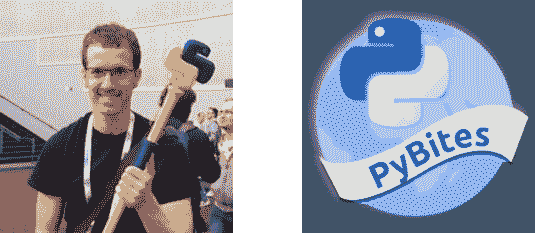

# 本周 PyDev:鲍勃·贝尔德博斯

> 原文：<https://www.blog.pythonlibrary.org/2019/12/02/pydev-of-the-week-bob-belderbos/>

本周我们欢迎鲍勃·贝尔德博斯([@贝尔德博斯](https://twitter.com/bbelderbos) )成为我们本周的 PyDev！鲍勃是 [PyBites](https://pybit.es) 的联合创始人。鲍勃也为真正的蟒蛇做出了贡献，他是一名会说话的蟒蛇驯兽师。你可以通过查看 Bob 的[网站](https://bobbelderbos.com/)或访问他的 [Github 简介](https://github.com/bbelderbos)来了解更多关于 Bob 的信息。让我们花一些宝贵的时间来更好地了解鲍勃！

你能告诉我们一些关于你自己的情况吗(爱好、教育等)

我是一名软件开发人员，目前在甲骨文全球建筑工程集团工作。但我更出名的身份可能是 PyBites 的联合创始人，这是一个通过代码挑战掌握 Python 的社区。

我有商业经济学背景。2004 年完成学业后，我从荷兰移民到西班牙，开始在 IT 行业工作。我对编程很感兴趣。我自学了网页设计和编码，并开始了我最大的爱好:将无聊的事情自动化，让别人的生活变得更容易。

不编码的时候，我喜欢和家人(两个孩子的父亲)呆在一起，锻炼身体，看书，并且(如果有一天时间允许的话)喜欢重新学习绘画和意大利语🙂

**你为什么开始使用 Python？**

回到太阳微系统公司，我建立了一套支持工具来诊断服务器故障。我从 shell 脚本转向 Perl，但是它很快变成了维护的噩梦。输入 Python。在习惯了所需的缩进后，我爱上了 Python。我惊讶地发现，作为一名开发人员，这让我多么开心。真的引起了我的共鸣)。

从那以后，我再也没有回头。即使我愿意，现在有了 PyBites，认真投资其他语言就更难了(后面会有更多)。

你还知道哪些编程语言，你最喜欢哪一种？

我开始了我的软件之旅，用 PHP 和 MySQL 建立网站。我自学了很好的 HTML 和 CSS 基础，这让我受益至今。

作为一名 web 开发人员，了解 JavaScript 很重要，它为大多数 web 提供了动力！它肯定不是 Python，但是我用得越多，我就越喜欢这种语言。最后，几年前我学了一些 Java，但是除了写一个 Android 游戏之外，我没有找到一个用例。我很幸运能够用 Python 来完成这些天我几乎所有的工作，它是我最喜欢的编程语言。

你现在在做什么项目？

我几乎所有的空闲时间都花在了 PyBites 上，尤其是我们的 CodeChalleng.es 平台。我们最近推出了许多令人兴奋的功能:[学习路径](https://codechalleng.es/bites/paths)、[新手咬](https://codechalleng.es/bites/newbie)(我们的练习称为*咬*)和 [flake8/black](https://codechalleng.es/news) 。

该平台是使用 Django 构建的，它使用 AWS Lambda 来执行代码。你可以在这里听我说栈[。](https://testandcode.com/83)

除了平台开发，还有实际的咬练习(目前 229)。我喜欢添加新成员(我自己或与我们的 *Bite 作者*一起工作)，并帮助人们编写代码。

总之，我们现在有了一个伟大的生态系统，它允许我们每天教授(和学习)更多的 Python。这是非常令人满意的！

PyBites 的起源故事是什么？

朱利安和我，经过多年的友谊和集思广益，有一天真的说:如果我们想产生影响，我们需要开始某种项目，让我们自己去那里。

主题变成了 **Python** :我想提高自己的技能，Julian 想从头开始学习 Python 编程。这种(初始)技能水平的差异给它增加了一个很好的动力。

我们开始了我们的博客，在那里我们分享每周学到的东西。正如我们从[中学到的复合效应](https://www.amazon.com/dp/159315724X/?tag=pyb0f-20):为了增加你成功的机会，找一个成功的伙伴，一个在你巩固新习惯的同时回报他人帮助的人——这对我们非常有用！

有一点对我们来说很突出:**要学习编码，你需要写大量的代码**。大约在同一时间，我们听说了一个有趣的实验[诺亚·卡根](https://okdork.com)正在做:[咖啡挑战](https://fhww.files.wordpress.com/2018/07/75-noah-kagan.pdf)。这导致了我们的[博客代码挑战](https://pybit.es/pages/challenges.html)，最终导致了我们的 [#100DaysOfCode 旅程](https://pybit.es/special-100days-of-code.html) ( [和课程](https://training.talkpython.fm/courses/explore_100days_in_python/100-days-of-code-in-python))和我们的 [CodeChalleng.es 平台](https://codechalleng.es)。

在这个项目中，你遇到了什么样的挑战？

我们必须学会如何平衡工作和家庭生活。在全职工作的同时做这件事意味着巨大的个人时间投资。你必须组织起来，考虑规模，委派任务，以免不知所措/筋疲力尽。

这就引出了我们面临的第二个挑战:学习营销/商业方面的知识。建造它，他们就会来...不完全是！一个巨大的挑战是建立获得反馈和快速迭代(kaizen)的机制，以制造人们真正想要/需要的产品。

哪些 Python 库是你最喜欢的(核心或第三方)？

在标准库中有很多我在工作中或我们的平台上使用的 gem。部分收藏夹:[收藏](https://docs.python.org/3/library/collections.html)(named tuple/default dict/Counter)[ITER tools](https://docs.python.org/3.8/library/itertools.html)、 [re](https://docs.python.org/3/library/re.html) 和 [datetime](https://docs.python.org/3/library/datetime.html) / [日历](https://docs.python.org/3.8/library/calendar.html)。

外部模块:pypi 上有 20 万个包，我几乎没用过冰山一角。然而还有一些 *goto* 库: [requests](https://pypi.org/project/requests/) ， [feedparser](https://pypi.org/project/feedparser/) ， [BeautifulSoup](https://pypi.org/project/beautifulsoup4/) ， [dateutil](https://pypi.org/project/python-dateutil/) ， [pandas](https://pypi.org/project/pandas/) 和 [Django](https://pypi.org/project/Django/) 当然。

当我们学到一些很酷的东西时，我们会试着一口或几口把它包起来，和/或在 Twitter 上发布提示，查看我们的收藏，并在这里添加你自己的。

你还有什么想说的吗？

谢谢你邀请我。我喜欢阅读这些采访，是什么打动了其他开发人员，这真的很鼓舞人心。继续努力吧！

如果没有**行动号召** : [就像杰克·范德普拉斯说的](https://twitter.com/jakevdp/status/906901174728536066?lang=en):不要开始*学习 Python* ，我们就不会是皮比特人。选择一个你感兴趣的问题，学会用 Python 解决。-访问我们的网站 [CodeChalleng.es](https://codechalleng.es) 获取编码！

鲍勃，谢谢你接受采访！