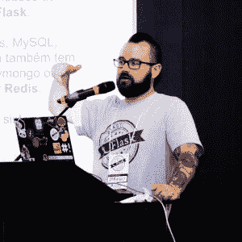

# 本周 PyDev:布鲁诺·罗查

> 原文：<https://www.blog.pythonlibrary.org/2019/03/18/pydev-of-the-week-bruno-rocha/>

本周我们欢迎布鲁诺·罗查([@罗查布鲁诺](https://twitter.com/rochacbruno))成为我们本周的 PyDev！Bruno 为 Red Hat 工作，并参与 Python、Flask 和 Rust 社区。你可以在 [Github](https://github.com/rochacbruno) 上看到他的一些项目，或者在[媒体](https://medium.com/@rochacbruno)上查看他的一些文章。让我们花点时间来更好地了解布鲁诺！

你能告诉我们一些关于你自己的情况吗(爱好、教育等)

我是布鲁诺·罗查，来自巴西圣保罗的软件工程师。

我在很小的时候就开始玩电脑，那时我 12 岁，我妈妈给了我一台旧的 IBM XT 5160。玩了几天 DOOM，学了几天 LOTUS 123 工作表，自然就成了家里的电脑男孩。我学习了 MS.DOS 6.22(当时的新事物)课程，学会了用 BASIC 和 dBase 编程，几年后 web 出现在巴西，我开始用 Perl 中的 CGI 制作 HTML 网站，也用 MS Access 95 中的宏创建程序。

我做了几年计算机基础课程的讲师，做过一些网页设计师的工作，也做过网络安装、PC 构建，1998 年我通过 Conectiva(一个基于巴西红帽的发行版)认识了 Linux。我开始接触开源和 Linux，然后我成为了 Linux 和 Windows NT 混合网络的系统管理员。

几年后，我加入了信息系统大学并毕业了，在毕业期间，我爱上了编程，从那时起，我一直从事软件开发工作，开始了一些小生意(在我们不称之为“创业”的日子里)，我为 Palm Inc .工作，用 C 语言为 Palm OS 开发驱动程序和销售人员系统，为巴西的几家大公司开发门户和 CMS，教授在线 Python 课程， 在巴西最大的就业委员会的数据科学团队工作，自 2016 年以来，我一直致力于 Red Hat 的质量工程和测试自动化。

除了软件和电脑，我从出生就是素食主义者，吃素超过 15 年。我一直非常积极地参与动物权利保护运动和救助被遗弃的动物(目前照顾 32 只被救助的动物)。

在我的空闲时间，我喜欢烹饪纯素食，但我最大的爱好是公路自行车，我参加了一些老式自行车比赛，我的比安奇 1973 和我的卡洛伊-10 1980，最近我成为了一个男孩的父亲，埃里克 3 个月大，生活发生了一点变化，从那时起，我最大的爱好是睡觉，只要我能。

**你为什么开始使用 Python？**

在 21 世纪初，我致力于将 Linux 带到我提供系统管理服务的公司的桌面上，Knoppix (Linux from Live CD)问世了，在巴西，我参与了名为 Kurumin Linux 的 Linux 发行版社区。这个 Linux 中的创新是所谓的“魔法图标”,许多都是用 Python 编写的，其中一个图标导致了一个关于 Python 的交互式教程，那时我有了第一次接触，然后我开始为这个社区做贡献。

将 Linux 引入桌面的想法失败了，但作为补偿，我学习了 Python，随着诸如 Pylons、Turbogears 和 Django 等 web 框架的出现，Python 很快在其他领域变得有用。

尽管使用不同的技术。为了支付账单，我越来越多地使用 Python，并将其作为我的首选项目语言，在 2008 年左右，我成为了核心提交者和 Web2py 最活跃的贡献者之一。我开始组织聚会，在许多社区活动和大型会议上发言，2012 年，我与 Python 合著了一本关于 web 开发的书，同年，我被提名为 Python 软件基金会的会员，我仍然在该基金会的两个工作组中工作。

自 2008 年以来，我在不同领域专门从事 Python 的工作，教学，维护一些开源库，与 Django 和 Flask 一起更多地参与 web，最近专注于测试自动化和质量工程。

你还知道哪些编程语言，你最喜欢哪一种？

我精通 C，C#，Javascript，Bash，PHP，Perl，Lua，Python，目前正在学习 Rust。

除了 Python(当然，因为它是支持我将近 15 年的技术和社区),如果我必须选择一种语言，我会选择 Rust，因为它是一种创新的语言，它给我的感觉是我正在以正确的方式做事，它非常具有挑战性，一切都表明它将有一个光明的未来！(或者说，生锈的未来)

你现在在做什么项目？

我主要围绕 Flask 创建了一些开源项目，其中之一是 [Flasgger](https://github.com/rochacbruno/flasgger) (可怕的名字)，它是创建 Swagger APIs 的扩展。我还用 Flask 和 NoSQL 创建了一个名为 [Quokka CMS](https://github.com/rochacbruno/quokka) 的 CMS，以及目前由社区维护的 Flask 的一些其他[扩展](http://brunorocha.org/my-projects/)，因为我没有太多时间投入到这些项目中。

我积极维护的唯一项目是一个名为 [Dynaconf](https://github.com/rochacbruno/dynaconf) 的库，它是一个 Python 配置管理器，具有 Django 和 Flask 的扩展，旨在通过支持各种文件格式、环境和数据库来促进动态设置的管理。

从专业角度来说，我从事的是红帽卫星和 Ansible Galaxy 的纸浆项目。Pulp 是一个 Django 应用程序，它控制软件包的分发。我的角色是开发 [Pulp-Smash](https://github.com/pulpQe) 一个锻炼 Pulp 的功能测试框架。

此外，我一直在教 Python 和质量工程，我在 YouTube 频道(葡萄牙语)上分享一些东西，并共同主持了[cast lio 播客](http://castalio.info/)。

哪些 Python 库是你最喜欢的(核心或第三方)？

在标准库中，我非常欣赏 Functools 和 Contextlib，我真的很喜欢元编程，我在几乎所有的项目中都使用了这两个库。

第三方我想提一下诗歌，我相信[诗歌](https://github.com/sdispater/poetry)是每个 Pythonist 爱好者一直梦想的“包管理器”，这个工具需要更多的关注，因为目前它是最好地解决依赖和分发问题的工具。

你还有什么想说的吗？

我想利用这个空间来非常感谢所有的“社会开发者”，他们把时间和智慧投入到创造已经改变世界的社会影响项目中，技术是一个很好的收入来源，但最重要的事情是“改变世界”，并且仍然给我开源的能量的是知道我用开源做的一点点事情可以在某种程度上帮助社会影响项目。

最后但同样重要的是:吃素吧！。

布鲁诺，谢谢你接受采访！