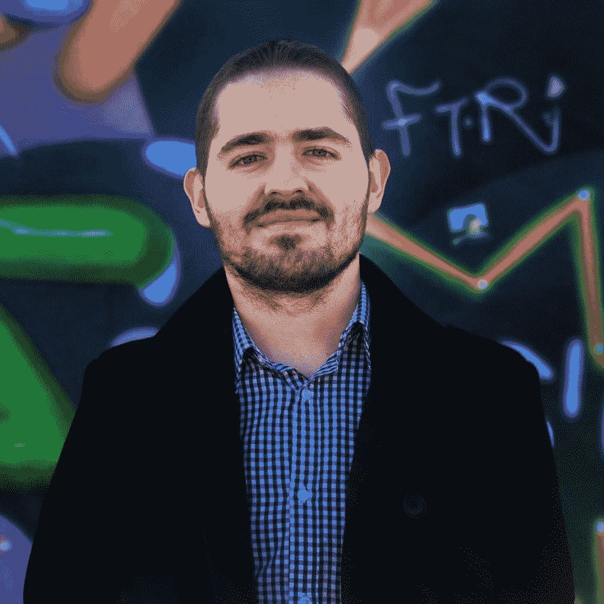

# 本周 PyDev:克里斯蒂·弗拉德

> 原文：<https://www.blog.pythonlibrary.org/2020/05/25/pydev-of-the-week-cristi-vlad/>

本周我们欢迎克里斯蒂·弗拉德([@克里斯蒂瓦拉 25](https://twitter.com/CristiVlad25) )成为我们本周的 PyDev！克里斯蒂在他的 [Youtube 频道](https://t.co/WV8MQrJoZk?amp=1)上用 Python 教授网络安全。他还写了一些书，并在他的博客上撰文。你也可以在那里看到他的书。

让我们花些时间来更好地了解 Cristi！

你能告诉我们一些关于你自己的情况吗(爱好、教育等)

我一直喜欢数字。拥有土木工程硕士学位，我决定在完成学业后放弃这个领域的一个很好的工作机会，去尝试计算机方面的东西。

企业家精神和改善我的生理状况的结合对我有很大的吸引力。所以我开始研究如何提高我的身体和精神能力，我钻研了生物化学、人体解剖学和各种科学文献，最终我写了 7 本关于身体改善的书。

带着与生俱来的好奇心，我总是试图自学计算机编程，但有几次都惨败。我尝试学习 JAVA，因为我也想戴上 Android 开发者的帽子。这是在 2011 年到 2015 年之间。

我想给编程最后一次机会，如果我没有任何进展，我会完全放弃努力。

**你为什么开始使用 Python？**

JAVA 绝对不是我要走的路。它又丑又没吸引力。所以我的下一个最佳选择必须是干净、直观、非常直截了当的。那就是 Python。那是 2015 年，Python 有一个由热情的开发人员组成的成熟社区。

所以我用大量的资源轰炸自己来吸收 Python，非常强调实践。我使用 biopython 和其他库对基因组学和 Python 的结合进行了大量练习。那救了我。当谈到计算机编程时，我开始觉得我并不完全迟钝。

你还知道哪些编程语言，你最喜欢哪一种？

Python 是迄今为止我最喜欢的语言。然而，随着我开始更好地掌握它，我也探索了其他概念，比如 Javascript、C++、C、Bash 和汇编。

你现在在做什么项目？

我目前没有积极地、有目的地从事大型编程项目，但是我经常使用 Python 和 Bash 来编写自己的工具，用于渗透测试和 bug 搜索。

我最近的两个项目是两个课程，帮助有抱负的和已建立的网络安全专业人员在日常工作中学习和使用 Python。

用于渗透测试人员的 python:http://bit.ly/2I0sRkm

我的 Youtube 频道是另一个正在进行的项目，我经常在那里教授 Python 在笔测试和 bug 赏金猎人中的应用。

https://www.youtube.com/channel/UCXXXoi68Hv6caNLWfw7j8MQ

哪些 Python 库是你最喜欢的(核心或第三方)？

我会说 requests、beautifulsoup 和 socket 是我的前三名，主要是因为我在教学和实践中经常使用它们。当然，作为一名网络安全专业人员，我也喜欢与 scrapy 一起工作。

图书馆太棒了！不要误解我。但是作为一个有抱负的极简主义者，我尽力做到最好。我不想从头开始重新发明轮子。这将是徒劳的。然而，只要有可能，我就尽量限制自己使用准系统。

**你是怎么用 Python 进入网络安全的？**

这是一个自然的过程。在学习 Python 的同时，我也了解了 Kali Linux 和伦理黑客。那是一见钟情。

**您在网络安全方面使用的顶级工具有哪些？**

打嗝套件、grep、cat 和 google。

你还有什么想说的吗？

是的，Python 给了你超能力。学习如何用它来自动化你无聊的事情。从今天开始。

克里斯蒂，非常感谢你接受采访！