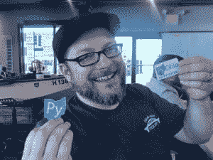

# 本周 PyDev:Dave Forgac

> 原文：<https://www.blog.pythonlibrary.org/2017/08/07/pydev-of-the-week-dave-forgac/>

本周，我们欢迎戴夫·福加克成为我们本周的 PyDev！Dave 是 PyOhio、ClePy 和克利夫兰 API Meetup 的组织者。他还在 PyCon 2017 上做了一个关于分享您的代码的演示，您可以在下面观看:

[https://www.youtube.com/watch?v=qOH-h-EKKac](https://www.youtube.com/watch?v=qOH-h-EKKac)

戴夫还有一个列出他其他演讲的网站。你可能也会觉得他的 [Github](https://github.com/tylerdave) 简介很有趣。让我们花一些时间来更好地了解 Dave！

你能告诉我们一些关于你自己的情况吗(爱好、教育等)

我是俄亥俄州大克利夫兰地区 American Greetings 的一名高级软件工程师。在那里，我主要关注 API 设计和开发、应用程序部署和内部开发人员体验。

我在克利夫兰长大，在失去奖学金和休假之前，我上过几个学期的大学课程。我在 2003 年搬到了特拉华州的威尔明顿，并最终回到了学校，比原计划晚了八年完成了信息系统学位(永远不会太迟！)2011 年，我和妻子搬回了克利夫兰地区。我们现在有一个 3.5 岁的孩子和一个新生儿让我们忙个不停。

我喜欢和我的孩子一起玩，和我的家人在镇上散步，烹饪，酿造，徒步旅行和桌面游戏。我最近真的很喜欢第五版 D&D。我也有一堆“玩具”编程项目，当我有时间的时候我就去做。

最近，我花在社区组织上的时间比我写代码的时间还多。我帮助组织了一些当地的聚会和聚会。我是 PyOhio 2017 项目主席，刚刚敲定了日程。你应该找个时间去看看 PyOhio！

**你为什么开始使用 Python？**

我的第一份付费编程工作是使用 Perl，在某个时候，有人(我希望我能记得是谁！)建议我去看看 Python。1999 年圣诞节，我给自己买了一本《学习 Python 》,很喜欢我看到的内容。然后我做了一些 PHP 和 Ruby 的工作，但也涉猎了 Python。当我在 2008 年开始在一家虚拟主机公司工作时，我终于开始更经常地使用它来自动化管理任务。从那以后，Python 一直是我的主要语言。

你还知道哪些编程语言，你最喜欢哪一种？
 *这些年来，我学过很多语言，从我小时候从邻居的垃圾桶里捡来的一台 TRS-80 的 BASIC 语言开始。我已经用 Perl、PHP、Java、Ruby、JavaScript / Node 和 Go 做了大量的工作。到目前为止，Python 是我最喜欢的语言，也是我最喜欢的社区。不过，根据任务的不同，我可以看到自己在围棋上做更多的工作。*

你现在在做什么项目？

在过去的几个月里，我一直在为 OSCON 和 PyCon 的讲座和辅导课做准备，这些工作一完成，PyOhio 的组织工作就进入了高潮。八月份，一个新的孩子要来了，我可能不会有太多的时间去做额外的项目。一旦我找到一些空闲时间，尽管我正在完成一个 DIY 气象站，并为 D & D 使用的 Alexa 技能添加一些功能。我还计划对几个现实世界连接的 Twitter 机器人进行一些更新:@iotjackolantern 和@iotxmastree

哪些 Python 库是你最喜欢的(核心或第三方)？

*我想到了三个，因为它们改变了我日常编写和管理 Python 代码的方式:*

*   Cookiecutter 允许你根据模板和一些问题的答案生成项目。它会为您处理所有的样板文件，这样您就可以快速开始处理您的包所做的事情，而不是打包和设置。我发现这让我更有可能打包和发布代码。我喜欢你可以在生成的项目中包含测试存根和文档布局，因为当你发布一个项目时，人们更有可能对现有的测试/文档做出改进，而不是为你大规模地创建它们。我建议找到一个接近您所需的包模板，将其分叉，并将其用作 Python 项目的基础。
*   Pipsi 将 Python 包安装在它们自己独立的 virtualenvs 中，并使它们可以从你的缺省 shell 中获得。我用它来使许多 Python 命令行工具对我可用，而不必担心激活 virtualenv。例如，我通过 Pipsi 安装了 Cookiecutter。
*   Jupyter 为您提供了一个基于 web 的界面，用于交互式运行 Python(和其他代码)。您通常会在数据分析和科学计算的环境中听到它，但我发现这是一种试验新代码或在我忘记时保存事物如何工作的示例的好方法。

你还有什么想说的吗？
 *我非常兴奋 2018-2019 年的 PyCon 将在克里夫兰举行！我期待着展示我的不被重视的城市，并认为人们将度过一段美好的时光。如果你想谈论参观克利夫兰的 PyCon 或其他任何事情，请在 Twitter @tylerdave 上找到我。*

感谢您接受采访！