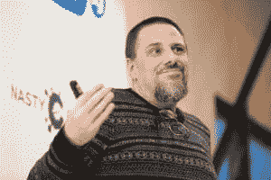

# 本周 PyDev:大卫·默茨

> 原文：<https://www.blog.pythonlibrary.org/2016/11/21/pydev-of-the-week-david-mertz/>

本周我们欢迎大卫·默茨([@默茨 _ 大卫](https://twitter.com/mertz_david))成为我们本周的 PyDev！David 是《Python 中的[文本处理](http://amzn.to/2e4xRVO)以及 IBM developerWorks 上许多关于 Python 的有趣文章的作者。我很确定我在第一次学习 Python 的时候读过其中的一些文章。你可以在这里查看一份非常详细的清单。他曾担任 Python 软件基金会董事会成员长达 6 年。让我们花一些时间来更好地了解他！

你能告诉我们一些关于你自己的情况吗(爱好、教育等)

我走了一条奇怪的路去写 Python 代码，以及关于 Python 代码的写作。我的博士学位是后结构主义马克思主义政治哲学。我在那个领域做了一些出色的工作，喜欢为学术期刊写作，并在这类会议上发表论文。但我也有点反应迟钝，所以我花了十年时间才明白，没有人会真的付钱给我去了解那些东西；可悲的是，真正的终身职位体系，尤其是在人文学科，大多已经死亡，而兼职工作的报酬大多在最低工资左右(或更低)。

**你为什么开始使用 Python？**

几年后，我以用其他语言写代码为生(大多数是 xBase 方言，比如 Clipper 实际上，我真的很喜欢这些语言)，我继续努力跟上其他技术的发展。我第一次使用 Python 是在 1998 年，但是非常顺便。

此后不久，在 1999 年或 2000 年，我有机会开始为一些广泛阅读的出版物撰写关于计算机编程和计算机科学的文章。其中最稳定的是 IBM developerWorks，我在那里有专栏**迷人的 Python** 。在 2000-2008 年期间，我还为他们(比如另一个名为 **XML Matters** 的专栏，以及各种其他文章)和其他出版商写过其他文章，包括为 Addison Wesley 写的一本书。

这样做的好处是，我可以沉浸在“应用计算机科学”的主题中，就像在这个领域获得另一个研究生学位一样。我在那里的目标总是追求一些有趣的概念——一个库、一种编程技术、一种有用的工具等等——然后写一篇我希望在我开始学习它之前就已经存在的文章。幸运的是，与大多数受过纯技术教育的人相比，我过去和现在都能够以更独特的风格和更清晰的思路写作。

在整个过程中，我越来越喜欢 Python，尽管我学习了它并将其与许多其他编程语言进行了比较。

你还知道哪些编程语言，你最喜欢哪一种？

我涉猎了几十种，也许几百种语言。但是在过去的 15 年里，我写的大部分代码都是用 Python 写的。

然而，我对那些有很多好的设计思想的 xBase 语言有着美好的回忆。我仍然喜欢每天在类 Unix 系统上使用 shell 工具(bash、grep、sed、cut、tr 等)。；每一个都有他们自己的迷你语言——有些甚至是图灵完全性的)。

我写过 C，C++，Java，PHP，Pascal，Fortran，以及其他用于实际生产的东西。但实际上我并不爱这些。实际上，尽管许多用户抱怨它的缺点，r 还是有一定的优雅之处。Javascript 自身的方式也是如此。REXX 在某些方面也很简洁。当然，我钦佩 Haskell 的数学纯粹性——它让我想起了我喜欢研究的模型理论、高级逻辑和超限集合论。

你现在在做什么项目？

主要是开发连续体分析的培训材料，并为他们进行实际教学。

我还监督了一个专有产品 IOPro 在自由软件世界的发布，名字是 TextAdapter。这是我在 PyData SF 上谈到的一个很酷的产品/项目，它是由 Cython 和 Python 混合编写的(带有一点普通的 C 语言)。

哪些 Python 库是你最喜欢的(核心或第三方)？

*我非常喜欢[这个](https://www.python.org/dev/peps/pep-0020/)。之后，可能 [itertools](https://docs.python.org/3/library/itertools.html) 是我的最爱之一。我的同事 Matt Rocklin 的 [toolz](https://pypi.python.org/pypi/toolz) 拥有简洁的功能。实际上，与此相关的是，我真的很喜欢 Dask，它可能既是一个工具，也是一个库。*

作为一门编程语言，你认为 Python 将何去何从？

我认为它正在接管科学计算，这令我非常兴奋。就核心语言而言，我开始担心它在过去几年里变得太差了。一些新的小功能的吸引力正在以一种我不完全喜欢的方式对抗结构中的极简主义。但是它仍然是——并且我相信它将仍然是——最易读的编程语言选择。

感谢您接受采访！