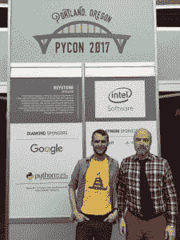

# 本周 PyDev:David WOL ever

> 原文：<https://www.blog.pythonlibrary.org/2017/06/26/pydev-of-the-week-david-wolever/>

本周，我们欢迎大卫·沃勒弗([@沃勒弗](https://twitter.com/wolever))成为我们本周的 PyDev。大卫是加拿大和 Akindi.com PyCon 公司的联合创始人，这是一家让多项选择泡泡表测试不那么可怕的小公司。他也是[鼻子参数化](https://pypi.python.org/pypi/nose-parameterized)项目和 [pprint++](https://github.com/wolever/pprintpp) 项目的作者。你也可以在 [Github](https://github.com/wolever) 上查看他还参与了哪些项目。让我们花点时间来了解一下大卫！

你能告诉我们一些关于你自己的情况吗(爱好、教育等)

我是 Python 的长期粉丝，也是来自加拿大多伦多的初创公司创始人。当我意识到我对构建软件感兴趣，而不是证明图形搜索算法的运行时界限时，我从多伦多大学的软件工程专业退学了(尽管我非常感谢那些喜欢这样做的人)，从那以后，我一直与小型创业公司合作。

我是我公司的首席技术官， [Akindi](https://akindi.com) ，让 Scantron 风格的多项选择泡泡表变得不那么可怕。

2012 年，我和几个朋友创办了加拿大 PyCon，我对今年将在蒙特利尔举办感到非常兴奋(现在就去买票，因为票会卖光的:https://pycon.ca)

除了电脑，我真的很喜欢绳结(前三名:阿尔卑斯蝴蝶，水壶吊索挂钩，链 sinnet)和摩托车。

我在 https://twitter.com/wolever 发推文

**你为什么开始使用 Python？**

我在 2003 年左右开始使用 Python 来破解一个开源的基于 curses 的 MSN Messenger 客户端，名为[Pebrot](http://pebrot.sourceforge.net/)

你还知道哪些编程语言，你最喜欢哪一种？

我在日常工作中写了很多 JavaScript，而且我对 Bash 非常精通。我还用 C、C++、PHP 和 Go 编写了大量代码。

不过，我最喜欢的语言是 SQL。我从使用 SQL(尤其是 Postgres)中获得了不健康的快乐。

我投资的下一门语言将是一个强大的、静态的类型系统。也许流动？打字稿？我还不确定。但是我厌倦了把所有的时间浪费在计算机本应该为我检测到的问题上。

你现在在做什么项目？

我的主要项目是我的公司，[阿金迪](https://akindi.com)。我们的产品是 Scantron 风格的多项选择气泡表评分系统，比市场上的任何其他产品都要简单。(不)幸运的是，我们已经发展得足够大了，我不用每天都做很多编码工作。

就开源项目而言，我有几个引以为豪的小项目:

*   [git-blast](https://github.com/wolever/git-blast) ，显示按最后提交日期排序的 git 提交
*   [参数化](https://github.com/wolever/parameterized)，这是一个参数化的测试库，适用于所有的测试框架
*   pprintpp ，pprintpp 模块的替代产品，但它实际上很漂亮

哪些 Python 库是你最喜欢的(核心或第三方)？

哦，这是个棘手的问题。不过，我想到了一些:

*   gevent:我喜欢 gevent 的实现，它公开的 API 无疑是 Python 中最好的并发 API。如果有类似的线程和多处理 API，那就太棒了。
*   pathlib:非常漂亮，我还没有后悔使用它。
*   熊猫:哦，天哪，熊猫真伟大。我每次用它的时候都会微笑。
*   pdb++:我喜欢用 pdb 调试，pdb++使它变得更好

作为一门编程语言，你认为 Python 将何去何从？

这是一个很棒的问题，我诚实的回答是我不知道。

不过，我希望构建干净、可用的 API 的努力会继续下去。Python 的 API 正在稳步改善，但是每次我需要将日期时间转换成时间戳或者将时间戳转换成日期时间时，我仍然需要检查 StackOverflow。

你对当前的 Python 程序员市场有什么看法？

真烦人！因为每个人都想雇佣他们，这让我很难雇佣他们ðÿ˜œ

你还有什么想说的吗？

str.partition 非常有用，几乎闻所未闻。大家都要用 str.partition！

感谢您接受采访！