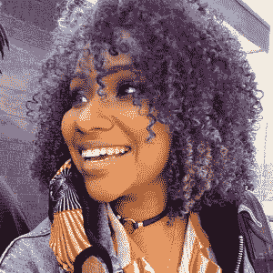

# PyDev of the Week: Dawn Wages

> 原文：<https://www.blog.pythonlibrary.org/2021/11/15/pydev-of-the-week-dawn-wages/>

This week we welcome Dawn Wages ([@DawnWagesSays](https://twitter.com/DawnWagesSays)) as our PyDev of the Week! Dawn is a core developer for [Wagtail CMS](https://wagtail.io/), which is based on Django. Dawn is also a speaker. You can get more details of what Dawn is up to from her [website](http://dawnwages.info/) or by checking her [GitHub profile](https://github.com/DawnWages).

Let's spend some time getting to know Dawn better!

**Can you tell us a little about yourself (hobbies, education, etc):**

I'm from North Carolina, living in Philadelphia. I'm terrible at all my hobbies! I like to roller skate with my friends in South Philly, make art (mostly watercolor or oil pastels), and hang out with my partner (skateboarder and UX Designer extraordinaire) and our two dogs -- Rocky, the Rottweiler and Theo, the Beagle, watching anime and taking long walks around the city.

**Why did you start using Python?**

Out of the ashes of a career in finance, I wanted to find a career using skills that I've already used in my undergraduate Business Degree. I was pivoting to being a Business Analyst and while attempting to dip my toe into Data Science, I found PhillyPUG (Philadelphia Python Users Group). DjangoCon US 2016 was held in Philadelphia and I found a network of people who pushed my Python use forward and offered FREE resources. That six-month period was my real "start" in Python.

**What other programming languages do you know and which is your favorite?**

I use JavaScript daily. No language shaming here, but Python will always be that girl in my book.

**What projects are you working on now?**

Outside of my 9-5, I'm the founder of At The Root (https://AtTheRoot.dev) which is home to the first and only AntiRacist Ethical Source License. We're working in partnership with the Organization for Ethical Source (https://EthicalSource.dev) to propel the first draft of our License forward. Code-wise, we’re currently developing the At The Root Forum and Checklist, a place where subject matter experts can give actionable suggestions on how to help your project be actively anti racist -- things like requiring a block button on social platforms, or conclusions drawn from collecting gender, or access and consent when collecting biometric data. The forum is built in Gatsby/React and Wagtail/Django/Python and we're looking for both code and content contributors. If someone is interested in either, please email contact@AtTheRoot.dev.

I just joined the Research Programming team at The Wharton School at The University of Pennsylvania. With them, I'm helping execute the research visions of Professors and PhD students, where software can be an aide. Some of these projects are open, and I hope to blog about what I can soon. It’s unfortunate that I didn’t get to many of my blog post ideas while I was consulting, but I’m excited for the opportunity to write about topics I’ve been ruminating over for a long time. My content will be at [Glitter Tech](https://GlitterTech.dev) although there's not much there yet.

**Which Python libraries are your favorite (core or 3rd party)?**

Most of my top picks are going to be libraries supporting Wagtail and Django! It will be hard to pick, but Django Rest Framework must be one of my top. [Factory Boy](https://factoryboy.readthedocs.io/en/stable/), [CookieCutter](https://cookiecutter.readthedocs.io/en/), and [Black Python formatter](https://black.readthedocs.io/en/stable/) are big ones I've been using a lot lately. I'm very excited to cut my teeth on [Rich](https://rich.readthedocs.io/en/stable/introduction.html) and [htmx](https://htmx.org/). I've heard great things.

**How did you become a core developer of WagtailCMS?**

I got to know the Django community through the conference scene. Wagtail, among the very active group in the Django Conference circle, were always kind and held several workshops over my first few years attending. My first time speaking at a conference was at Wagtail Space 2018\. I remained interested and active in events as I started building personal projects in Wagtail. I spent a short time in Europe (Amsterdam and London) in 2019, and met more Wagtail friends. Coming up on two years ago, I was offered a role on the Wagtail Core Team and was ecstatic to be able to provide value to a framework that has given me so much, and to work with brilliant people to boot. Most of my contribution comes from organizing and Wagtail advocacy right now.

**Is there anything else you’d like to say?**

These years have taken a lot out of all of us. Take care of yourself and tend to your community. Django Girls and PhillyPUG were integral in my career growth. There are tens of thousands of people whose livelihood has been put in jeopardy because of the global pandemic and its cascade of unfortunate ramifications. If you can aid in an underestimated (and underrepresented) person's career trajectory -- DO IT! The code review, the conversation, the mock interview, the random question answered could be invaluable to someone in desperate need of a career change. I don't take the kindness the community has given me for granted. Put yourself in spaces where you're able to see those who may be new to the community so when you do have the bandwidth to help, you can.

Depending on when this is released, we may need mentors for Django Girls at DjangoCon 2021! If you're interested before October 10th 2021, please email philadelphia@djangogirls.org. If you're coming to this after the deadline or don't have the bandwidth to volunteer your expertise currently, I totally understand and I'm sending you all warmth and peace. It's hard out here.

Also, don’t forget the power of mutual aid. There is no more impactful way to improve someone’s life than direct action.

**Thanks for doing the interview, Dawn!**