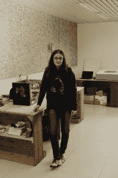

# 本周 PyDev:Margherita DI LEO 博士

> 原文：<https://www.blog.pythonlibrary.org/2015/01/05/pydev-of-the-week-dr-margherita-di-leo/>

本周，我们欢迎玛格丽塔·迪·利奥博士担任我们的本周 PyDev。她是我们这个系列的第一个 PyLady！让我们花些时间去了解她吧！

你能告诉我们一些关于你自己的情况吗(爱好、教育等)

我来自意大利南部的一个小村庄。就像来自意大利南部的人的最经典的刻板印象一样，我非常喜欢睡觉、吃饭和做饭，尤其是为大而吵的公司。此外，像大多数来自南方的女人(另一个刻板印象！)，我的爱好需要创造性的工艺，如缝纫、编织、钩针编织，我会添加编码，因为时代在变，工艺的方式也在变。

我毕业时是一名环境工程师，专业是自然风险管理。我的第一份工作经历是在一家私营公司担任可再生能源工厂的项目设计师。过了一段时间，我回到学术界，获得了环境监测方法和技术的博士学位。目前，我在欧洲委员会联合研究中心(JRC)，伊斯普拉(VA)，意大利[森林资源和气候部门](http://forest.jrc.ec.europa.eu/team/person/35/detail/)担任研究员。

*我主要是做 GIS(地理信息系统)分析师，有选择自由的时候就选择免费开源软件(FOSS)工具。*
*我是自由/开源软件的爱好者，积极参与支持使用自由/开源软件的协会，例如作为 OSGeo 的创始成员。 [OSGeo](http://www.osgeo.org/) 是开源*
*地理空间基金会，一个支持、促进和传播地理空间自由/开源软件(GFOSS)使用的国际组织。我还在 JRC 成立了一个小组，在这个小组里，我们组织关于 GFOSS 的会议和讲座。该倡议旨在促进*
*开发者之间的信息交流和交叉合作。*

**你为什么开始使用 Python？**

我在 Python 中的第一份工作是开发 GRASS GIS 扩展(addon)。GRASS 是一个流行的地理信息系统，最初由美国陆军建筑工程研究实验室开发，后来发展成为一个自由/开源软件项目，得到了一个活跃社区的支持。感谢如此热情的社区，我选择了 GRASS 作为我最喜欢的 GIS，并逐渐成为一名开发人员，也成为了项目指导委员会(PSC)的成员。

可以用 Python、C 开发 GRASS 应用程序，也可以用 Fortran 或 bash。让 Python 成为我的选择的原因是，只要遵守一些编码规则，就有可能让你的应用程序跨平台。另一个优点是，你可以用 Python 创建一个完整的动作链，从预处理(包括解析输入文件)到最终产品，甚至是发布到 web 上，完全使用 Python 作为粘合剂。此外，一些非常重要的地理空间库可以通过 Python 轻松使用。

你还知道哪些编程语言，你最喜欢哪一种？

在大学，我接受了 Fortran、C 和 C++的正规教育，但在现实生活中没有怎么使用它们，我更喜欢 Python、Bash、类似 Matlab 的 [GNU Octave](https://www.gnu.org/software/octave/) ，以及最近的 [R](http://www.r-project.org/) 。后者很有可能成为我继 Python 之后的新宠。它是专门为统计计算而设计的，但是许多库已经被开发用于任何目的。你可以在数据分析和统计的整个过程中使用 R，从数据检索、预处理、分析、绘图，到发布到网络上，例如参见[knitter](http://yihui.name/knitr/)和 [shiny](http://shiny.rstudio.com/) 。此外，特别方便的是“应用”系列函数，它们执行隐式循环。

你现在在做什么项目？

我目前从事的一个最有趣的项目是利用遥感图像监测植物病虫害爆发的框架。这个项目的关键方面本质上与大型数据集的计算时间和及时结果的需求有关，我们正在探索在[谷歌地球引擎](http://www.google.com/earth/outreach/tutorials/eartheng_gettingstarted.html)中运行计算的可能性。该平台向提出请求的可信测试开发人员提供高级特性，包括开发自己的数据分析算法的可能性(也使用 Python)。

另一个有趣的项目是我和我的合作伙伴在业余时间开发的使用开放硬件组件的自制无人机。开放硬件的优势在于它适合于在资源稀缺的情况下用于环境监测，例如在发展中国家。

哪些 Python 库是你最喜欢的(核心或第三方)？

如上所述，我广泛使用地理空间库。我最喜欢的一个是 pyProj，它嵌入了复杂的数学变换，对应于地球的不同制图表达，允许以明显“简单”的方式进行非常优雅的计算，例如，给定任何参考系统中表达的两对坐标，计算两点之间的距离。

另外，为了进行数据分析，我已经广泛使用了 [NumPy](http://www.numpy.org/) 、 [sciPy](http://www.scipy.org/about.html) 、 [Matplotlib](http://matplotlib.org/) 、 [pandas](http://pandas.pydata.org/) 和 [IPython](http://ipython.org/) 。我也非常欣赏[多重处理](https://docs.python.org/2/library/multiprocessing.html)加速计算时间。

你还有什么想说的吗？

非常感谢你邀请我参加这次采访，我关注你的博客已经很多年了，它是我宝贵的指导。我知道你的博客在研究 wxPython，我想说它的社区是最受欢迎和最有帮助的。在我看来，社区是开源项目成功的基础。

**谢谢！**

### 前一周的 PyDevs

*   [马里亚诺·莱因加特](https://www.blog.pythonlibrary.org/2014/12/29/pydev-of-the-week-mariano-reingart/)
*   巴斯卡尔·乔德里
*   蒂姆·罗伯茨
*   汤姆·克里斯蒂
*   史蒂夫·霍尔登
*   卡尔查看
*   迈克尔·赫尔曼
*   布莱恩·柯廷
*   卢西亚诺·拉马拉
*   沃纳·布鲁欣
*   浸信会二次方阵
*   本·劳什