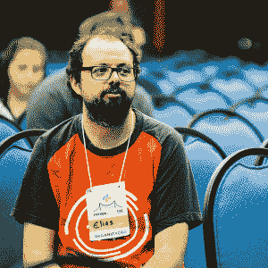

# 本周 PyDev:Elias dorne les

> 原文：<https://www.blog.pythonlibrary.org/2018/03/19/pydev-of-the-week-elias-dorneles/>

本周我们欢迎 Elias Dorneles 成为本周的 PyDev！Elias 负责制作 [Beeware Suite](https://pybee.org) 的工具，也参与了其他几个项目，所有这些你都可以在 [Github](https://github.com/eliasdorneles) 上看到。他还有一个编程[博客](https://eliasdorneles.github.io/)，你可以去看看。让我们花一些时间来了解更多关于以利亚！

你能告诉我们一些关于你自己的情况吗(爱好、教育等)

所以，我在巴西南部出生长大，直到 15 岁左右才真正接触到电脑。我最初接触电脑是为了写乐谱和制作简单的动画，在拥有一台电脑和有相似兴趣的朋友家里呆上几个小时。🙂然后，当我有机会上大学时，我选择了计算机科学。在那里，我学习了编程，开始使用 Linux，熟悉了自由和开源软件文化，并越来越多地参与其中，一点一点地。我的爱好时常改变，我喜欢尝试新事物。大多数情况下，我会弹吉他，并为我自己不会弹的流行歌曲做指弹改编。但是你也可能会发现我在画漫画，和一个朋友在网上结对编程，读一些书或者只是在某个地方迷路。我最近搬到了巴黎，从那以后我也一直在四处旅行。去年，我休了一个假期，参加了 [Recurse 中心](https://www.recurse.com)，这对我来说有点像梦想成真！在那里，我遇到了一些很棒的人，在[的 Android 工具上工作了一会儿，在 BeeWare suite](https://pybee.org) 上练习了很多结对编程，这太棒了！

**你为什么开始使用 Python？**

当我在大学的时候，我有这样一个阶段，我每隔几个月就会学习一门不同的语言。Python 最初和我在一起是因为 Django，它有很棒的文档，看起来比我当时做的 PHP 要好得多。但是我还记得我写了一个小脚本来处理一个 Excel 电子表格，并且代码在第一次尝试时基本上工作正常。这真的让我大吃一惊，就像“哇，这种语言让我成了坏蛋！”，让我真的想一头扎进去。

你还知道哪些编程语言，你最喜欢哪一种？

专业上，我做过很多 Python、Bash、Javascript、Java、Groovy 和 PHP，也在较小程度上做过 Scala 和 Ruby。

另外，我还修补了 Erlang/Elixir、一些 Lisp 方言、Elm 和其他一些语言。

Python 仍然是我的首选语言，它仍然是我的最爱，这也是因为社区——出于某种原因，它似乎吸引了很多优秀的人。

你现在在做什么项目？

我目前全职为一家法国初创公司工作，但同时我也在断断续续地为 T2 的 BeeWare 套件开发 Android 工具，这意味着这些天我主要是在改进 T4 的 VOC 编译器和构建一些示例应用程序。我真的很喜欢这个项目，为它工作的人们都很好，我认为 Python 也非常需要它！

这些天来，我真的对没做多少事感到有点难过。自从我搬到法国后，将我的开源活动与找到我在这里的路、学习法语以及所有这些协调起来是一个挑战。但是我希望我很快就能重新站起来，有很多事情要做！

哪些 Python 库是你最喜欢的(核心或第三方)？

我喜欢许多图书馆，但我将借此机会提及一些我觉得不太受重视的图书馆。所以我真的很喜欢 [urwid](http://urwid.org) ，我用它为终端构建了许多有趣的东西！这不是一个库，但是 [pudb](https://pypi.python.org/pypi/pudb/) 调试器工具已经非常有用很多次了！ [Cookiecutter](https://github.com/audreyr/cookiecutter) 非常有用，我们在蜂产品中大量使用它！坚韧、 [vcrpy](https://github.com/kevin1024/vcrpy) 是非常有用的工具，可以放在我的工具箱里！

Visidata 是我的一些朋友正在开发的一个很有潜力的工具！(我仍在学习)最后，我对此很有偏见，但 [Parsel](https://github.com/scrapy/parsel) 和 [dateparser](https://github.com/scrapinghub/dateparser) 是我最喜欢的，我在它们上面做了很多工作——向维护它们的 Scrapinghub 的人们大声疾呼！

你还有什么想说的吗？

我将借此机会心怀感激:非常感谢我的朋友们，他们总是如此支持我--你知道你是谁！

向 BeeWare 团队、Recurse Center 以及 Python Brasil 社区的优秀员工致以诚挚的谢意，特别要感谢 Python Floripa 和 PyLadies Brasil 团队！感谢你们的存在！< 3 另外，谢谢 Mike 来采访我，这很有趣。🙂

非常感谢你接受采访！