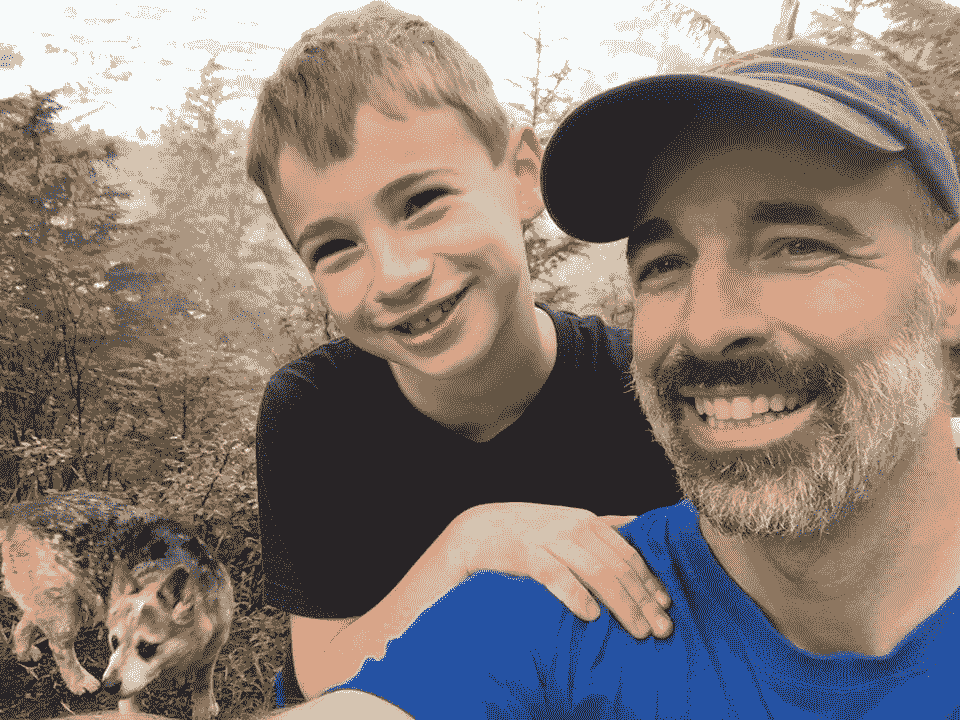
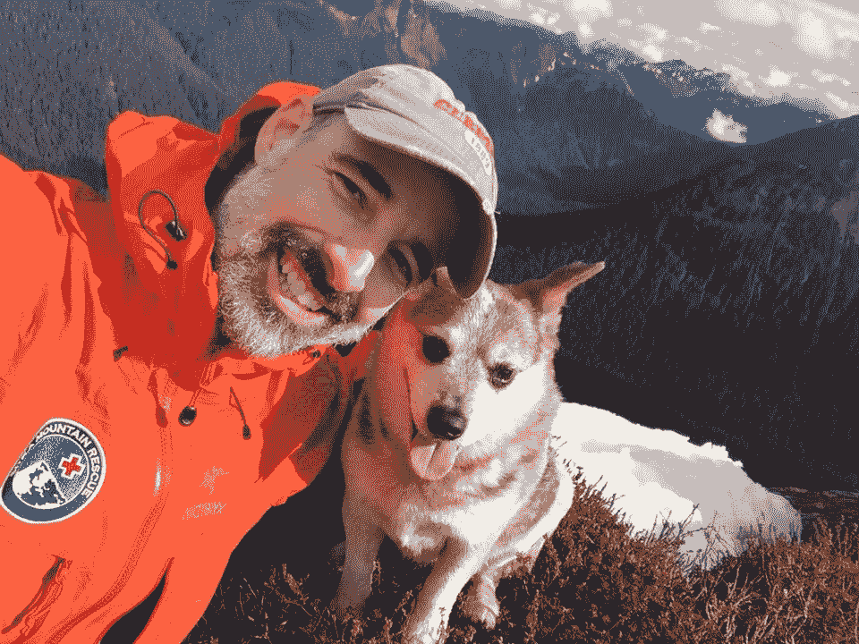

# 本周 PyDev:Eric Matthes

> 原文：<https://www.blog.pythonlibrary.org/2019/08/05/pydev-of-the-week-eric-matthes/>

本周，我们欢迎埃里克·马特斯( [@ehmatthes](https://twitter.com/ehmatthes) )成为我们本周的 PyDev！Eric 是畅销书 [Python 速成班](https://amzn.to/2FxwZHB)的作者。他还制作了一套整洁的 [Python 闪存卡](https://amzn.to/2J9ZFqX)，我在今年早些时候[审阅过](https://www.blog.pythonlibrary.org/2019/04/02/product-review-python-flash-cards/)。你可以在 Eric 的[网站](https://ehmatthes.github.io/)上找到他，或者在 [Github](https://github.com/ehmatthes) 上查看他的一些作品。

让我们花一些时间来更好地了解 Eric！

你能告诉我们一些关于你自己的情况吗(爱好、教育等)

当然可以！20 世纪 80 年代初，我在波士顿郊区的新罕布什尔州南部长大。那时我的父亲是 DEC 的一名软件工程师，我第一次学习编程是在地下室的一台小型计算机上。我非常感谢我的父亲分享他在家里拥有的技术，而不是告诉我远离这一切。看着电脑从几乎没有人拥有家用电脑的早期发展到几乎每个人一生中都拥有多台电脑，真是令人惊叹。

我在高中喜欢数学和科学，因为我喜欢 AP 化学，所以我在本科时选择了化学工程专业。但我很快发现，工程学其实就是学习解决别人的问题。不过，我很喜欢我的物理课，因为它们都是关于理解宇宙，从非常大到非常小。有一段时间，我天真地担心，如果我和物理呆得足够久，我会开始发现这个世界没那么有趣，因为我在更深的层次上理解了它。很高兴发现事实正好相反:我学得越多，我周围的一切就越迷人。

在我的教育经历中，我一直在学习新的编程语言。我参加了各种各样的编程课程，并且总是有几个有趣的项目。在大学的一年春假期间，我用 C 语言编写了一个 3d 绘图程序。

我想成为一名粒子物理学家，但我不想永远做学生。我决定尝试教几年书，并很快发现试图接触到我班上的每个学生的智力挑战就像做硬科学一样令人满意。我热爱教学，并决定坚持下去。

2011 年我儿子出生，一个月后我父亲去世。那段时间真的很艰难，但对我来说也是一次成长经历。我妈让我翻翻我爸的电脑，让她知道有没有值得保存的东西。这是一次非常亲密的经历，看着他正在做的所有项目，读着他的笔记。我以前每次回家都会去他的办公室拜访他，只要那天他的电脑开着并运行着，我就仍然感觉和他有直接的联系。令人难过的是，意识到这些项目永远不会完成，也不会被任何人使用。在接下来的几周里，我意识到如果我死了，你也会在我的电脑上发现一堆未完成的项目。我承诺要开始用我学到的技能去做一些有意义的事情。

我想开发一些工具，让公共教育更加公平。我在 PyCon 2013 上做了一个关于教育界可以从开源模式中获得多少收益的演讲，后来 No Starch Press 的 Bill Pollock 找到了我。“我希望你能建立你所描述的东西，如果你想写一本技术书籍，请告诉我。”我回到教室，看到墙上挂着一张海报:“为了开始构建有意义的项目，关于编程，你至少需要知道什么？”这是我为我的学生列出的清单，列出了他们需要知道的最少的东西，以便能够构建他们关心的东西，如游戏、数据可视化和简单的 web 应用程序。我意识到那是我想写的书，那张海报上的问题成了 Python 速成班的指导问题。我并没有打算写一本书，但我意识到，在五年试图向高中生教授编程的过程中，我找到的所有资源要么是针对年轻人的，要么是假设比我的学生拥有更多的技术知识和经验。我决定写一本书给那些不想要儿童读物的人。看到 Python 速成课程对预期受众中的几乎每一个人都有效，这是非常令人满意的:有足够动力想要一本更严肃的书的年轻人、高中生、所有专业的本科生、研究生、工作的成年人以及对在较大年龄学习编程感兴趣的退休人员。我惊讶地发现，它甚至对那些已经熟练掌握另一种语言并希望快速掌握 Python 的人也很有效。

我不只是做技术工作。在新罕布什尔州长大后，我在 20 世纪 90 年代-2000 年代初搬到纽约市住了七年。我在夏天骑自行车穿越美国几次，然后一度在自行车上生活了一年多。我从西雅图骑到缅因州，下到佛罗里达，再到加利福尼亚，最后到阿拉斯加。那是一次改变人生的经历，我在 2002 年永远搬到了阿拉斯加东南部。我喜欢住在一个相当大但与世隔绝的小镇，就在真正的荒野边缘。当我去越野跑时，我很有可能会看到一只棕熊。当我在森林里与熊近距离接触时，服务器崩溃更容易被理解。我喜欢陡峭的山，自从我搬到这里，我一直是技术救援队的积极成员。我也喜欢过部分自给自足的生活。每年我们都捕捉自己的王鲑、红鲑、银鲑、大比目鱼、蟹和鹿。生活在一个几乎每个人都外出捕鱼、打猎并自己收集大量食物的社区里是非常美妙的。

**你为什么开始使用 Python？**

在 2000 年代中期，我选择的语言是 Java。我使用 C 已经有一段时间了，并且喜欢 Java 提供的高级库。然后一个朋友说，“嘿，你应该看看 Python。你的程序只要用 Java 写就可以了。”像当时许多刚接触 Python 的人一样，我对使用空格而不是大括号持怀疑态度，并且我很惊讶我不需要声明变量。但是这些想法更吸引人而不是令人不快。我当时正在做一个项目，对随机漫步进行艺术表现，我已经构建了一个桌面应用程序来生成和设计随机漫步。我用 Python 重写了应用程序，它实际上只有我的 Java 程序的三分之一长。我被难住了，从那以后，我几乎在每个项目中都使用 Python。

当被问及为什么使用 Python 时，人们会说:“我为语言而来，为社区而留。”这个答案当然代表了我的想法。在我父亲去世后，我决定更认真地对待我的编程工作，我找了一个技术会议参加。我很感激我偶然发现了 PyCon。我第一次去是在 2012 年，当时恰逢一些早期的多元化和行为准则计划。我看到社区设定了明确的多元化目标，制定了实现这些目标的具体计划，并贯彻这些计划。当我现在去 PyCon 的时候，我看到了完全不同的人群，呈现的各种主题真是太棒了。Python 社区正在回答这个问题，“如果我们让每个人都能编程，人们会构建什么？”至关重要的是，我们要给予各行各业的人们编程所提供的力量，让人们构建满足他们自己和他们社区需求的项目。

你还知道哪些编程语言，你最喜欢哪一种？

我在 20 世纪 70 年代和 80 年代初开始学习 Basic。直到 2000 年代中期的 Java 和 Python，我才开始深入了解任何语言，但在这个过程中，我对 Logo、C、Pascal、Fortran、HTML、CSS、JavaScript 和 SQL 有了一些了解。

我现在几乎每天都在用 Python。在接下来的一年左右，我真的想巩固我对 SQL 的理解，我想探索一种像 Lisp 或 Haskell 这样的函数式语言。我也喜欢尝试各种我听说过但从未使用过的语言，比如 Rust 和 Go。我从来不想被 Python 困住，因为这是我所知道的；如果有更好的东西出现，我想和这个行业一起发展。

你现在在做什么项目？

我刚从教学岗位上退休，把全部时间放在写作和编程上。随着 Python 速成班越来越成熟，支持这本书逐渐成了第二份工作。作为一名带着一个年幼儿子的全职老师，我所有的写作工作都需要在早上 7 点前或晚上 9 点后完成。那很难。我很高兴完成了课堂教学，并可以自由地跟进因这本书的成功而出现的许多机会。

我最近的项目涉及一个当地的非营利组织，致力于减少延绳钓渔船船员和抹香鲸之间的冲突。延绳钓在海底设置数英里长的钓线，每隔 10 或 15 英尺设置一个鱼钩。它们以底栖动物为目标，如大比目鱼和黑鳕鱼。他们让绳子浸泡 6 个小时左右，然后把绳子拖回水面。抹香鲸已经学会了在延绳钓附近出没，它们可以在一英里长的延绳钓上的每一条鱼浮出水面之前将它们一网打尽。我和一个团队一起工作，他们让渔船在去渔场的路上拖着水听器阵列。来自水听器阵列的数据被用于绘制该地区任何抹香鲸的位置，这些位置被广播给该地区的任何船只。目的是帮助每个人避免在鲸鱼出没的地方捕鱼，以利于捕鱼人员和鲸鱼。(延绳钓渔船不是拖网渔船。海底拖网渔船拖着网穿过海底，摧毁它们所经之处的一切。延绳钓是一种可持续渔业，副渔获率相对较低。)我在这个项目中的角色是帮助人们从渔船上的卫星设备获取数据，这些人可以绘制这些数据，并将其返回到渔场的船只上。很荣幸能和这么一群来自渔业和科学界的有趣的人一起工作。

我还致力于:

*   更新 Python 速成班附带的[备忘单](https://ehmatthes.github.io/pcc/cheatsheets/README.html)。这些都非常受欢迎，我期待着今年夏天晚些时候发布更新版本。
*   向 Python 速成班的[在线资源添加新的部分。我打算在书中的练习之外增加一系列挑战。我还想写一系列的文章和讨论，这些文章和讨论是建立在人们从书中所学到的东西的基础上的。我还计划开发一套教学指南，以支持这本书在学术环境中的使用。](https://ehmatthes.github.io/pcc_2e/)
*   我正在分析当地的天气模式，以帮助解决气候变化对我们社区的影响。
*   我正在做一个项目，应该可以帮助数学老师、学生和数学家分享高质量的数学问题。
*   我正在做一个项目，这个项目应该会在所有学科领域带来更高质量的教育标准。我希望这个项目能为老师、学生和家长带来更好的工具。
*   我正准备写 Python 速成班的后续文章。
*   我在观察人们如何使用我用[无淀粉压机](https://nostarch.com/pythonflashcards)开发的 [Python 闪存卡](https://www.amazon.com/Python-Flash-Cards-Concepts-Examples/dp/1593278969)。它们在网上卖得不是特别好，但当人们亲自看到它们时，他们会爱上它们。我想公布人们使用这些来巩固他们对 Python 的理解的方式。

哪些 Python 库是你最喜欢的(核心或第三方)？

听起来可能很无聊，但我喜欢 ReportLab。我希望看到一个比 PDF 更开放的标准，但现实是 PDF 是人们共享文档最简单的格式之一。除非你想成为一个理想主义者，拒绝任何涉及 PDF 的项目，否则作为一名程序员，你迟早要钻研 PDF 的内部原理。我参与了一些非常有影响力的项目，这些项目将 pdf 作为一个重要的角色。当我不得不这样做时，ReportLab 让工作变得触手可及。在你在 ReportLab 上写你的书之前，我就这么做了；既然我已经完成了课堂教学，我期待着通过你的书工作。

我也爱 MatplotLib 和 Plotly。Matplotlib 是许多现代 Python 绘图库的基础，我努力保持它的流畅性，并将其用于各种项目。我也一直在寻找一个友好的高级可视化库，现在 Plotly 很好地完成了这个角色。我喜欢 Plotly 也有各种其他语言的端口。Requests 在处理任何基于网络的数据源时都非常有用。我也喜欢 Jupyter 笔记本，用于探索性的可视化工作，以及教育项目。

我绝对喜欢姜戈。这是成为一名程序员的好时机，当我想到为什么会这样时，Django 是我首先想到的事情之一。在我成长的过程中，如果你有一个正在开发的重要程序，你想与全世界分享它，你需要找到一种方法将你的代码的物理拷贝分发给全世界。这是一项令人生畏的任务，实际上只有专业程序员才能做到。现在，如果你有一个想法和一些基本的编程技能，你可以构建一个简单的 web 应用程序，并在一天之内将你的项目公之于众。太不可思议了！Django 并不是真的要建立网站；它是关于使用一个网站作为与世界其他地方分享你的编程工作的一种方式。我真的很期待帮助更多的人理解如何使用 Django 让他们的小项目快速地、自信地为世界其他地方所用。

**是什么启发了你写《Python 速成班》？**

我早些时候谈到了这一点，但我要补充一点。与高中生一起尝试各种各样的学习资源，看着他们因为各种原因而不起作用，这真的令人沮丧。对我的学生来说，事情解决了，因为我有足够的背景知识来填补他们的空白。我认识到，独立的学习者和没有强大编程背景的教师可能会放弃这些资源，甚至放弃学习编程。

我决定写一本书，对读者的技术背景不做任何假设，同时尊重他们作为一个成熟的学习者。

在写作/出版过程中，你学到了什么？

我的天啊。这是千真万确的，你从老师那里学到的和从学生那里学到的一样多。我从编写 Python 速成班中学到的东西和人们从阅读它中学到的一样多。

写书是一个具体的项目。你永远不会真正写完一本技术书籍，但确实有具体的里程碑。有一个我可以完全投入的项目，并且知道在某个时候会有一个我可以持有的成品，这真的很好。那和课堂教学很不一样。我学到了承诺、完成、专业和深深的谦卑。没有一本书是完美的，尤其是一本较长的技术书籍。被人指出错误，并对需要的更新保持警惕，这是非常令人羞愧的。

你对有抱负的作家有什么建议吗？

首先，它的工作量和人们说的一样多，然后更多。我原以为我需要六个月的时间来写 Python 速成课，结果花了差不多两年半的时间。找到你自己想要满足的需求，并写下来解决这个需求。

注意过程。学会使用 Git 这样的版本控制系统，考虑作为一个技术写手如何使用。你的提交不应该和纯粹作为程序员工作时一样。例如，每次我为一本书制作截图时，我都会提交一条消息，比如“生成的截图 15-4”这样，当制作编辑要求一系列更新的截图时，我可以检查这些提交，并随时轻松地重新生成任何截图。此外，当开发新材料时，我会编写一个程序，并提交我想向读者解释的开发过程中的任何一点。这让我专注于开发一个有意义的、架构良好的项目，然后回头专注于写作。

如果你写了一本技术书并出版了，请保持更新！如此多的技术书籍比他们需要的更快地过时了。作为一个作者，你可以在你的书每次印刷的时候做一些小的修改和更新。Python 速成班的第一版经历了大约 11 次印刷。几乎每一次新的印刷都涉及一些小的更正或更新。例如，Django 项目最初是使用 Django 1.8 编写的。第一版的最新印刷使用了 Django 2.1。这本书的成功很大一部分归功于这些更新。如果我不更新这本书，人们早就批评它越来越过时了。

如果你对写一本技术书籍感兴趣，先在网上写。这是一个练习写作的好方法，也是获得追随者的好方法，因为他们知道自己在谈论一个特定的话题。这也有助于了解如何为你的书开发和维护一套在线资源。

最后，只是读和写。也要阅读非技术书籍，这样你的技术写作就不会太枯燥。即使是技术书籍也会讲述一个故事，好的技术作家也是好的故事讲述者。

你还有什么想说的吗？

今天有很多关于每个人学习编码的讨论。我不认为每个人都应该学习如何编码，但是我绝对相信每个想学习如何写代码的人都应该能够做到。拆掉所有的墙！编程就是力量，而这种力量需要与几乎所有想要它的人分享。

如果你想分享你对 Python 速成班的想法，我有一个收集反馈的调查。我正在利用调查结果不断完善这本书，并更好地了解要开发哪些其他学习资源。

如果你想更多地了解骑自行车生活一年是什么感觉，我在[通往阿拉斯加之路](https://www.amazon.com/Road-Alaska-Eric-Matthes/dp/1544175965/)中写了相关内容。它没有像我的技术写作一样受到关注，但如果你喜欢旅行故事，这是一本有趣的读物。

我是推特上的 [@ehmatthes](https://twitter.com/ehmatthes) ，如果你想联系我，请发邮件至 gmail 的 ehmatthes。谢谢大家！

埃里克，谢谢你接受采访！