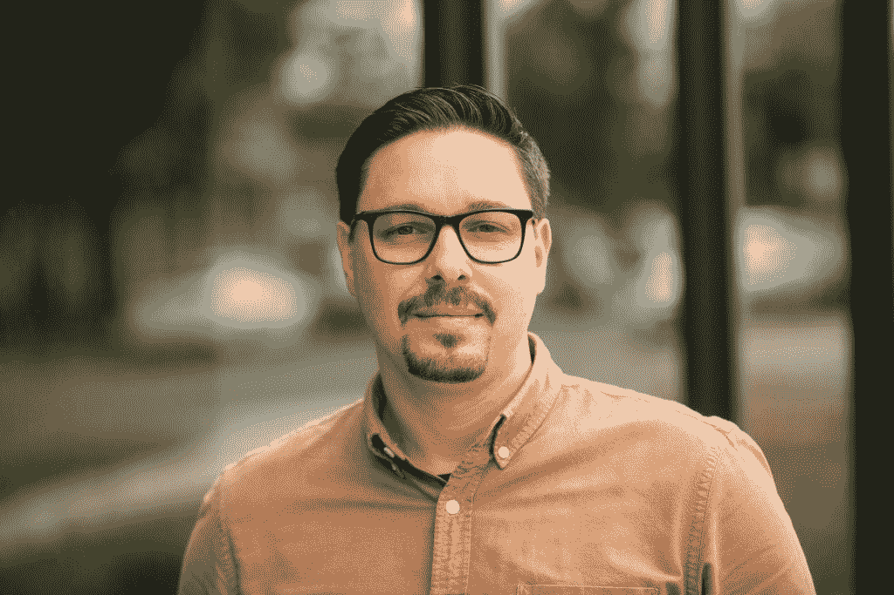

# 本周 PyDev:弗兰克·瓦尔卡塞尔

> 原文：<https://www.blog.pythonlibrary.org/2020/10/05/pydev-of-the-week-frank-valcarcel/>

本周我们欢迎 Frank Valcarcel([@ fmdfrank](https://twitter.com/fmdfrank))成为我们的本周 PyDev！他是 [Cuttlesoft](https://cuttlesoft.com/) 的联合创始人。如果你想了解 Frank 正在做的项目，请直接访问 [Github](https://github.com/frankv) 。

让我们花些时间来了解一下 Frank 吧！

你能告诉我们一些关于你自己的情况吗(爱好、教育等)

我是佛罗里达州人，但我现在住在科罗拉多州丹佛市，大约 4 年前我公司的总部搬到了这里。我们来自佛罗里达州的塔拉哈西，我在那里的佛罗里达州立大学上学，并在名为 [Domi Station](https://www.domistation.org/) 的社区加速器中创办了我们的公司。

我有点像工作狂，所以我不太喜欢业余爱好，但是当我有时间的时候，我喜欢阅读、骑自行车、钓鱼、徒步旅行和摄影。

我也喜欢旅行，但疫情让我无法确定是否会回到那里。

**你为什么开始使用 Python？**

实际上，我是在 Udacity 的第一批在线课程中开始学习 Python 的。我刚刚完成了我在大学的第一门编程课程(一门关于用 C++进行游戏开发的大二选修课)，想为即将到来的课程做进一步的准备。

Udacity 课程教授了一些 CS 基础知识，许多测验都是用 Python 编写的。该课程的顶点项目之一是实现谷歌初始 PageRank 算法的简化版本和网络爬虫。这可能是在 beautifulsoup 被创造出来之前，所以这个任务绝对是一个挑战，但也很有趣。

你还知道哪些编程语言，你最喜欢哪一种？

我从互联网浏览器时代的 JavaScript 开始，从那以后一直为 web 开发。我在大学里学过 C/C++，但后来再也没碰过它们。我用 Go 和 Java 编写过一些琐碎的程序，但是我认为真正精通的语言只有 C#、Ruby 和 PHP。

Ruby 可能是我第二喜欢的语言，仅次于 Python。我真的很喜欢 Ruby 的表现力。

我希望有一天能学会长生不老药。

你现在在做什么项目？

我刚刚完成了一个相当复杂的后端项目，涉及 Django、Celery 和 Google 的 Firestore。我不经常担任工程师，因为我主要负责公司的日常运营，所以这对我来说是一个有趣的变化。

哪些 Python 库是你最喜欢的(核心或第三方)？

我非常喜欢 Flask，甚至为它编写了一些包，但是现在我已经被 Django 吸引了，因为它的业务涉及了更多的企业级项目。

我爱朱庇特！这是我最近常用的原型制作工具。

spaCy 和 Prodigy 是来自 [Explosion](https://explosion.ai/) 团队的两个令人印象深刻的 NLP 和 AI 开发工具。

其他著名的最爱:

*   黑色
*   pytest
*   熊猫
*   诗意
*   [VCR . py](https://vcrpy.readthedocs.io/en/latest/)(Ruby 的 VCR 库的一个端口)记录/回放 HTTP 请求进行测试
*   [箭头](https://arrow.readthedocs.io/en/stable/)
*   “通过模仿日期时间模块，允许您的 Python 测试穿越时间”
*   vscode-python(从技术上来说不是 python，但是它应该在这个列表中)

你是如何组织 Python 活动的，比如 PyColorado 或 Boulder Python？

我从佛罗里达开始。在我的第一次 PyCon(蒙特利尔 2015)后，我回到家，受到启发，在塔拉哈西成立了一个 Python 用户组。已经有的用户组。Net 和 Java(主要由公共部门的开发人员使用)。这很有趣，教会了我们很多关于如何培养社区的知识，但我们最终把它交给了新的领导，并继续作为赞助商。

当我们搬到科罗拉多时，我们很幸运地加入了已建立的团体。这使得在当地观众面前建立关系网、招募和练习会议演讲变得容易。

当伊恩·道格拉斯宣布他们正在寻找新的组织者时，我正在博尔德·皮森做一个演讲，所以我自告奋勇。我就是这样认识了斯科特·维塔莱和佐伊·法默，他们将继续和我一起计划和组织 PyColorado。

PyColorado 只是我们都有的一个想法。我去了很多地区会议，不能理解为什么科罗拉多没有自己的！这是一个非常美丽的州，这里有很多 Python 用户。所以我们给了自己几年的时间来完成它，招募了一些我们知道的最好的组织者，然后开始工作。

这对我来说仍然是最高的成就，我希望有一天我们能够再举办一次。

你能分享一下你的公司 Cuttlesoft 成立的背景吗？

在 FSU 的第一年后，我从课程和实习中积累了足够的经验，为一家全国性咨询公司找到了第一份合同工程师的工作。

我在那份工作上呆了大约一年，结束时我发现我喜欢咨询工作，但不喜欢我现在工作的公司。我认为 Gerber 对 E-Myth 的解释总结了发生在我身上的事情，因为我清楚地记得我告诉一位同事“我可以做得更好”的那一刻。

接下来的一年，我为初创公司做自由职业者，甚至帮助建立了一个团队，在福利管理行业创办了一家新公司。在这段时间里，我一直梦想着经营一家软件咨询公司。在乔治亚理工学院的一次周末黑客马拉松后，我终于成功说服了艾米丽和我一起做生意，于是就这样 [Cuttlesoft](https://cuttlesoft.com/) 成立了。

你还有什么想说的吗？

是的，两件事。

1.  如果可以的话，请[向 PSF](https://www.python.org/psf/donations/) 捐款。或者考虑成为[赞助商](https://www.python.org/psf/sponsorship/)。这些捐赠支持了世界各地的伟大计划，并有助于支持我们的全球 Python 社区。
2.  对维护者友好，支持，最重要的是耐心。这是一般的建议，但感觉很重要。每个人都在某种程度上受到疫情的影响，对大多数人来说，生活可能充满了新的和意想不到的挑战。

我鼓励每个人都练习换位思考，如果你想了解更多关于开源维护者面临的困境，我有两个建议给你:

1.  阅读 Nadia Eghbal 的书[在公众中工作:开源软件的制作和维护](https://www.amazon.com/dp/0578675862/)
2.  观看 Brett Cannon 关于[设定开源参与期望](https://www.youtube.com/watch?v=-Nk-8fSJM6I&ab_channel=PyCascades)的演讲

这一点对我来说切中要害，感觉就像是我在互联网上不断与陌生人进行的对话。我们不应该需要在开源中倡导公民话语。

弗兰克，谢谢你接受采访！