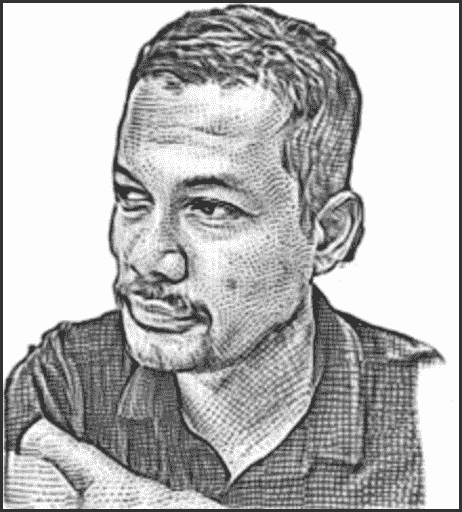

# 本周 PyDev:伊克巴尔·阿卜杜拉

> 原文：<https://www.blog.pythonlibrary.org/2022/12/12/pydev-of-the-week-iqbal-abdullah/>

本周，我们欢迎 Iqbal Abdullah ( [@iqbalabd](https://twitter.com/iqbalabd) )成为我们本周的 PyDev！Iqbal 是东亚和东南亚地区的 Python 社区组织者。

让我们花些时间来更好地了解 Iqbal！

## 你能告诉我们一些关于你自己的情况吗(爱好、教育等):

我叫伊克巴尔·阿卜杜拉。我的国籍是马来西亚。在过去的 20 多年里，我一直居住在日本

我能流利地理解三种自然语言，其中一种是基本的。我通过经营一家名为[拉洛卡实验室](https://lalokalabs.co/en/)的小型技术公司来谋生，我也很高兴地提到这家公司大量使用了 Python 的**。**

 **在 Python 社区中，[我是 PSF 会员](https://lalokalabs.co/en/2022/10/laloka-labs-ceo-iqbal-abdullah-joins-psf-fellow-membership/)，PSF 管理成员，并且一直[积极参与东亚和东南亚地区的 Python 社区](https://lalokalabs.co/en/tag/pycon/)。

我还在多元化和包容性(D&I)工作组以及 PSF 的商标工作组提供帮助。

## 你为什么开始使用 Python？

我开始用 Python 是因为我当时所处的职场(Yahoo！日本在 2002 年)使用 Python 来管理和监控其服务器。在那之前，我大部分时间都在用 C 语言工作。那时，我们以一种非常时髦的方式使用 C。为了最大化服务器吞吐量，减少客户的等待时间，我们将所有内容编译到 apache 模块中，在业务逻辑完成后，它会输出 HTML。所以 HTML 代码是和我们所有的 C 业务逻辑一起编译的。

但是使用 C 来管理服务器是不切实际的，所以我们运行脚本，一些在 cron 上运行，一些手动执行，来管理、监控和编译我们拥有的数百台服务器的数据。

## 你还知道哪些编程语言，你最喜欢哪一种？

我可以说我只知道四种编程语言:Python、Javascript、Java 和 c。只有 Python 是我在过去 5 年中一直使用的编程语言。这是我最喜欢的，尽管老实说，它已经开始演变成一种东西，如果我在 15 年前尝试当前的 Python，我不会觉得有趣。

Python 是我的最爱，主要因为三点:

1.我可以用它来快速测试东西(创建原型),而不用大费周章地设置东西。与上面的第一点相关:有许多现成的库和框架可以使用。
3。Python 提倡“有一种显而易见的方法来做到这一点”，再加上强制的空白，提高了可读性。不管是谁写的代码，你基本上都能弄清楚那个人想做什么。

## 你现在在做什么项目？

除了概念证明(POC)或学习新概念和新事物，我现在不写太多代码。大部分繁重的编码工作由我们的首席技术官 Kamal Mustafa 领导的工程团队完成。话虽如此，我们的最新项目是一个名为 Kafkai 的[人工智能内容生成器，它大量使用 Python 作为 web 应用程序的框架，也作为连接我们使用的不同模型的培训以及生成本身的粘合剂。](https://kafkai.com/)

## 哪些 Python 库是你最喜欢的(核心或第三方)？

我最喜欢的是 Django 框架。我从 0.9 版本开始使用它，当时生活更简单，只有基于函数的视图。现在有其他更轻量级的框架，比如 Flask，如果你的

还有熊猫，这使得大量数据的可视化变得简单多了。作为一个小企业主，这有助于我了解我们的客户在做什么(相对于他们在说什么)，并允许我做出基于证据的决策。

## 你是如何开始组织 Python 会议的？

这一切都是从 2010 年我参加了第一届 APAC PyCon 大会开始的。那时 Python 开始成为一种流行语言，但在东京还没有流行到让足够多的人考虑组织会议。

从新加坡回来后，我遇到了我在会议期间遇到的来自东京的其他与会者，我们决定尝试组织我们自己的会议。这是 PyCon JP 的开始。我们当时不确定它是否会被机构群体所接受，但在会议进行了 10 年之后，我们也许最终可以说它是成功的。

根据我在管理 PyCon JP 时学到的知识，我将这个想法带到了马来西亚的社区，我们在 2014 年开始了 PyCon MY，最终由我主持了 2017 年在吉隆坡举行的 APAC 地区 PyCon。

## 作为会议组织者，你学到的前三件事是什么？

作为会议组织者，我学到的前三件事:

1.世界不会因你而开始，也不会因你而结束:几乎所有组织会议的人都是志愿者。事实是，我们的工作大多数时候都是理所当然的。所以我们不应该把自己当回事，在失去兴趣的时候，在筋疲力尽之前离开。
2。*给他们带路，他们就会跟着走*:我在两个不同的国家开始了 PyCons，尽管这两个国家的文化和语言不同，但人类是一样的:他们对开始持怀疑态度，害怕失败。如果我们降低失败的风险，并展示出即使参加我们会议的二十个人也能开心一天，他们就会被说服。我们通过计算机与人类一起工作:我们在技术行业内往往会失去大局，对技术以及我们如何使用它来运行事物感到兴奋。但事实是，会议是由人类为人类举办的，所以我们需要集中精力为与会者提供最佳价值，这几乎始终意味着人类的联系和知识共享，而这只能在现实生活中才能实现。

## 你还有什么想说的吗？

是的。事实上，有不少:

*   首先，如果你使用 Python，并且还没有这样做，请成为 PSF 成员！你可以在网上注册，只需要 3 分钟。
*   其次，作为 PSF 多元化和包容性工作组的一部分工作，我们正在收集构成我们多元化社区的不同人群的数据。如果您还没有这样做，请填写[我们的调查问卷](https://docs.google.com/forms/d/e/1FAIpQLSc8957QqYuPDF2qL8Q2ctFzBH_mPMi0yxSQ2oqOACTU9jIVDg/viewform?usp=sf_link)，以便我们有数据来更好地了解我们的社区。
*   第三，如果你以所有者甚至是雇员的身份参与一家使用 Python 开发商业产品的企业，请与负责财务的人讨论你如何能够[为 Python](https://blog.xoxzo.com/en/tag/annual-open-source-grant/) 做出贡献。
*   最后，请记住对你周围的人说谢谢，他们作为维护者、社区组织者或志愿者为 Python 贡献了时间和精力。**