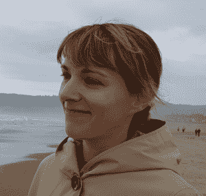

# 本周 PyDev:Irina Truong

> 原文：<https://www.blog.pythonlibrary.org/2018/12/17/pydev-of-the-week-irina-truong/>

本周，我们欢迎 Irina Truong([@ Irina Truong](https://twitter.com/irinatruong))成为我们本周的 PyDev！Irina 已经在几次 Python 会议上发言，并且是 [pgcli](https://www.pgcli.com/) 的维护者，pgcli 是一个 Python 包，是 Postgres 数据库的命令行接口。你可以在 [Github](https://github.com/j-bennet) 上看到她还在做什么。让我们花点时间去了解一下伊琳娜吧！

你能告诉我们一些关于你自己的情况吗(爱好、教育等)？

我拥有乌克兰哈尔科夫电子大学的计算机科学硕士学位。我练合气道，可能的话会骑自行车去一些地方。我还喜欢飞行(并持有私人飞行员证书)、单板滑雪和攀岩，但当我女儿出生时(她 4 岁了)，这些爱好不得不让位。我喜欢旅行。我去过欧洲的几个国家，但从未去过亚洲或南美，所以这些地方都在我的游览清单上。

**你为什么开始使用 Python？**

我已经用 C#工作了很长时间。NET)，但整体印象不是很好。网络生态系统。我用几种不同的语言编写 web 应用程序，然而却没有一见钟情。直到我遇到了我的第一个关于构建小型 web 应用程序的 Python 教程。代码清晰、简洁，应用程序不需要设置任何服务器在本地运行。我知道我想用这种语言写作。所以我在里面写了一个个人的小项目。然后，我买了第一次 PyCon 的票，在这里我找到了一个新的雇主，一个可以让我用 Python 写作的雇主。想象一下！

你还知道哪些编程语言，你最喜欢哪一种？

我用 Perl、PHP、Java 写了几年，用 Ruby 写了一点。我学习了 Scala，但是从来没有机会在现实世界的项目中使用它。C#是最长的一个阶段，但是一旦转到 Python，就再也没有回头。偶尔，我不得不做一些前端工作(HTML/CSS/Java Script)，但我更喜欢后端。Python 仍然是我的最爱，Scala 紧随其后。作为一名开发人员，我必须了解 SQL，尽管它不是一种编程语言。

你现在在做什么项目？

在我的日常工作中，我是一家名为 **Parse.ly** 公司的开发人员。我们的产品是面向数字出版商的分析仪表板。为了提供所有这些漂亮的图表和统计数据，我们在 AWS 中使用 Apache Spark 和 Apache Storm 收集和处理大量事件。

工作之外，我是 [pgcli](https://github.com/dbcli/pgcli) 的维护者。对于 PostgreSQL 来说，它是一个更好的客户端，基于一个叫做 [Python Prompt Toolkit](https://github.com/jonathanslenders/python-prompt-toolkit) 的神奇库。我还参与了其他 dbcli 项目，比如 [mycli](https://github.com/dbcli/mycli) ，这是一个 MySQL 的 cli。我还为 Docker 编写了一个名为 [Wharfee](https://github.com/j-bennet/wharfee) 的小 CLI，但遗憾的是，这个项目并没有得到太多的关注。最近开始给 [Dask](https://github.com/dask/dask) 投稿。

哪些 Python 库是你最喜欢的(核心或第三方)？

我发现 **bpython** 非常有助于快速了解“如果我用 python 做这件事会发生什么”。**熊猫**很适合查看一些数据。当我需要找出我不认识的包中的依赖关系时， **pipdeptree** 非常有用。作为 API 正确使用的一个例子，我会说**请求**库。

你是如何在 Python 大会上发言的？

我有一个朋友在 PyCon 上做了一个演讲(**am jith Ramanujam**,**PGC Li**的作者)。然后是另一个朋友(**埃斯特·南**，**皮拉迪斯**的联合创始人)。当然，他们都是超人，但是，很长一段时间以来，我一直认为，我不是最聪明的人，我没什么好说的。在某个时候，越来越多的人开始带着工作上的问题来找我，我能够给他们很好的答案，所以我意识到我有话要说。但是我总是非常害怕让自己出现在公众面前。我和我的两个朋友都谈到了这个问题，并试图从他们的经历和他们应对公众演讲挑战的方式中学习。最后，我想,“嗯，肯定不会比怀孕 5 个月就通过私人飞行员考试更糟糕吧?”？我是对的。它不是。

你对那些认为自己不能在会议上发言的人有什么建议吗？

看看 PyCon 舞台上的那些演讲者。他们看起来怎么样？自信？知识渊博？搞笑？在里面，他们战战兢兢。我知道，因为我和很多人谈过，也问过这个问题。没有人去那里想“是啊，小菜一碟，我要成为明星了”。但是通过练习会变得更好。所以尽可能多的练习。首先，打开你的摄像机，对着它说话。复习。解决你的行为问题(嗯...，呃，坐立不安)，再试一次，并记录。重复，直到你可以说“你知道，这听起来并不太糟糕！†.此时，在当地的集会上展示你的演讲。谈话结束后，从人们那里获得反馈。带上一两个朋友，这样你可以得到更好的反馈，更多的细节。在你对一群 30 人演讲后，对一群 500 人演讲真的没什么不同。

还有，在这里看一些很棒的建议:[https://ref . readthe docs . io/en/latest/advice _ for _ pycon _ speakers/](https://ref.readthedocs.io/en/latest/advice_for_pycon_speakers/)。这句话对我特别有帮助:

> 一位投稿人说,“我还没见过有人被嘘下台的演讲，我见过一些可怕的演讲。â€

非常正确！你不会把一个开发伙伴嘘下台，是吗？那你为什么害怕别人对你做那样的事？

你还有什么想说的吗？

作为一名软件开发人员，你通常与其他人在一个团队中工作。不要容忍别人不专业或不友好地对待你或团队中的任何人。如果有人是个混蛋，把他们叫出来，或者和其他人提起。善待他人，分享你的知识。如果你最终和一群让你不愉快的人在一起，尽管这不是你的错，离开吧。

谢谢你接受采访，伊琳娜！