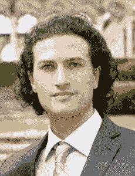

# 本周 PyDev:伊夫林·德米罗夫

> 原文：<https://www.blog.pythonlibrary.org/2015/02/02/pydev-of-the-week-ivelin-demirov/>

本周，我们欢迎 Ivelin Demirov 成为本周的 PyDev。艾夫林是《T2 可视化学习 Javascript》一书的作者，最近他的下一本书《T4 可视化学习 Python》在 Kickstarter 上获得了成功。让我们花些时间去了解艾芙琳吧！

你能告诉我们一些关于你自己的情况吗(爱好、教育等)

早在 1989 年，我开办了一个由当地学校组织的计算机班。

它教 Z80 的汇编程序。那一刻，我明白了我更像是一个视觉学习型的人。

我于 2001 年毕业，是一名工业工程师。我喜欢创造新产品，但我爱上了图形和网页设计。在接下来的 12 年里，我为不同的机构工作，最终成为了一名艺术总监。那段时间我一直和程序员一起工作，我很好奇他们在做什么，甚至试图自己写一些代码，但作为一个视觉型的人，我真的很难专注于一个充满代码的无聊的黑白屏幕。

**你为什么开始使用 Python？**

当我在一个网站上工作，向我部门的程序员来回发送指令时，我对结果和完成一段脚本所需的时间感到非常沮丧，以至于我想坐下来自己写。我知道我需要慢慢开始，因为我以前试过，结果不是很好。一个来自开发部门的朋友建议我从 Python 开始，它是迫使你写干净代码的最简单的语言。

你还知道哪些编程语言，你最喜欢哪一种？

由于当时我的重点是 web 开发，所以我从 HTML、CSS 和 JavaScript 开始

然后尝试了 Ruby，PHP，C++。JavaScript 和苹果新推出的 Swift 语言是我最喜欢的。

你现在在做什么项目？

现在我正在编写一本交互式电子书，使用隐喻、现实生活中的物体类比和简单的拖放练习来教授 Python。

哪些 Python 库是你最喜欢的(核心或第三方)？

大概是 pyGame 吧，太好玩了！

 **是什么让你决定写一本关于 Python 的书？**

自从我写了第一本关于 JavaScript 的书，许多人开始问我是否可以用同样的风格写一本 Python 书。

你能告诉我们你的 Python 书籍与众不同的地方吗？

我读了很多关于心理学的书，我知道有三种主要的学习方式:听觉、视觉和动觉。我的书侧重于视觉类型。

大部分 Python 或者任何编程语言的书籍都是有多年经验的专业程序员写的。这些作者已经形成了一种优秀的逻辑和对原理的理解，他们觉得这些原理对他们来说是如此自然，因此很难向一个不精通技术并且在学校数学不太好的人解释。

你还有什么想说的吗？

如果你发现自己在努力学习编码，不要放弃，寻找替代的学习方法或者更好的方法，自己创造。你将在这个过程中学习，然后帮助成千上万和你有同样感受的人。

**谢谢！**

### 一周的最后 10 个 PyDevs

*   [Andrea Gavana](https://www.blog.pythonlibrary.org/2015/01/26/pydev-of-the-week-andrea-gavana/)
*   蒂姆·戈登
*   道格·赫尔曼
*   玛格丽塔·迪利奥博士
*   [马里亚诺·莱因加特](https://www.blog.pythonlibrary.org/2014/12/29/pydev-of-the-week-mariano-reingart/)
*   巴斯卡尔·乔德里
*   蒂姆·罗伯茨
*   汤姆·克里斯蒂
*   史蒂夫·霍尔登
*   卡尔查看