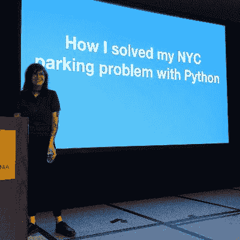

# 本周 PyDev:杰西卡·加森

> 原文：<https://www.blog.pythonlibrary.org/2020/03/16/pydev-of-the-week-jessica-garson/>

本周，我们欢迎杰西卡·加森([@杰西卡·加森](https://twitter.com/jessicagarson))成为我们本周的 PyDev！Jessica 是 Twitter 的开发者拥护者。她还在纽约大学教授 Python。你可以在 [Github](https://github.com/JessicaGarson) 上看到她的一些活动。让我们花些时间去更好地了解她吧！

你能告诉我们一些关于你自己的情况吗(爱好、教育等)

我目前是 Twitter 的开发者倡导者，在那里我致力于确保开发者在使用 Twitter API 时有良好的体验。这意味着我编写示例代码，在会议上发言，并创建博客帖子。我也用 Python 制作噪音音乐，并以艺术家的名字 Messica Arson 定期在纽约地区演出。在从事技术工作之前，我从事政治活动。

**你为什么开始使用 Python？**

我在 2010 年开始自学如何编码，事实证明非常困难。我在一家政治数据咨询公司工作，所有的后台代码都是用 Perl 编写的，所以我开始阅读一本关于 Perl 的书。一位同事看到了我的书，把我拉到一边，说如果他今天学习如何编码，他会学习 Python。此后不久，我在 DC 的华盛顿州发现了一个名为“听我说代码”的社区组织，这是一个由女性为女性开设的免费初级课程。

你还知道哪些编程语言，你最喜欢哪一种？

最近我一直在提高我的 JavaScript 技能。我很高兴能更多地了解 TensorFlow.js。在过去的一年里，我在 R 方面的技能也有了很大提高。我有时也用 Ruby 和 Haskell 做音乐。

你现在在做什么项目？

我一直对 R 包很感兴趣，reticulate 允许你在 R 中运行你最喜欢的 Python 包。我[最近想出了](https://dev.to/twitterdev/running-search-tweets-python-in-r-45eo)如何在 R 中运行搜索 tweets-python 的 Python 包。

哪些 Python 库是你最喜欢的(核心或第三方)？

FoxDot，SuperCollider 的 Python 包装器，允许我用 Python 制作怪异的可跳舞的噪音音乐。我大约每个月都会在纽约地区表演，想到我用我最喜欢的编程语言表演，我就很兴奋。我想在今年的某个时候录制一张新专辑。

你是如何参与组织科技会议/聚会的？

在我开始自学后不久，我就开始教人们如何编码。我开始工作的环境非常支持我。我对我正在建造的东西感到非常自豪，以至于我想与他人分享我正在创造的东西，所以我开始在当地的聚会和会议上发言。我意识到在某些时候，我也可以运行和策划这些活动。

我知道你以前在 NYU 教过 Python。你有什么激动人心的经历想分享吗？

教学是一种令人难以置信的授权体验。看着我的学生在我们相处的时间里学习和成长是如此令人兴奋。最近我在 PyGotham 遇到了一个以前的学生。很高兴看到我教过的人现在正在教授机器学习的 Python 课程。

杰西卡，谢谢你接受采访！