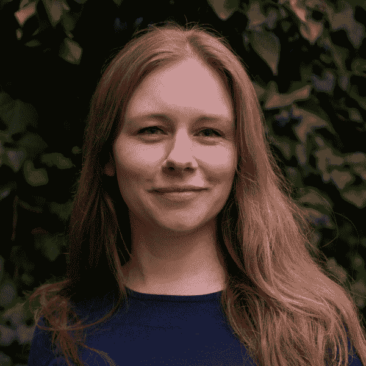
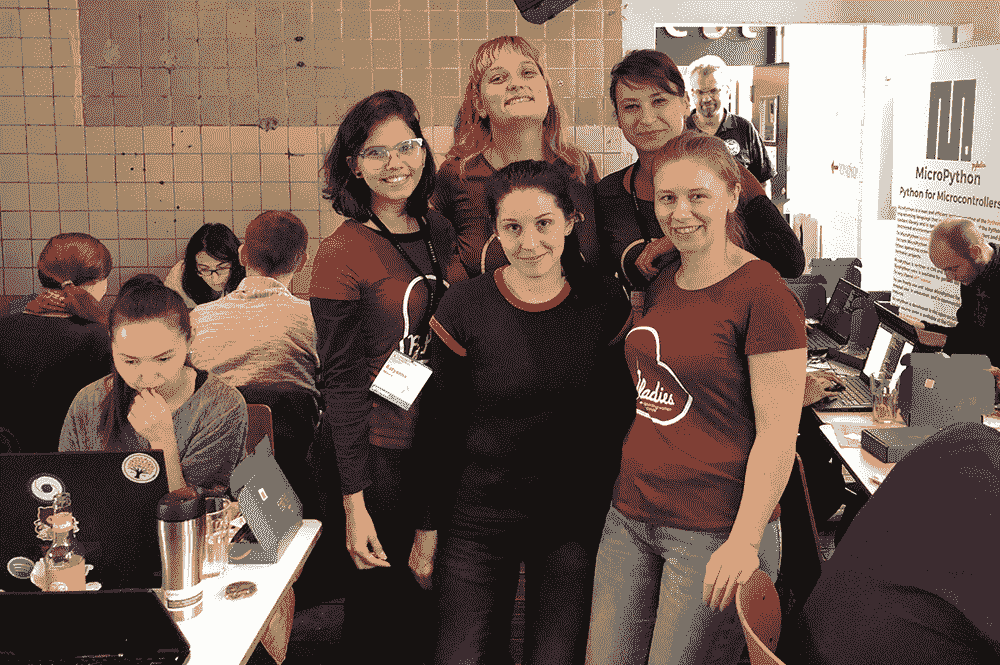

# PyDev of the Week: Jessica Greene

> 原文：<https://www.blog.pythonlibrary.org/2022/03/14/pydev-of-the-week-jessica-greene/>

This week we welcome Jessica Greene ([@sleepypioneer](https://twitter.com/sleepypioneer)) as our PyDev of the Week! Jessica is a backend engineer at Ecosia and is an active member of PyLadies. She also gives talks at multiple tech conferences.

You can see some of what Jessica is up to over on [GitHub](https://github.com/sleepypioneer).

Let's spend some time getting to know Jessica better!

**Can you tell us a little about yourself (hobbies, education, etc):**

I grew up in the UK but moved to Berlin 11 years ago to live with my partner. In the UK I studied Media Production and worked in the Film and television industry. When I moved to Berlin I took time out to learn German and then started working in the specialty coffee industry and became a coffee roaster at the [Barn](https://thebarn.de/).

I had always had some interest in computers thanks to my parents getting a household computer while I was at school. During my art foundation degree, I also experimented with creating interactive websites in Dreamweaver. So when I decided to leave coffee roasting in 2017, retraining as a developer seemed like a viable option.

I consider myself a self/community taught developer, meaning I have no formal training but instead took a number of online courses and joined local community workshops. This was also a possibility for me due to the support I received through the German government. It was in these communities that I met other women engineers and realised how wonderful programming was and the confidence to seek employment as an engineer. In 2018 I took part in the Rails Girls Summer of Code program, a 3-month scholarship for women in tech working in open-source software.

After this, I landed an internship with [Ecosia](http://www.ecosia.org/) after hearing about them through another community member. I have been working there now for over three years and moved from being a junior to mid-level engineer. I am currently working on a team focused on adding green features to our search results such as highlighting sustainable options.

Outside of my work at Ecosia I love to learn new things and also support others through mentoring and organising community events. I have been an active PyLadies member since 2018 and also supporting a number of other community initiatives.

When I’m not at my computer I love to cook, watch movies, knit, read, and occasionally dog sit 🙂

**Why did you start using Python?**

I started to learn Python after my partner who works in video games suggested I try it out. Shortly after I attended my first [PyLadies Berlin](https://berlin.pyladies.com/). From the start, I was keen to explore data science projects so Python seemed an obvious choice but throughout my career, I’ve used it in so many different ways from Microcontrollers to APIs to Data analysis. I thoroughly recommend folks starting out to look at [Automate the boring stuff with Python](https://automatetheboringstuff.com/) by Al Sweigart because it does a good job of introducing you to some of the many different use cases in an interactive manner.

**What other programming languages do you know and which is your favourite?**

Since starting to learn programming I have tried out many different languages but professionally worked predominantly with Python, Golang, and JavaScript. They all have their use cases and implementations I appreciate. Starting a bit later in tech I feel that I haven’t felt some of the pains I have heard other engineers talk about. I love that Python is an incredibly versatile language. It has so many interesting use cases from microcontrollers in space to deploying machine learning models on the web. Python can often provide a scripting language that connects part of your systems, so even if it’s not the first language in the tech stack it’s likely to be in there somewhere. This is why I think it’s a great language to learn when you are getting started, that and the amazing community of course!

**What projects are you working on now?**

Since last year I reignited my interest in machine learning and data engineering so I have been taking part in the [Data Talks Club zoomcamps](https://github.com/DataTalksClub) and building my own toy projects. I’m hoping to be able to start integrating more of what I am learning into my work.

I’m also currently working on several community projects and seeing how we can automate some of our processes to empower more members to host events, share content, connect with one another and find opportunities to thrive within the tech industry.

**Which Python libraries are your favourite (core or 3rd party)?**

In the core language, I really like [Turtle](https://docs.python.org/3/library/turtle.html). Early on while learning Python, I came across tutorials that use the Turtle library to teach people to program because of the visual feedback loop it provides. I’ve also seen some awesome community projects using it for creating generative art. I love that you can take a small package like this and do so much creatively with it.

For a 3rd party app, I like the [Prometheus client](https://github.com/prometheus/client_python) because with relative ease you can start monitoring your python applications. In fact, my colleague Vanessa Aguilar and I will be giving a workshop about this during [PyCon De 2022.](https://2022.pycon.de/program/RE89WX/)

**How did you end up doing public speaking? **

I previously worked as a barista in a specialty coffee roastery where we would share with each customer information about the producer of their coffee while we brewed it. This experience helped build my confidence in public speaking although as a child I was also in an amateur theatre group. As a coffee roaster, I also attended a number of coffee conferences where I gave talks or workshops. Knowledge sharing has always been important to me, not least because sometimes it can be held back from certain groups or seen as too specialist.

My first ever tech talk was at the [Nextcloud](https://nextcloud.com/) conference in Berlin where I spoke about git commands I found useful likening them or the experience of using them to characters from the wizard of oz. Since then I have given a number of online and in-person talks. It’s been a real honour to be invited to give a Keynote at [PyCon Italia](https://pycon.it/en/keynotes/inclusive-community-leadership) this year, I am really looking forward to it 🙂

**Do you have any tips for people who are afraid to step out into public speaking?**

Public speaking is something one has to train to be good at in my honest opinion. So I would encourage people to see that it takes practice and learning from mistakes. Every time I speak, be it at a conference or at a meetup I learn something new. I also watch other people who I admire talk, and learn from them the nuances of how to engage an audience or get your point across. If you are new to speaking in public or find it daunting, firstly you are not alone, my heart pounds every single time. I recommend finding a community that is welcoming and supportive to get started with, and I can’t think of one better than the Python community, to be honest.

Last year I helped organise [Python Pizza Hamburg](https://hamburg.python.pizza/) (though we were actually remote due to covid 19). We managed to encourage a lot of first-time speakers because the 10-minute format is less intimidating. We also ran group sessions to help folks submit to the CFP. I think conferences like it can also be a great way to get started.

**Is there anything else you’d like to say?**

I would like to give a huge shout-out to the many talented inspiring people in the PyLadies Germany community as well as the other communities I am part of, I am so grateful for the support and encouragement I was given which has led to me being able to build this career and I hope I can pass that on to others.

 **Thanks for doing the interview, Jessica!**