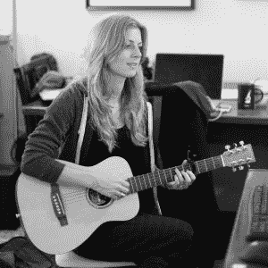

# 本周 PyDev:杰西卡·麦克凯勒

> 原文：<https://www.blog.pythonlibrary.org/2017/05/01/pydev-of-the-week-jessica-mckellar/>

本周，我们欢迎杰西卡·麦克凯勒([@杰西卡·麦克凯勒](https://twitter.com/jessicamckellar))成为我们本周的 PyDev！Jessica 是 Python 软件基金会的前董事，也是一名成功的企业家。她还是 Reilly 的[作者](http://amzn.to/2omLSkv)，也是 Twisted framework 的核心开发人员。你可以查看她的[网站](http://web.mit.edu/jesstess/www/)或者她的 [Github 简介](https://github.com/jesstess/)来了解她在做什么。让我们花些时间去更好地了解她吧！

你能告诉我们一些关于你自己的情况吗(爱好、教育等)

我是一名企业家、软件工程师和开源开发者，目前居住在旧金山。我是 Python 软件基金会的前董事、波士顿 Python 用户组的前组织者和 PyCon 北美多样性拓展主席。

我开玩笑说我从来不休假，我只是去 Python 大会上演讲。这让我有机会与世界各地的本地 Python 社区交流和学习。我很高兴在 2013 年赢得了 O'Reilly 开源奖，这是对我在 Python 社区中所做的努力的肯定，这是对许多有才华的人的长期努力的肯定，我也很幸运地称他们为我的朋友。

我目前是一家早期企业软件公司的创始人和首席技术官，我很高兴从一开始就使用 Python 3 并从中受益。此前，我是一家被 Dropbox 收购的实时协作初创公司的创始人和工程副总裁。在那之前，我是麻省理工学院的一名电脑迷，加入了她在 Ksplice 的朋友，Ksplice 是一家为 Linux 开发无重启内核更新服务的公司，后被甲骨文收购。这些不同的经历让我进入了 2017 年福布斯 30 名 30 岁以下企业软件类别，正好赶上了这个类别。

**你为什么开始使用 Python？**

我在麻省理工学院学了 Python。我参加了从 Lisp 到 Python 的大转变，学习它的入门课程。

我的第一学位实际上是化学。在我上化学课的时候，我的许多朋友都在计算机科学系，我会用眼角的余光看着他们，心想——他们似乎在学习一个工具箱，里面装满了解决世界上各种问题的工具...â€

我也想要那些技能。我在大二的时候上了几门计算机科学课，很快就被吸引住了，偷偷在一家软件公司实习，没有告诉我的化学顾问(我不推荐这种策略)，并设法在剩下的几个学期里拿到了计算机科学学位。

你还知道哪些编程语言，你最喜欢哪一种？

Python 显然是我最喜欢的语言，因为它是解决各种问题最简单、最快的方法。我认为它也是让第一次编程的程序员迷上编程的最佳语言。我也很幸运在我做过的每一份工作中都使用 Python。

我很感激在学校和 Ksplice 与 C 和汇编一起度过的时光，因为它有助于真正理解计算机是如何工作的。

我和我的联合创始人开玩笑说，每次我们创建一家公司(我们一起排在第三位)，web 前端堆栈就完全翻转了，我们必须重新学习一切。我们认为我们在 2012 年使用 jQuery 是值得骄傲的，当然今天我应该学习 React，我认为超级时髦的人已经转向 Vue 了？web 前端堆栈的变化率如此之高，我很感激其他人是这方面的热情专家，所以我不必如此。

你现在在做什么项目？

新公司现在占据了我的大部分时间，当我有空闲时间的时候，我倾向于花在像会议这样的面向社区的工作上。

我希望今年能腾出时间来发布更多的视频编程教程。我的 PyCon Python 介绍和开源贡献教程介绍在 YouTube 上有几十万的浏览量，我还通过 O ' Reilly 发布了介绍和中间内容。从世界各地的人们那里获得反馈是我一生中最令人满意的经历之一。就在今天，我收到了一封来自加拿大密西沙加的卡车司机的邮件，他正在从这些视频中学习编程。

学习如何编程是一种变革性的体验，它真的改变了你与世界互动的方式，所以我很高兴能在更多人获得这种体验的过程中扮演一个小小的角色。

哪些 Python 库是你最喜欢的(核心或第三方)？

我对 Twisted 的第一个开源贡献是让我成为了一名核心维护者，并写了一本关于这个库的书。扭曲将永远在我心中占有特殊的位置。

能够在这家新公司中使用 Python 3 语言和标准库的一些增强功能真是一件乐事。举个小例子，最近我们需要一个简单的调度来解决一个问题，瞧，Python 3.4 中就有@functools.singledispatch 了。

作为一门编程语言，你认为 Python 将何去何从？

编程语言的生死取决于使用该语言的就业机会。我认为，维持一种编程语言和生态系统的最简单方式是成为学校教授的语言，这确保了大量新的学习者和大量即将毕业的学生创建的公司偏向于他们在学校已经知道的语言。

今天，大多数大学仍然用 Java 或 C++教授他们的计算机科学课程。这在全球和美国都是如此，但有趣的是，在美国，Python 在大学阶段的采用轨迹是所有语言中最强的(高中倾向于遵循大学语言选择)——更多的大学正在转向 Python，而不是任何其他语言。

这是一个巨大的机会，我们应该作为一个群体积极应对。最好的课程，最能吸引和留住不同的观众，应该是 Python。Python 应该是学习如何编程的最令人愉快的语言，不管你是否会说英语。

非常感谢你接受采访！