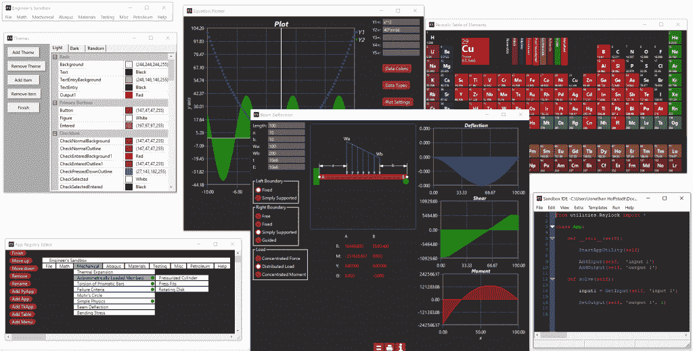
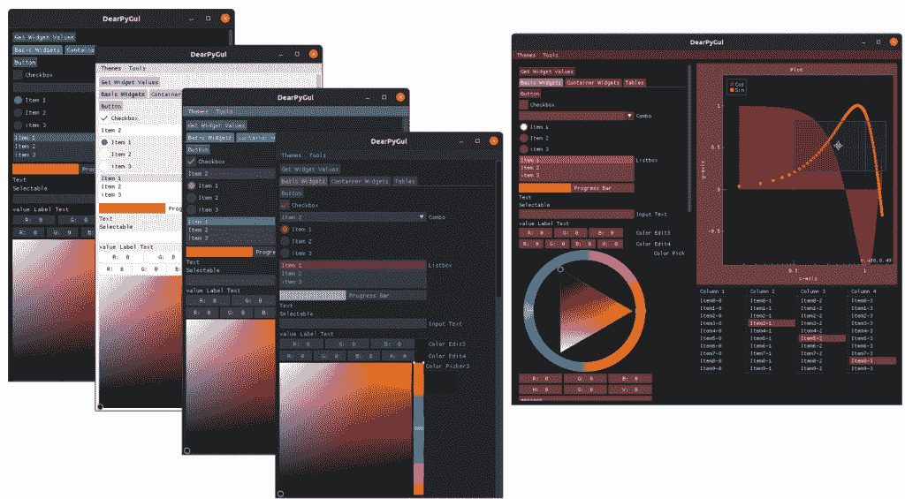

# 本周 PyDev:乔纳森·霍夫施塔特

> 原文：<https://www.blog.pythonlibrary.org/2021/03/01/pydev-of-the-week-jonathan-hoffstadt/>

本周，我们欢迎乔纳森·霍夫施塔特( [@jhoffs1](https://twitter.com/jhoffs1) )成为我们本周的 PyDev！乔纳森是《亲爱的 T2》的合著者。这是一个简洁的新 Python GUI 包。你可以在 [Github](https://github.com/hoffstadt) 上看到 Jonathan 还在做什么。

让我们花些时间来更好地了解乔纳森！

你能告诉我们一些关于你自己的情况吗(爱好、教育等)

我是德克萨斯州休斯顿的一名机械工程师。我拥有路易斯安那州立大学的机械工程学士学位，曾是美国海军陆战队的一名拖车炮手，大学毕业后一直在石油和天然气行业工作。

我的爱好包括国际象棋、射击和编程。对于编程，我发现 3D 图形非常有趣。

**你为什么开始使用 Python？**

我从中学开始就对编程感兴趣，因为我收到了一本 C++傻瓜书作为礼物，但是直到大学我才接触到 Python。正是在那里，我开始使用 Python 作为 MATLAB 的免费替代品来完成作业。没过多久，我就迷上了这门语言。

我开始在作业之外尽我所能使用它。这包括制作小游戏，在实习中自动完成任务，用树莓派控制实验板，以及其他任何事情。与其他语言相比，我惊讶于你能如此迅速地让事情发生。

我最终在有限元分析和计算流体力学的课程中使用了 Python。对于我们的高级设计顶点项目，我的团队的任务是构建一个弧焊 3D 打印机。作为接触编程最多的成员，我负责项目的软件方面，在这个项目中，我使用 Python 来控制所有的机械设备，包括机器人手臂和团队创建的定制电子设备。我还编写了我的第一个用户界面，它使用 tkinter 和 pygame 来包装开源切片引擎，并提供刀具路径和机械臂位置的 3D 视图。

你还知道哪些编程语言，你最喜欢哪一种？

C、C++和 Java 是我的其他主要语言，尽管我曾经使用过 C#、Swift 和 Objective-C。

事实是我有两种最喜欢的语言。大型项目的 C++。Python 适用于小型项目、脚本编写和完成工作！

你现在在做什么项目？

我目前花了大部分时间在《亲爱的 PyGui》上。

哪些 Python 库是你最喜欢的(核心或第三方)？

我最喜欢的 Python 库应该是 NumPy、Pillow、tqdm、json 和 Nuitka。

亲爱的 PyGUI，你的包裹是怎么来的？

亲爱的 PyGui 是我和我的朋友 Preston Cothren 合著的一个图形用户界面库。作为机械工程师，我们每天都使用 python 进行计算、编写脚本以及为机械设计和分析中使用的各种软件添加插件。我们想要一种简单的方法，用最少的努力给不同的脚本添加一个接口。

该软件的第一次迭代被称为“工程师的沙盒”，这是商业的。不仅创建小界面很容易，而且打包和分发也很容易。它带有一个内置的 IDE 和 60 个预制的应用程序。“沙盒”是一个嵌入了 python 的 C++程序，图形是用 wxWidgets 创建的。最终，这个项目失败了，只有几百个用户。你可以在下面看到它的图像:

在放弃工程师的沙盒六个月后，我们重新审视这个想法，重新评估。我们有 3 个体会:

1.我们的主要目标受众(机械工程师)大多对编程不感兴趣。

2.该软件对开发人员(我们的第二个目标受众)来说太严格和有限了。有限的部件、布局、有限的第三方可操作性等。

3.大多数开发人员更喜欢使用开源库。

从这些实现中，我们回到了绘图板，并决定制作一个完整的 GUI 库。这个迭代是开源的，是 Python 的扩展(而不是一个独立的软件)，并且尽可能容易使用。

在迭代之间，我们爱上了 C++库，亲爱的 ImGui，因此决定使用它作为基础库来构建。由于 Dear ImGui 是一个即时模式 Gui 库，与其他 ui 库相比，它允许我们使 Dear PyGui 非常动态。

自从我们在 2020 年 7 月发布了第一个公开测试版以来，亲爱的 PyGui 的人气持续快速增长:

作为一名开源开发者，你学到的前三件事是什么？

作为一名开源开发者，我了解到:

1.这是一项艰苦的工作，会让你欣赏开源软件和开发者。

2.倾听社区的声音，但也知道何时说“不”。

3.资金很难找到，所以你应该享受你正在做的工作。

你还有什么想说的吗？

是啊！这是给那些编程新手的。经常有人问我如何学习一门编程语言、库、主题等。我的答案一直是:学习编程的最好方法就是开始构建东西。

我通常浏览一本书，然后立即开始尝试构建一些东西。当我陷入困境时，我会回到书中更仔细地阅读相关章节。一旦到了重构和优化的时候，我通常会回到书中，阅读更高级的章节，因为我更清楚高级章节试图解决的问题。我发现这个技巧对我帮助很大。虽然你可能会在做完后再重新发明轮子，但是你最终会有一个更深刻的理解，你不太可能忘记。

乔纳森，谢谢你接受采访！