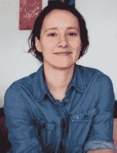

# 本周 PyDev:凯瑟琳·贾穆尔

> 原文：<https://www.blog.pythonlibrary.org/2018/07/16/pydev-of-the-week-katharine-jarmul/>

本周，我们欢迎凯瑟琳·贾马尔( [@kjam](https://twitter.com/kjam) )成为我们本周的 PyDev！凯瑟琳是《T2 与 Python 的数据争论》一书的合著者。她也是 KIProtect 的联合创始人。你可以在 [Github](https://github.com/kjam) 上了解她正在做的项目。让我们花些时间去更好地了解她吧！

你能告诉我们一些关于你自己的情况吗(爱好、教育等)

当然可以！我第一次在电脑上工作是在 90 年代，用我的拨号共享 Windows 95 电脑为家庭音乐建立粉丝网站。从那以后，我对计算机和现在所谓的数据科学有着爱恨交加的关系。我接受过一些数学、统计学和计算机科学方面的正规教育，但也自学了大部分内容，因此我很自豪地认为自己是自学成才的一员。为了好玩，我喜欢和朋友一起做饭、吃饭，阅读新闻或 arXiv 报纸，和线上或线下志同道合的人一起咆哮...)

**你为什么开始使用 Python？**

我第一次使用 Python 是在 2007 年，当时我在华盛顿邮报工作。一位导师(Ryan O Neil)在看到我用 JavaScript 构建的一个小应用程序后，给了我一个机会。他安装了一台 Linux 计算机，并安装了 Django 应用程序栈——甚至给了我一个提交密钥！我不能告诉你我破坏了服务器多少次，但是 6 个月后，我启动了我的第一个 Django 应用程序。我被吸引住了，想做更多的东西。

你还知道哪些编程语言，你最喜欢哪一种？

我还涉猎了许多其他语言:C++、Java、Go，甚至 Perl、R、PHP 和 Ruby。我最喜欢 Python，但这可能是因为我最了解它。我现在在围棋上工作更有规律了，这真的很有趣，但对我来说也很难做这么多的打字工作。Python 作为我的主要语言无疑已经宠坏了我，对于数据科学和机器学习来说，它被如此广泛地采用是有原因的。

你现在在做什么项目？

我最近宣布了我的新公司 ki protect([https://kiprotect.com](https://kiprotect.com/))。我们正在为数据科学和机器学习构建数据隐私和安全解决方案。本质上，我们认为数据隐私应该是每个人的权利，而不仅仅是我们这些有幸生活在欧洲的人。出于这个原因，我们希望使数据隐私民主化——让各地的数据科学家和工程师更容易实现安全和隐私的数据共享。我们的第一个产品是假名化 API，有限使用免费(大量使用付费)。这允许您发送私有数据，并通过一个 API 调用获得正确的假名数据。在未来的一年里，我们将提供更多的工具、解决方案和 API 来帮助提高安全性和隐私性。

哪些 Python 库是你最喜欢的(核心或第三方)？

对于从事机器学习和数据科学的人来说，NumPy 几乎是最好的东西。这是一个非常有用的库，核心开发人员所做的优化让我们可以用 Python(咳咳，Cython)进行快速、高效的数学运算，这非常棒。如果不是 NumPy 的稳定基础有助于在 Python 中培养一个真正的数据科学社区，我不确定我们是否会有像 Pandas、Scikit-Learn 甚至 Keras 和 TensorFlow 这样的东西。

你是如何结束写一本关于 Python 的书的？

我搬到欧洲后不久，我的合著者杰奎琳·卡齐尔找到了我。具有讽刺意味的是，就在一周前，我转向我的伴侣说,“你知道，我终于感觉不那么疲惫了。我想知道我下一步该做什么？这本书似乎是一个重新开始使用电脑的好机会。

你从那次经历中学到了什么？

写书真的很难。我知道每个人都这么说，但这需要你付出很多；你可能永远不会对结果完全满意。也就是说，我从那些将我们的书作为对 Python 和数据世界的欢迎介绍的人那里听到了很多好东西——如果我甚至转化了一个新的 Pythonista，我可以说我已经取得了一些影响

你还有什么想说的吗？

不要使您的网站离线，以遵守 GDPR(新的欧盟隐私法规)。我从(主要是)美国人那里听到的欧洲知识产权的全面封锁或其他荒谬无知的反应和观点，令我感到震惊。

首先，这个规则很容易阅读，所以我推荐阅读。如果这对你来说太难了，请查看我们的文章，其中涵盖了你作为数据科学家需要知道的许多知识([https://kiprotect.com/blog/<wbr>gdpr _ for _ data _ science . html](https://kiprotect.com/blog/gdpr_for_data_science.html))或这篇针对软件工程师的文章([https://www . smashingmagazine .<wbr>com/2018/02/gdpr-for-web-<wbr>开发者/](https://www.smashingmagazine.com/2018/02/gdpr-for-web-developers/) )。

其次，先把它想成一个用户。难道您不想对您的数据有更多发言权吗？你不想了解数据泄露吗？有人不告诉你就倒卖你的数据可以吗？以你希望被对待的方式对待你的用户。

终于有工具帮忙了！在 KIProtect，我们正在构建几种解决方案来帮助您的生活变得更加轻松。还有许多其他公司和项目致力于使我们的软件对每个人都更安全。不要把隐私和安全当作漂亮的附加产品，把它们当作核心产品的一部分。保护您的数据，它可能是您创造的最有价值的东西。

凯瑟琳，谢谢你接受采访！