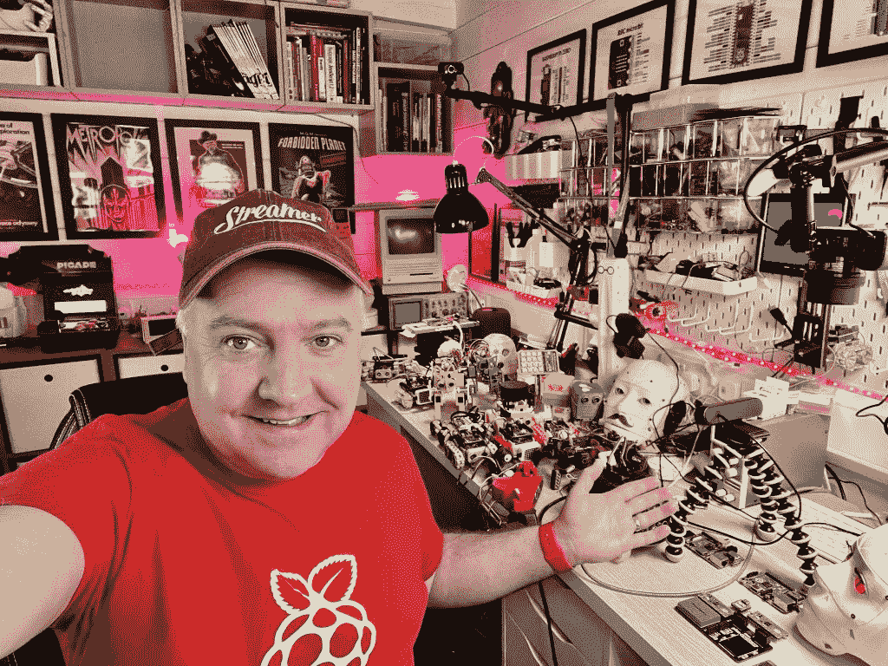

# PyDev of the Week: Kevin McAleer

> 原文：<https://www.blog.pythonlibrary.org/2023/01/02/pydev-of-the-week-kevin-mcaleer/>

This week we welcome Kevin McAleer ([@kevmac](https://twitter.com/kevsmac)) as our PyDev of the Week! Kevin likes making robots, using Python, and sharing that passion on social media, such as [YouTube](https://www.youtube.com/c/kevinmcaleer28). You can catch up with Kevin (and sign up for his newsletter!) on his [website](https://www.kevsrobots.com/about/bio).

Now let's spend a few minutes discovering more about Kevin!

## Can you tell us a little about yourself (hobbies, education, etc):

Hi! I'm Kevin McAleer, and I love designing & building robots, using the Python I've learned into practice by bringing those robots to life and sharing my passion on [YouTube](https://www.youtube.com/c/kevinmcaleer28).

I've always been passionate about computing and completed a degree in Computer Science in 1998, and back then, the languages we were taught were Cobol (it was on its way out then), C, and C++, and this 'new' language called Java. We did a bit of Javascript, too (it was called LiveScript at the time).

My hobby is creating small robots powered by MicroPython-based controllers, such as the Raspberry Pi Pico and Espressif ESP32\. I create one project each week and then do a show-and-tell live stream every Sunday. I write up each project, sharing the Python code, bill of materials as well as downloadable STL files over at [https://www.kevsrobots.com](https://www.kevsrobots.com). All my work is free and open source.

I love robotics because it's the intersection of programming, electronics and 3d design, so there is always something new to try and learn from.

## Why did you start using Python?

I learned Python because a lot of the Raspberry Pi projects I was seeing used Python, and I decided this was something I wanted to learn more about. The 'Pi' in Raspberry Pi is a tip of the hat to Python as the original prototype Raspberry Pi ran pure Python and no OS, much like the Raspberry Pi Pico does today.

After learning a couple of basics (and differences from the languages I knew), I was hooked. Python is so much easier to write code in than other languages, and because it's interpreted, it is faster to get to the results you're after.

## What other programming languages do you know and which is your favorite?

I know Pascal, C/C++ (and the Arduino variant, 'Processing'), some Java, Javascript (not a big fan), a tiny bit of Ruby,  Swift, Objective-C (yuck), Assembler and ZX Spectrum Basic!

My favourite language is Python - it helps me get things done and lends itself to easy-to-read and cleaner code. I love that I can run it almost everywhere, from tiny embedded devices and robots up to large server clusters.

## What projects are you working on now?

Right now, I'm writing a free MicroPython for beginners course. MicroPython is a subset of regular Python but designed for small MicroControllers with very limited RAM and processor resources. The course is aimed at beginners and people who have never programmed before and can be found over at [https://beta.kevsrobots.com/learn](https://beta.kevsrobots.com/learn) - I'm launching it very soon.

The course itself is built using Markdown text files, a fancy Python script that takes a simple YAML file with the course structure and then builds the supporting files for Jekyll, which then turns the markdown and YAML into beautiful static HTML pages.

My most popular project has been the 'How to build your own AI assistant in Python', which you can find here: [https://youtu.be/Y5atyJbVsAU](https://youtu.be/Y5atyJbVsAU).

## Which Python libraries are your favorite (core or 3rd party)?

I love the Phew! library from Pimoroni, it's similar to Flask but for Microcontrollers such as the Raspberry Pi Pico or ESP32\. It means I can host an entire interactive website on an embedded processor - one such example is the Big Mouth Billy Bass fish project, where visitors can control the fish over the internet using a website hosted within the fish itself! check out: [https://www.kevsrobots.com/blog/big-mouth.html ](https://www.kevsrobots.com/blog/big-mouth.html)for links to the video, code, and website itself!

Phew also has a great logging feature which is really useful for troubleshooting embedded devices.

I also love Flask and FastAPI for quickly building APIs for projects. I also love Pandas and Numpy for manipulating data and training Neural Networks with Keras and TensorFlow.

## How did you get into robotics?

I've always been fascinated with robots from a young age, but it was only in the last 10 years that I bought an Arduino Uno and 3d printed out the [SMARS robot](https://www.smarsfan.com). I quickly outgrew the Arduino Uno as it's only an 8-bit chip and mostly programmed with C++, it's not powerful enough to run Python.

Once I'd built a couple of SMARS robots, I decided to make some YouTube videos about them and also built the SMARSFan website to document how to make them.

## Do you have any tips for others who would like to start learning robotics too?

I'd say start with a simple robot like [BurgerBot](https://www.kevsrobots.com/blog/burgerbot_v2), and don't be worried about being out of your comfort zone. Imagine the joy you get from writing code, and it works just the way you want, and then multiply that when you make something move around and respond to its environment using your code. It's truly magical.

There are many affordable kits available online; all you really need is a battery box, a microcontroller and some motors to make a simple robot.

I think building robots also leads to writing better code because robots interact with the real world, and you end up writing really robust code to handle many scenarios. It also challenges you to learn new things, such as machine learning and artificial intelligence.

## Is there anything else you’d like to say?

If people want to see more of the robots, python code or videos I've made, head to [https://www.kevsrobots.com](https://www.kevsrobots.com). I'm also on all the social channels: @kevmac on Twitter, @kevinmcaleer on Instagram, @kevsmac on Mastodon.social, and recently @kevinmcaleer6 on TikTok.

So find me online and say Hello! I'm always interested in what people are working on (robots and non-robot projects).

**Thanks for doing the interview, Kevin!**