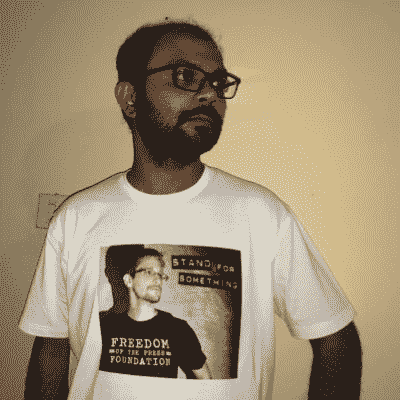

# 本周 PyDev:Kushal Das

> 原文：<https://www.blog.pythonlibrary.org/2019/01/07/pydev-of-the-week-kushal-das/>

本周我们欢迎 Kushal Das ( [@kushaldas](https://twitter.com/kushaldas) )成为我们的本周 PyDev！Kushal 是 Python 编程语言的核心开发者，也是 [PEP 582](https://www.python.org/dev/peps/pep-0582/) 的合著者。你可以通过查看他的[博客](https://kushaldas.in)或者他的 [Github 简介](https://github.com/kushaldas)来了解更多关于 Kushal 的信息。让我们花一些时间来更好地了解 Kushal！

你能告诉我们一些关于你自己的情况吗(爱好、教育等)

我是新闻自由基金会的工作人员。我们是一个非营利组织，在 21 世纪保护、捍卫和扶持公益新闻。我们致力于为记者和举报者开发加密工具，记录对媒体的攻击，培训新闻编辑室的数字安全实践，并倡导公众的知情权。

我一生也是各种自由软件项目的一部分。我是 CPython 的核心开发人员，也是 Python 软件基金会的董事。我是 Tor 项目核心团队的一员。十多年来，我一直是 Fedora 项目的定期撰稿人。

我与一大群朋友和同事一起协调 https://dgplug.org 的各种项目。我们在 Freenode 服务器上的#dgplug IRC 频道上一起学习新事物，互相帮助。欢迎访问该频道，并向我们问好。

我试着在我的[博客](https://kushaldas.in)上写下我定期学到的东西。

**你为什么开始使用 Python？**

2005 年底开始学习 Python。我想为我的新诺基亚手机写代码，Sirtaj Singh Kang 建议我开始学习 Python。在这样做的时候，我发现我必须写的代码行要少得多，而且也更容易理解。我开始更多地通过互联网与更广泛的 Python 社区交流，这让我更加着迷。正如布雷特·坎农所说:“为语言而来，为社区而留。对我们许多人来说都是如此。

你还知道哪些编程语言，你最喜欢哪一种？

在我的编程生涯中，我每 8 个月到一年就学习一门新语言。在我开始写 Python 之前，我习惯于根据我所从事的工作来写 C/Java/PHP。大约在 2009 年，我开始花时间学习函数式编程，并且非常喜欢 Lisp。我花了大约一年的时间继续编写更多的 Lisp，并试图找出如何在我的日常 Python 编程生活中使用这些想法。从 2013 年开始写 Go，确实有很多项目是用 Go 写的。

但是，最近我写了越来越多的铁锈。我真的很喜欢这个社区，也喜欢这个编译器🙂

以防有人想知道我们家有多喜欢 Python，我们的女儿名叫“Py”🙂

你现在在做什么项目？

在我的日常工作中，我与一个了不起的维护团队和社区一起维护 [SecureDrop](https://securedrop.org) 项目。SecureDrop 是一个开源的举报人提交系统，媒体组织可以安装它来安全地接受来自匿名来源的文档。它最初由已故的艾伦·施瓦茨编码，现在由新闻自由基金会管理。

我还在从事各种 Python 项目，这些项目将使我们能够为记者们在 [Qubes OS](https://qubes-os.org) 上拥有一个新的桌面客户端。 [Qubes Ansible](https://qubes-ansible.readthedocs.io/en/latest/) 是另一个项目，我试图确保我们可以使用 Ansible 来维护我们的 Qubes 系统。

哪些 Python 库是你最喜欢的(核心或第三方)？

我想我几乎在任何地方都使用 stdlib 的`json`模块和作为第三方的`requests`模块。IIRC 我的第一个 Cpython 补丁是关于为 json 模块添加测试的。

在 Python 世界中，还有许多我经常使用的令人惊叹的库，其中大部分都是我们令人惊叹的社区的产物。

在开源项目中，你学到了哪三件最重要的事情？

*   人比任何代码都重要。
*   善待每一个人。
*   在这个现代联系的世界里，交流是一切事物的关键工具。比起视频/音频通话，我们必须通过文字进行更多的交流。

你还有什么想说的吗？

我建议新的程序员研究更多的上游项目。在所有的项目中，我们都需要不同层次的帮助，所以我们有机会不仅通过代码，而且通过许多不同的方式做出贡献。

最后，但同样重要的是，我想提一下我的妻子 Anwesha，她来自一个完全不同的背景，帮助我为上游项目做出更多贡献，而且她自己也开始根据需要帮助项目。

谢谢你接受采访，Kushal！